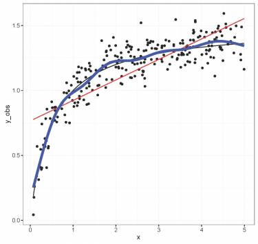
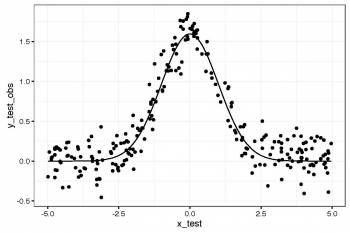

# The linear model...and where if fails

What do we mean by the linear model? Regression is the workhorse of
statistics. It allows us to model a response variable as a function of
predictors plus error. Linear regression is what most people first
encounter in statistics. As we saw in the [linear
models](http://qcbs.ca/wiki/r_workshop4) workshop, regression makes four
major assumptions:

1.  normally distributed error
2.  the variance of the errors doesn't change (homoscedastic)
3.  i.i.d. (each error is independent of the others)
4.  a linear response: *y = β~0~ + β~1~x*

There's only one way for the linear model to be right:

{width="350"}

And yet so many ways for it to fail:

{width="525"}

So how can we fix it? We must first know what the regression model is
trying to do:

     * fit a line that goes through the middle of the data,
     * do this without overfitting the data, such as simply using a line between each point and its neighbours.

Linear models do this by finding the best fit straight line that passes
through the data. In contrast, additive models do this by fitting a
curve through the data, but controlling how wiggly the line can get
*(more on this later)*.


# Introduction to GAMs

Let's look at an example. First, we'll generate some data, and plot
it.

```{r, echo = TRUE, eval = FALSE}
library(ggplot2)
set.seed(10)
n = 250
x = runif(n,0,5)
y_model = 3*x/(1+2*x)
y_obs = rnorm(n,y_model,0.1)
data_plot = qplot(x, y_obs) + 
            geom_line(aes(y=y_model)) + 
            theme_bw()
print(data_plot)
```

{width="350"}

We can appreciate that if we were to fit this as a linear regression
model, we would violate the assumptions listed above. Let's have a
look, using the `gam()` command from the `mgcv` package here to model an
ordinary least squares regression *(we will see below how to use `gam()`
to specify a smoothed, non-linear term)*.

```{r, echo = TRUE, eval = FALSE}
library(mgcv)
linear_model = gam(y_obs~x)
model_summary=summary(linear_model)
print(model_summary)
data_plot = data_plot+
             geom_line(colour="red",
             aes(y=fitted(linear_model)))
print(data_plot)
```

We can see in the model summary that our linear model explains quite a
bit of variance (*R^2^~adj~* = 0.639), however, diagnostic plots of the
model residuals would quickly show that the error variance is not
normally distributed nor homoscedastic, and that an important non-linear
pattern remains. Let's now try to fix this by fitting the data using a
smoothed (non-linear) term.

We will revisit this later, but briefly, GAMs are effectively a
nonparametric form of regression where the *βx~i~* of a
linear regression is replaced by an arbitrary smooth functions of the
explanatory variables, *f(x~i~)*, and the model becomes:

$$y_i = f(x_i) + ε_i$$

where *y~i~* is the response variable, *x~i~* is the covariate, and *f* is the
smooth function.

Importantly, given that the smooth function *f(x~i~)* is non-linear and
local, the magnitude of the effect of the explanatory variable can vary
over its range, depending on the relationship between the variable and
the response. That is, as opposed to one fixed coefficient beta,
the function *f* can continually change over the range of *x~i~*.
The degree of smoothness (or wiggliness) of *f* is controlled using
penalized regression determined automatically in `mgcv` using a
generalized cross-validation (GCV) routine (Wood 2006).

In `gam()` smooth terms are specified by expressions of the form: `s(x)`
where x is the covariate which the smooth is a function of.

```{r, echo = TRUE, eval = FALSE}
gam_model = gam(y_obs~s(x))
summary(gam_model)
data_plot = data_plot +  
     geom_line(colour="blue",aes(y=fitted(gam_model)))
print(data_plot)
```

The variance explained by our model has increased by 20% (*R^2^~adj~* =
0.859) and when we compare the fit of the linear (red) and non-linear
(blue) models, it is clear that the latter is the winner.

{width="375"}

The `mgcv` package also includes a default plot to look at the smooths:

```{r, echo = TRUE, eval = FALSE}
plot(gam_model)
```

How do we test whether the non-linear model offers a significant
improvement over the linear model? We can use the `gam()` and `anova()`
commands to formally test whether an assumption of linearity is
justified. To do, we must simply set our smoothed model so that it is
nested in our linear model; that is, we create model object that
includes both `x` (linear) and `s(x)` (non-linear) and we ask whether
adding `s(x)` to the model with only `x` as a covariate is supported by
the data.

```{r, echo = TRUE, eval = FALSE}
linear_model = gam(y_obs~x)
nested_gam_model = gam(y_obs~s(x)+x)
print(anova(linear_model, nested_gam_model, test="Chisq"))
```

The non-linear term is significant:

     Analysis of Deviance Table
     Model 1: y_obs ~ x
     Model 2: y_obs ~ s(x) + x
           Resid. Df    Resid. Dev     Df        Deviance    Pr(>Chi)    
     1    248.00        6.5846                              
     2    240.68        2.4988         7.3168    4.0858      < 2.2e-16 ***
     ---
     Signif. codes:  0 ‘***’ 0.001 ‘**’ 0.01 ‘*’ 0.05 ‘.’ 0.1 ‘ ’ 1

Note that the model `y_obs~s(x)` gives exactly the same results as
`y_obs~s(x)+x`, as shown above for the `nested_gam_model`. We used the
`s(x)+x` to illustrate the nestedness of the model, however, we will
omit the `+x` in the nested model comparisons that follow.


## Challenge 1

We will now try this test with some new simulated data, just to get a
handle on it. First generate the data using the code below, then fit a
linear and smoothed GAM model to the relation between `x_test` and
`y_test_obs`. What is the effective degrees of freedom of the smoothed
term? Determine if linearity is justified for this data.

``` {.rsplus|}
n <- 250
x_test <- runif(n,-5,5)
y_test_fit <- 4*dnorm(x_test)
y_test_obs <- rnorm(n,y_test_fit, 0.2)
```

### Challenge 1 Solution

``` {.rsplus|}
data_plot <- qplot(x_test, y_test_obs) + 
  geom_line(aes(y=y_test_fit))+
  theme_bw()
print(data_plot)

linear_model_test <- gam(y_test_obs~x_test)
nested_gam_model_test <- gam(y_test_obs~s(x_test)+x_test)
print(anova(linear_model_test, nested_gam_model_test, test="Chisq"))

summary(nested_gam_model_test)$s.table
```

    Analysis of Deviance Table


    Model 1: y_test_obs ~ x_test
    Model 2: y_test_obs ~ s(x_test) + x_test
         Resid. Df   Resid. Dev    Df      Deviance   Pr(>Chi)    
    1     248.0      81.09                              
    2     240.5      7.46          7.5012   73.629    < 2.2e-16 ***
    ---
    Signif. codes:  0 ‘***’ 0.001 ‘**’ 0.01 ‘*’ 0.05 ‘.’ 0.1 ‘ ’ 1

                   edf   Ref.df        F p-value
    s(x_test) 7.602145 8.029057 294.0944       0

Answer: Yes non-linearity is justified. The effective degrees of freedom
(edf) are \>\> 1.

{width="350"}
