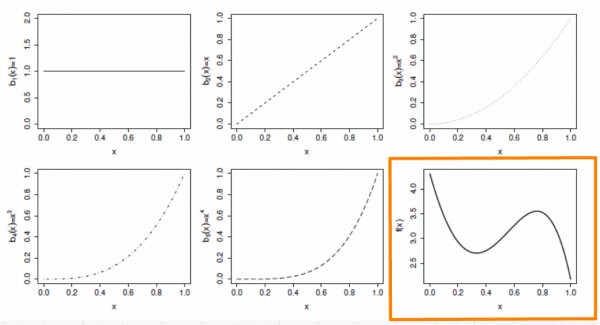
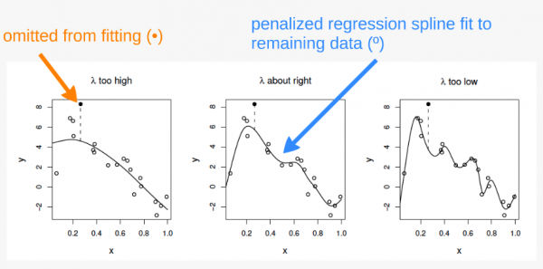

# How GAMs work {#how-gams-work}

We will now take a few minutes to look at what GAMs are doing behind the
scenes. Let us first consider a simple model containing one smooth function $f$ of one covariate, $x$:

$$y_i = f(x_i) + \epsilon_i$$

To estimate the smooth function $f$, we need to represented the above equation in such a way that it becomes a linear model. This can be done by defining basis functions, $b_j(x)$, of which $f$ is composed:

$$f(x) = \sum_{j=1}^q b_j(x) \times \beta_j$$

## Example: a polynomial basis

Suppose that $f$ is believed to be a 4th order polynomial, so that the space of polynomials of order 4 and below contains $f$. A basis for this space would then be:

$$b_0(x)=1 \ , \quad b_1(x)=x \ , \quad b_2(x)=x^2 \ , \quad b_3(x)=x^3 \ , \quad b_4(x)=x^4$$

so that $f(x)$ becomes:

$$f(x) = \beta_0 + x\beta_1 +  x^2\beta_2 + x^3\beta_3 + x^4\beta_4$$

and the full model now becomes:

$$y_i = \beta_0 + x_i\beta_1 +  x^2_i\beta_2 + x^3_i\beta_3 + x^4_i\beta_4 + \epsilon_i$$

The basis functions are each multiplied by a real valued parameter, $\beta_j$, and are then summed to give the <font color="orange">final curve $f(x)$</font>.

```{r, fig.align = 'center', out.width='100%', echo = FALSE, purl = FALSE}

```

By varying the $\beta_j$ we can vary the form of $f(x)$ to produce any polynomial function of order 4 or lower.

## Example: a cubic spline basis

A cubic spline is a curve constructed from sections of a cubic
polynomial joined together so that they are continuous in value. Each
section of cubic has different coefficients.

```{r, fig.align = 'center', echo = FALSE, purl = FALSE, out.width='100%'}
knitr::include_graphics("images/cubic_spline.png")
```

Here is a representation of a smooth function using a rank 5 cubic spline basis with knot locations at increments of 0.2:

```{r, fig.align = 'center', echo = FALSE, purl = FALSE, out.width='7s0%'}
knitr::include_graphics("images/cubic_spline5.jpg")
```

Here, the knots are evenly spaced through the range of observed x values. However, the choice of the degree of model smoothness is controlled by the the number of knots, which was arbitrary. 

:::puzzle
Is there a better way to select the knot locations?
:::

### Controlling the degree of smoothing with penalized regression splines

Instead of controlling smoothness by altering the number of knots, we
keep that fixed to size a little larger than reasonably necessary, and
control the model's smoothness by adding a "wiggleness" penalty.

So, rather than fitting the model by minimizing (as with least squares regression):

$$||y - XB||^{2}$$

it can be fit by minimizing:

$$||y - XB||^{2} + \lambda \int_0^1[f^{''}(x)]^2dx$$

Where, as $\lambda$ goes to $\infty$, the model becomes linear.

The selection of the best fit smoothing parameter, $\lambda$, makes use of a cross-validation approach. If $\lambda$
is too high then the data will be over smoothed, and if it is too low, the data will be under smoothed. Ideally, it is best to choose $\lambda$ so that the $\hat{f}$ is as close as possible to $f$. A suitable criterion might be to choose $\lambda$ to minimize:

$$M = 1/n \times \sum_{i=1}^n (\hat{f_i} - f_i)^2$$

Since $f$ is unknown, $M$ must be estimated. The recommend methods for this are maximum likelihood (*ML*) or restricted maximum likelihood estimation (*REML*). Generalized cross validation (*GCV*) is another possibility, which is a technique that leaves out each datum from the data in turn and considers the average predictive ability of models fitted to the remaining data to predict the removed datum. For further details on these methods, see [@wood_2006].

:::explanation
__The principle behind cross validation__

```{r, fig.align = 'center', out.width = '100%', echo = FALSE, purl = FALSE}

```

In the first panel, $\lambda$ is too high, and the curve is oversmoothed. Here, the curve loosely fits the data and therefore  predicts the missing point very poorly. 

In the third panel, $\lambda$ is too high, and the curver is overfitted. Here, the curve fits the data very closely, following the signal as well as the noise surrounding it. The influence of this additional (uninformative) variability causes it to predict the missing datum rather poorly. 

In the second panel, $\lambda$ is just about right. The curve fits the underlying signal quite well, while smoothing through the noise. The missing datum is reasonably well predicted.

:::