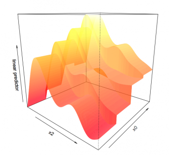
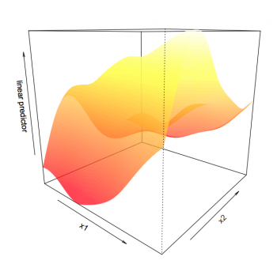

# Interactions

There are two ways to include interactions between variables:

-   if one variable is smoothed, and the other isn't: using the `by`
    argument,
-   fully smoothing both variables.

Where the `by` argument lets you have a smooth term vary between
different levels of a factor. We will examine this using our categorical
variable `x0` and ask whether the non-linear smoother `s(x2)` varies across
different levels of `x0`. To determine whether smooth terms differ
significantly among factor levels, we will use an ANOVA test on the
interaction term.

```{r, echo = TRUE, eval = FALSE}
categorical_interact <- gam(y~x0+s(x1)+s(x2,by=x0),data=gam_data)
categorical_interact_summary <- summary(categorical_interact)
print(categorical_interact_summary$s.table)
plot(categorical_interact,page=1)
# or alternatively: plot using vis.gam function, where theta is the degree rotation on the x-y plane
vis.gam(categorical_interact,view=c("x2","x0"),theta=40,n.grid=500,border=NA) 
anova(two_smooth_model, categorical_interact,test="Chisq")
```

{width="350"}

Visually, we see that the shape of smooth terms are comparable among the
four levels of `x0`. The ANOVA test confirms this as well (Deviance =
98.6, *p* = 0.2347).

Finally we'll look at the interactions two smooth terms, `x1` and `x2`.
Here the `by` argument is dropped (both quantitative variables).

```{r, echo = TRUE, eval = FALSE}
smooth_interact <- gam(y~x0+s(x1,x2),data=gam_data)
smooth_interact_summary <- summary(smooth_interact)
print(smooth_interact_summary$s.table)
plot(smooth_interact,page=1,scheme=3)
# plot(smooth_interact,page=1,scheme=1) will give a similar plot to the vis.gam()
vis.gam(smooth_interact,view=c("x1","x2"),theta=40,n.grid=500,border=NA) 
anova(two_smooth_model,smooth_interact,test="Chisq")
```

{width="350"}

The interaction between `s(x1)` and `s(x2)` is significant and the 2D plot
nicely illustrates this non-linear interactions, where `y` is greatest at
high values of `x1` but low to mid-values of `x2`. Try playing around with
`theta` to rotate the figure around. If you plan to run a lot of these,
delete the argument `n.grid=500` to make the plots run faster.
