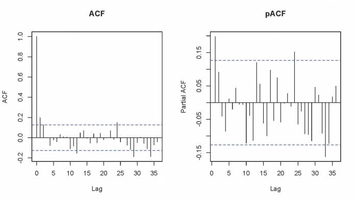
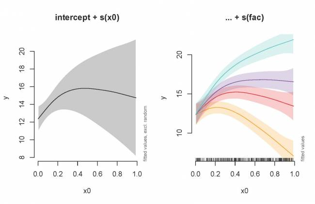
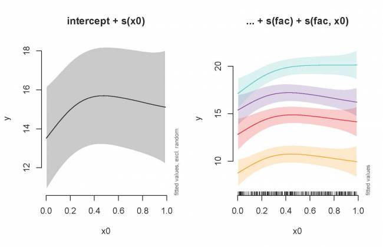

# Quick intro to Generalized Additive Mixed Models (GAMMs)

## Dealing with non-independence

When observations are not independent, GAMs can be used to either
incorporate:

-   a serial correlation structure to model residual autocorrelation
    (autoregressive: AR; moving average: MA; or a combination of the two:
    ARMA),
-   random effects that model independence among observations from the
    same site.

That is, in addition to changing the basis as with the nottem example
above, we can also add complexity to the model by incorporating an
autocorrelation structure or mixed effects using the `gamm()` function in the `mgcv` package. Although we will not be using it here, the [`gamm4`](https://cran.r-project.org/web/packages/gamm4/gamm4.pdf) package can also be used to estimate GAMMs in R. 

To start, let's have a look at the first case; a model
with temporal autocorrelation in the residuals. We will revisit the
Nottingham temperature model and test for correlated errors using the
(partial) autocorrelation function.

```{r, echo = TRUE, eval = FALSE}
par(mfrow=c(1,2))
acf(resid(year_gam), lag.max = 36, main = "ACF")
pacf(resid(year_gam), lag.max = 36, main = "pACF")
```

{width="700"}

The autocorrelation function plot (ACF; first panel above) provides the
cross-correlation of a time series with itself at different points in
time (i.e. similarity between observations at increasingly large time
lags). In contrast, the partial autocorrelation function (PACF: second panel above)
gives the partial correlation of a time series with its own lagged values
after controlling for the values of the time series at all shorter lags.
The ACF and pACF plots are thus used to identify after how many time
steps do observations start to be independent from one another. The ACF
plot of our model residuals suggests a significant lag of 1, and perhaps
a lag of 2. Therefore, a low-order AR model is likely needed. We can
test this by adding AR structures to the Nottingham temperature model,
one with an `AR(1)` (correlation at 1 time step) and one with an `AR(2)`
(correlation at two times steps), and test for the best-fit model using
ANOVA.

```{r, echo = TRUE, eval = FALSE}
year_gam <- gamm(nottem~s(nottem_year)+s(nottem_month, bs="cc"))
year_gam_AR1 <- gamm(nottem~s(nottem_year)+s(nottem_month, bs="cc"),
                     correlation = corARMA(form = ~ 1|nottem_year, p = 1))
year_gam_AR2 <- gamm(nottem~s(nottem_year)+s(nottem_month, bs="cc"),
                     correlation = corARMA(form = ~ 1|nottem_year, p = 2))
anova(year_gam$lme,year_gam_AR1$lme,year_gam_AR2$lme)
```

                     Model df      AIC      BIC    logLik   Test   L.Ratio p-value
    year_gam$lme         1  5 1109.908 1127.311 -549.9538                         
    year_gam_AR1$lme     2  6 1101.218 1122.102 -544.6092 1 vs 2 10.689206  0.0011
    year_gam_AR2$lme     3  7 1101.598 1125.962 -543.7988 2 vs 3  1.620821  0.2030

The `AR(1)` provides a significant increase in fit over the naive model
(LRT = 10.69, *p* = 0.0011), but there is very little improvement in
moving to the `AR(2)` (LRT = 1.62, *p* = 0.203). So it is best to include
only the `AR(1)` structure in our model.

## Mixed modelling

As we saw in the previous section, `bs` specifies the type of underlying
base function. For random intercepts and linear random slopes we use
`bs=\"re\"`, but for random smooths we use `bs=\"fs\"`.

Three different types of random effects are distinguished when using
GAMMs (where `fac`  is a categorial variable coding for the random effect
and `x0` is a continuous fixed effect):

-   *random intercepts* adjust the height of other model terms with a
    constant value: `s(fac, bs=\"re\")`
-   *random slopes* adjust the slope of the trend of a numeric
    predictor: `s(fac, x0, bs=\"re\")`
-   *random smooths* adjust the trend of a numeric predictor in a
    nonlinear way: `s(x0, factor, bs=\"fs\", m=1)`, where the argument `m=1`
    sets a heavier penalty for the smooth moving away from 0, causing
    shrinkage to the mean.

We will first examine a GAMM with only a random intercept. As before, we
will use the `gamSim()` function to automatically generate a dataset,
this time with a random effect component generate, then run a model with
a random intercept using `fac` as the random factor.

```{r, echo = TRUE, eval = FALSE}
# generate and view data
gam_data2 <- gamSim(eg=6)
head(gam_data2)

# run random intercept model
gamm_intercept <- gam(y ~ s(x0) + s(fac, bs="re"), data=gam_data2)

# examine model output
summary(gamm_intercept)$s.table
```

Note that there is now a smoother term for the random intercept in the
summary table. You can plot and view the random intercepts for each
level of `fac` as follows:

```{r, echo = TRUE, eval = FALSE}
plot(gamm_intercept, select=2) 
# select=2 because the random effect appears as the second entry in the summary table.
```

We can also use the `plot_smooth` function to visualize the model, which
in contrast to the default `plot.gam`, allows us to plot a smooth of the
summed effects of a GAM (based on predictions) as we saw earlier, but in
addition, optionally removes the random effects. Here, we will plot the
summed effects for the `x0` without random effects, and then plot the
predictions of all four levels of the random `fac` effect:

```{r, echo = TRUE, eval = FALSE}
par(mfrow=c(1,2), cex=1.1)
plot_smooth(gamm_intercept, view="x0", rm.ranef=TRUE, main="intercept + s(x1)", rug=FALSE)
plot_smooth(gamm_intercept, view="x0", cond=list(fac="1"), 
            main="... + s(fac)", col='orange', ylim=c(8,21), rug=FALSE)
plot_smooth(gamm_intercept, view="x0", cond=list(fac="2"), add=TRUE, col='red')
plot_smooth(gamm_intercept, view="x0", cond=list(fac="3"), add=TRUE, col='purple')
plot_smooth(gamm_intercept, view="x0", cond=list(fac="4"), add=TRUE, col='turquoise')
```

{width="650"}

Next we will run and plot a model with random slopes:

```{r, echo = TRUE, eval = FALSE}
gamm_slope <- gam(y ~ s(x0) + s(x0, fac, bs="re"), data=gam_data2)
summary(gamm_slope)$s.table

plot_smooth(gamm_slope, view="x0", rm.ranef=TRUE, main="intercept + s(x0)", rug=FALSE)
plot_smooth(gamm_slope, view="x0", cond=list(fac="1"), 
            main="... + s(fac)", col='orange',ylim=c(7,22), rug=FALSE)
plot_smooth(gamm_slope, view="x0", cond=list(fac="2"), add=TRUE, col='red')
plot_smooth(gamm_slope, view="x0", cond=list(fac="3"), add=TRUE, col='purple')
plot_smooth(gamm_slope, view="x0", cond=list(fac="4"), add=TRUE, col='turquoise')
```

{width="650"}

We will now include both a random intercept and slope term.

```{r, echo = TRUE, eval = FALSE}
gamm_int_slope <- gam(y ~ s(x0) + s(fac, bs="re") 
                      + s(fac, x0, bs="re"), data=gam_data2)
summary(gamm_int_slope)$s.table

plot_smooth(gamm_int_slope, view="x0", rm.ranef=TRUE, main="intercept + s(x0)", rug=FALSE)
plot_smooth(gamm_int_slope, view="x0", cond=list(fac="1"), 
            main="... + s(fac) + s(fac, x0)", col='orange', ylim=c(7,22), rug=FALSE)
plot_smooth(gamm_int_slope, view="x0", cond=list(fac="2"), add=TRUE, col='red', xpd=TRUE)
plot_smooth(gamm_int_slope, view="x0", cond=list(fac="3"), add=TRUE, col='purple', xpd=TRUE)
plot_smooth(gamm_int_slope, view="x0", cond=list(fac="4"), add=TRUE, col='turquoise', xpd=TRUE)
```

{width="650"}

Note that the random slope is static in this case:

```{r, echo = TRUE, eval = FALSE}
plot(gamm_int_slope, select=3) 
# select=3 because the random slope appears as the third entry in your summary table.
```

Lastly, we will examine a model with a random smooth.

```{r, echo = TRUE, eval = FALSE}
gamm_smooth <- gam(y ~ s(x0, fac, bs="fs", m=1), data=gam_data2)
summary(gamm_smooth)$s.table
```

Here, if the random slope varied along x0, we would see different curves
for each level:

```{r, echo = TRUE, eval = FALSE}
plot(gamm_smooth, select=1) 
# select=1 because the smooth slope appears as the first entry in your summary table.
```

All of the above models can in turn be compared using `anova()` as in
the previous sections to determine the best fit model.
