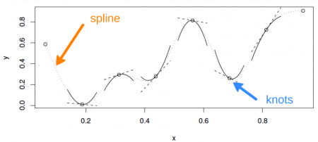

# GAMs behind the scenes

We will now take a few minutes to look at what GAMs are doing behind the
scenes. Lets first consider a model containing one smooth function of
one covariate, *x~i~*:

$$y_i = f(x_i) + ε_i$$

To estimate the smooth function *f*, we need to represented the above
equation in such a way that it becomes a linear model. This can be done
by choosing a basis, *b~i~(x)*, defining the space of functions of which
*f* is an element:

$$f(x) = \sum_{i=1}^{q}b_i(x)β_i$$

## A simple example: a polynomial basis

Suppose that *f* is believed to be a 4^th^ order polynomial, so that the
space of polynomials of order 4 and below contains *f*. A basis for this
space would then be:

$$b_1(x)=1, b_2(x)=x, b_3(x)=x^2, b_4(x)=x^3,
b_5(x)=x^4$$

so that *f(x)* becomes:

$$f(x) = β_1 + x_iβ_2 + x^2_iβ_3 +
x^3_iβ_4(x) + x^4_iβ_5$$

and the full model now becomes:

$$y_i = β_1 + x_iβ_2 + x^2_iβ_3 +
x^3_iβ_4(x) + x^4_iβ_5 + ε_i$$

The basis functions are each multiplied by a real valued parameter,
*β~i~*, and are then summed to give the **final curve** *f(x)*.

{width="600"}

By varying the *β~i~* we can vary the form of *f(x)* to produce any
polynomial function of order 4 or lower.

## Another example: a cubic spline basis

A cubic spline is a curve constructed from sections of a cubic
polynomial joined together so that they are continuous in value. Each
section of cubic has different coefficients.

{width="450"}

Here's a representation of a smooth function using a rank 5 cubic
spline basis with knot locations at increments of 0.2:

{width="300"}

In this example, the knots are evenly spaced through the range of
observed x values. However, the choice of the degree of model smoothness
is controlled by the the number of knots, which was arbitrary. Is there
a better way to select the knot locations?

### Controlling the degree of smoothing with penalized regression splines

Instead of controlling smoothness by altering the number of knots, we
keep that fixed to size a little larger than reasonably necessary, and
control the model's smoothness by adding a "wiggleness" penalty.

So, rather than fitting the model by minimizing (as with least squares
regression):

$$||y - XB||^2$$

it can be fit by minimizing:

$$||y - XB||^2 + \lambda \int_0^1 [f''(x)]^2 dx$$

As *λ* goes to *∞*, the model becomes
linear. The selection of the best fit smoothing parameter, *λ*,
makes use of a cross-validation approach. If *λ*
is too high then the data will be over smoothed, and if it is too low
then the data will be under smoothed. Ideally, it would be good to
choose *λ* so that the *predicted f* is as close as
possible to *f*. A suitable criterion might be to choose *λ* to minimize:

$$M = \frac{1}{n} \sum_{i=1}^{n}(\hat{f_i} - f_i)^2$$

Since *f* is unknown, *M* is estimated using a generalized cross
validation technique that leaves out each datum from the data in turn
and considers the average ability of models fitted to the remaining data
to predict the left out datum (for further details, see Wood 2006).

## Illustration of the principle behind cross validation

{width="600"}

In the first panel, the curve fits many of the data poorly and does no
better with the missing point. In the third panel, the curve fits the
noise as well as the signal and the extra variability induced causes it
to predict the missing datum rather poorly. In the second panel,
however, we see that the curve fits the underlying signal quite well,
smoothing through the noise and the missing datum is reasonably well
predicted.

{width="600"}

## Brief note on effective degrees of freedom (edf)

How many degrees of freedom does a fitted GAM have?

Instead of providing the output of the cross-validation in terms of
*λ* (some tuning parameter modulating the fit's
complexity), the GAM function in the `mgcv` package uses a term called
the effective degrees of freedom (edf) as a consistent way to quantify
model complexity (that is, to justify our intuition that the degrees of
freedom tracks model complexity). Because the number of free parameters
in GAMs is difficult to define, the edf are instead related to *λ*,
where the effect of the penalty is to reduce the
effective degrees of freedom. So let's say the arbitrarily large number
of knots is set to *k=10*, then *k-1* sets the upper limit on the degrees of
freedom associated with a smooth term. This number then decreases as the
penalty *λ* increases until the best fit penalty is
found by cross-validation.
