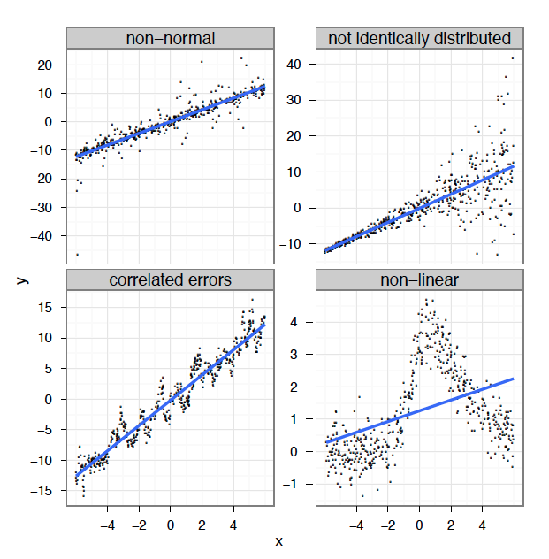

# Le modèle linéaire...et où il échoue

Qu'est-ce qu'un modèle linéaire ? La régression linéaire est ce que la
plupart des gens apprennent avant tout en statistiques et est parmi les
méthodes les plus performantes. Elle nous permet de modéliser une
variable réponse en fonction de facteurs prédictifs et d'une erreur
résiduelle. Tel que vu dans l'atelier sur les [modèles
linéaires](https://github.com/QCBSRworkshops/workshop04), la régression fait cependant
quatre suppositions importantes :

1.  l'erreur est distribuée normalement
2.  la variance des erreurs est constante
3.  chaque erreur est indépendante des autres (homoscédasticité)
4.  la réponse est linéaire: *y = β~0~ + β~1~x*

Il n'y a qu'une façon pour qu'un modèle linéaire soit correctement
appliqué :

{width="350"}

et pourtant tant de façons pour qu'il ne le soit pas :



Alors, comment résoudre ce problème ? Nous devons premièrement savoir ce
que le modèle de régression cherche à faire :

     * ajuster une ligne qui passe au milieu des données,
     * faire cela sans sur-ajuster les données, c'est-à-dire en passant une ligne entre chaque point.

Les modèles linéaires le font en trouvant la meilleure ligne droite qui
passe à travers les données. En revanche, les modèles additifs font cela
en ajustant une courbe à travers les données, mais tout en contrôlant le
degré de courbure de la ligne *(plus d'information sur cela plus bas)*.


# Introduction aux GAMs

Examinons un exemple. Premièrement, nous allons générer des données et
les représenter graphiquement.

```{r, echo = TRUE, eval = FALSE}
library(ggplot2)
set.seed(10)
n = 250
x = runif(n,0,5)
y_model = 3*x/(1+2*x)
y_obs = rnorm(n,y_model,0.1)
data_plot = qplot(x, y_obs) + 
            geom_line(aes(y=y_model)) + 
            theme_bw()
print(data_plot)
```

{width="350"}

Si nous modélisions cette relation par une régression linéaire, les
résultats ne respecteraient pas les suppositions énumérées ci-dessus.
Commençons par modéliser une régression en utilisant la méthode des
moindres carrés en utilisant la fonction `gam()` de la librairie `mgcv`
- donc en tant que modèle linéaire *(nous verrons plus bas comment
utiliser cette fonction pour spécifier un terme non linéaire).*

```{r, echo = TRUE, eval = FALSE}
library(mgcv)
linear_model = gam(y_obs~x)
model_summary=summary(linear_model)
print(model_summary)
data_plot = data_plot+
             geom_line(colour="red",
             aes(y=fitted(linear_model)))
print(data_plot)
```

Nous pouvons constater à partir du sommaire que notre modèle linéaire
explique une grande partie de la variance (*R^2^~adj~* = 0.639).
Toutefois, les graphiques de diagnostic des résidus du modèle montrent
que l'écart type ne suit pas une distribution normale et que la
variance n'est pas homoscédastique. De plus, il reste un patron
non-linéaire important. Essayons maintenant de résoudre ce problème en
ajustant les données avec un terme non linéaire.

Nous reviendrons sur ceci un peu plus tard, mais brièvement, les GAMs
sont une forme non paramétrique de la régression où le
*βx~i~* d'une régression linéaire est remplacé par une
fonction de lissage des variables explicatives, *f(x~i~)*, et le modèle
devient :

$$y_i = f(x_i) + ε_i$$

où *y~i~* est la variable réponse, *x~i~* est la covariable, et *f* est la
fonction lissage.

Étant donné que la fonction de lissage *f(x~i~)* est non linéaire et
locale, l'ampleur de l'effet de la variable explicative peut varier en
fonction de la relation entre la variable et la réponse. Autrement dit,
contrairement à un coefficient fixe *βx~i~*, la fonction *f*
peut changer tout au long du gradient *x~i~*. Le degré de lissage de *f*
est contrôlée en utilisant une régression pénalisée qui est déterminée
automatiquement à l'aide d'une méthode de validation croisée
généralisée (GCV) de la librairie `mgcv` (Wood 2006).

Avec `gam()` les termes non linéaires sont spécifiés par des expressions
de la forme: `s(x)`.

```{r, echo = TRUE, eval = FALSE}
gam_model = gam(y_obs~s(x))
summary(gam_model)
data_plot = data_plot +  
     geom_line(colour="blue",aes(y=fitted(gam_model)))
print(data_plot)
```

La variance expliquée par notre modèle a augmenté de 20% (*R^2^~adj~* =
0.859) et quand on compare l'ajustement du modèle linéaire (rouge) au
modèle non-linéaire (bleu), il est clair que l'ajustement de ce dernier
est relativement meilleur.

{width="350"}

La librairie `mgcv` comprend également une fonction `plot` qui, par
défaut, nous permet de visualiser la non-linéarité du modèle.

```{r, echo = TRUE, eval = FALSE}
plot(gam_model)
```

Comment utilisons-nous les GAMs pour savoir si un modèle linéaire est
suffisant pour modéliser nos données ? Nous pouvons utiliser les
fonctions `gam()` et `anova()` pour tester formellement si une hypothèse
de linéarité est justifiée. Nous devons simplement le configurer de
sorte que notre modèle non-linéaire est emboîté dans notre modèle
linéaire; c'est à dire, nous devons créer un objet qui inclut à la fois
`x` (linéaire) et `s(x)` (non-linéaire). En utilisant la fonction
`anova()`, on vérifie si l'ajout de `s(x)` au modèle avec seulement `x`
comme covariable est justifié par les données.

```{r, echo = TRUE, eval = FALSE}
linear_model = gam(y_obs~x)
nested_gam_model = gam(y_obs~s(x)+x)
print(anova(linear_model, nested_gam_model, test="Chisq"))
```

Le terme non linéaire est significatif:

     Analysis of Deviance Table
     Model 1: y_obs ~ x
     Model 2: y_obs ~ s(x) + x
           Resid. Df    Resid. Dev     Df        Deviance    Pr(>Chi)    
     1    248.00        6.5846                              
     2    240.68        2.4988         7.3168    4.0858      < 2.2e-16 ***
     ---
     Signif. codes:  0 ‘***’ 0.001 ‘**’ 0.01 ‘*’ 0.05 ‘.’ 0.1 ‘ ’ 1


## DÉFI 1

Nous allons maintenant essayer cela avec d'autres données générées
aléatoirement. Nous allons d'abord générer les données. Ensuite, nous
allons ajuster un modèle linéaire et un GAM à la relation entre `x_test`
et `y_test_obs`. Quels sont les degrés de libertés effectifs du terme
non-linéaire ? Déterminez si l'hypothèse de linéarité est justifiée
pour ces données.

```{r, echo = TRUE, eval = FALSE}
n <- 250
x_test <- runif(n,-5,5)
y_test_fit <- 4*dnorm(x_test)
y_test_obs <- rnorm(n,y_test_fit, 0.2)
```

### Réponse au défi 1

```{r, echo = TRUE, eval = FALSE}
data_plot <- qplot(x_test, y_test_obs) + 
  geom_line(aes(y=y_test_fit))+
  theme_bw()
print(data_plot)

linear_model_test <- gam(y_test_obs~x_test)
nested_gam_model_test <- gam(y_test_obs~s(x_test)+x_test)
print(anova(linear_model_test, nested_gam_model_test, test="Chisq"))

summary(nested_gam_model_test)$s.table
```

    Analysis of Deviance Table


    Model 1: y_test_obs ~ x_test
    Model 2: y_test_obs ~ s(x_test) + x_test
         Resid. Df   Resid. Dev    Df      Deviance   Pr(>Chi)    
    1     248.0      81.09                              
    2     240.5      7.46          7.5012   73.629    < 2.2e-16 ***
    ---
    Signif. codes:  0 ‘***’ 0.001 ‘**’ 0.01 ‘*’ 0.05 ‘.’ 0.1 ‘ ’ 1

                   edf   Ref.df        F p-value
    s(x_test) 7.602145 8.029057 294.0944       0

Réponse: Oui la non-linéarité est justifiée. Les degrés de libertés
effectifs (edf) sont \>\> 1.

{width="350"}