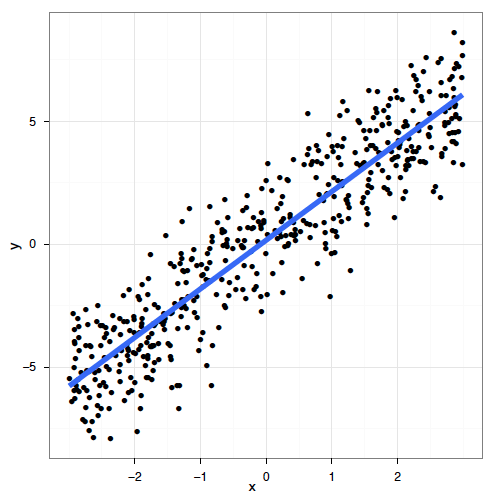

# Le modèle linéaire... et où il échoue {#intro-linear-models}

```{r, eval=TRUE,echo = FALSE}
library(ggplot2, quietly = TRUE)
library(mgcv, quietly = TRUE)
```

Que veut-on dire par "modèle linéaire"? La régression est la base des
statistiques. La régression linéaire est ce que la plupart des gens apprennent avant tout en statistiques et est parmi les méthodes les plus performantes. Elle nous permet de modéliser une variable réponse en fonction de facteurs prédictifs et d'une erreur résiduelle.

Comme on a vu dans l'[Atelier 4: Modèles linéaires](https://r.qcbs.ca/workshops/r-workshop-04/), le modèle linéaire fait quatre suppositions importantes :

1. Relation linéaire entre les variables de réponse et les variables prédicteurs:  $$y_i = \beta_0 + \beta_1 \times x_i + \epsilon_i$$
2. L'erreur est distribuée normalement: $$\epsilon_i \sim \mathcal{N}(0,\,\sigma^2)$$
3. La variance des erreurs est constante
4. Chaque erreur est indépendante des autres (homoscédasticité)

Un modèle linéaire peut parfois s'adapter à certains types de réponses non linéaires (par exemple $x^2$), mais cette approche repose fortement sur des décisions qui peuvent être soit arbitraires, soit bien informées, et est beaucoup moins flexible que l'utilisation d'un modèle additif. Par exemple, ce modèle linéaire à prédicteurs multiples peut traiter une réponse non linéaire, mais devient rapidement difficile à interpréter et à maîtriser:

$$y_i = \beta_0 + \beta_1x_{1,i}+\beta_2x_{2,i}+\beta_3x_{3,i}+...+\beta_kx_{k,i} + \epsilon_i$$

Les modèles linéaires fonctionnent très bien dans certains cas spécifiques où tous ces critères sont respectés:

 

Dans la réalité, il est souvent impossible de respecter ces critères. Cela signifie que, dans de nombreux cas, les modèles linéaires sont inappropriés:


Alors, comment résoudre ce problème ? Pour répondre à cette question, nous devons d'abord considérer ce que le modèle de régression tente de faire. Un modèle linéaire essaye d'ajuster la __meilleure droite__ qui passe au milieu des données _sans __sur-ajuster___ les données, ce qui se produirait si nous tracions simplement une ligne entre chaque point et ses voisins. 

En revanche, les modèles additifs (GAM) ajustent une fonction de lissage non-linéaire à travers les données, tout en contrôlant le __degré de courbure__ de la ligne our éviter un ajustement excessif. Les modèles additifs peuvent donc capturer des relations non linéaires en ajustant une fonction lisse à travers les données, plutôt qu'une ligne droite. Nous reviendrons plus tard sur le __degré de courbure__ de la ligne!

# Introduction aux GAMs

Utilisons un exemple pour démontrer la différence entre une régression linéaire et un modèle additif.

Nous allons utiliser le jeu de données `ISIT`. Ce jeu de donnée comporte des mesures de bioluminescence en relation à la profondeur (*depth*), la station de rechercher et la saison (*Season*).

```{r}
isit <- read.csv("data/ISIT.csv")
head(isit)
```

Prenons que les données de la deuxième saison pour l'instant:

```{r, echo = TRUE}
isit2 <- subset(isit, Season==2)
```

Commençons par essayer d'ajuster un modèle de régression linéaire à la relation entre `Sources` et `SampleDepth`. Nous pouvons utiliser la commande `gam()` de la librairie `mgcv` pour modéliser une régression par les moindres carrés. Nous verrons plus loin comment utiliser `gam()` pour spécifier un terme lissé et non linéaire.

```{r}
linear_model <- gam(Sources ~ SampleDepth, data = isit2)
summary(linear_model)
```

Le modèle linéaire explique une bonne partie de la variance de notre jeu de données ($R_{adj}$ = 0.588), ce qui veut dire que notre modèle est super bon, non? Voyons comment notre modèle cadre avec les données:

```{r}
data_plot <- ggplot(data = isit2, aes(y = Sources, x = SampleDepth)) + 
  geom_point() +
  geom_line(aes(y = fitted(linear_model)),
            colour = "red", size = 1.2) + 
  theme_bw()
data_plot
```

Les suppositions de la régression linéaire énumérées dans le [Chapitre 4](#intro-linear-models) sont-elles satisfaites dans ce cas? Comme vous l'avez peut-être remarqué, nous ne respectons pas les conditions du modèle linéaire:

1.  Il existe une forte relation _non linéaire_ entre `Sources` et `SampleDepth`.
2.  L'erreur n'est _pas_ normalement distribuée.
3.  La variance de l'erreur n'est _pas_ homoscédastique.
4.  Les erreurs ne sont _pas_ indépendantes les unes des autres.

Comme nous l'avons brièvement mentionné au [Chapitre 2](#intro-linear-models), nous pouvons spécifier manuellement un modèle linéaire avec plusieurs variables prédicteurs pour essayer de prendre en compte cette réponse non linéaire. Par exemple, nous pourrions essayer de construire ce modèle linéaire avec plusieurs prédicteurs:

$$y_i = \beta_0 + \beta_1(x_{1,i}) + \beta_2(x_{2,i}) + ... + \epsilon$$
Cependant, l'ajustement de ce modèle serait déterminé manuellement sur la base de décisions prises lors de la modélisation, et deviendrait rapidement difficile à utiliser. Un des grands avantages d'utiliser un GAM est que la forme optimale de la non-linéarité, i.e. **le degré de lissage** de $f(x)$ est contrôlée en utilisant une régression pénalisée qui est déterminée automatiquement est déterminée automatiquement selon la méthode d'ajustement (généralement le *maximum de vraisemblance* ou *maximum likelihood*).


:::explanation

Nous reviendrons sur ceci un peu plus tard, mais brièvement, les GAMs
sont une forme non paramétrique de la régression où le
$\beta x_i$ d'une régression linéaire est remplacé par une
fonction de lissage des variables explicatives, $f(x_i)$, et le modèle
devient :

$$y_i = f(x_i) + \epsilon_i$$

où $y_i$ est la variable réponse, $x_i$ est la covariable, et $f$ est la
fonction lissage.

Étant donné que la fonction de lissage $f(x_i)$ est non linéaire et
locale, l'ampleur de l'effet de la variable explicative peut varier en
fonction de la relation entre la variable et la réponse. Autrement dit,
contrairement à un coefficient fixe $\beta x_i$, la fonction $f$
peut changer tout au long du gradient $x_i$. Le degré de lissage de $f$
est contrôlée en utilisant une régression pénalisée qui est déterminée
automatiquement à l'aide d'une méthode de validation croisée
généralisée (GCV) de la librairie `mgcv` [@wood_2006].
:::

Nous pouvons essayer de construire un modèle plus approprié en ajustant les données avec un terme lissé (non-linéaire). Dans `mgcv::gam()`, les termes lissés sont spécifiés par des expressions de la forme `s(x)`, où $x$ est la variable prédictive non linéaire que nous voulons lisser. Dans ce cas, nous voulons appliquer une fonction de lissage à `SampleDepth`.

```{r}
gam_model <- gam(Sources ~ s(SampleDepth), data = isit2)
summary(gam_model)
```

La variance expliquée par notre modèle a augmenté de plus de 20% ($R_{adj}$ = 0.81)! Lorsque nous comparons l'ajustement des modèles linéaire (rouge) et non linéaire (bleu), il est clair que ce dernier cadre mieux avec nos données:

```{r}
data_plot <- data_plot +
     geom_line(aes(y = fitted(gam_model)),
               colour = "blue", size = 1.2)
data_plot
```

:::explanation

Rappel: Contrairement à un coefficient fixe $\beta$, la fonction de lissage peut changer tout au long du gradient $x$.

:::

La librairie `mgcv` comprend également une fonction `plot` qui, par
défaut, nous permet de visualiser la non-linéarité du modèle.

```{r, echo = TRUE, eval = FALSE}
plot(gam_model)
```

## Test de linéarité

Comment tester si le modèle non linéaire offre une amélioration significative par rapport au modèle linéaire?

On peut utiliser `gam()` et `AIC()` pour tester si une supposition de linéarité est justifiée. Pour ceci, on peut comparer la performance d'un modèle linéaire contenant `x` comme prédicteur linéaire à la performance d'un modèle non linéaire contenant `s(x)` comme prédicteur lisse. En d'autres termes, on demande si l'ajout d'une fonction lisse au modèle linéaire améliore l'ajustement du modèle à nos données.
Comment utilisons-nous les GAMs pour savoir si un modèle linéaire est
suffisant pour modéliser nos données? 

```{r}
linear_model <- gam(Sources ~ SampleDepth, data = isit2)
smooth_model <- gam(Sources ~ s(SampleDepth), data = isit2)
AIC(linear_model, smooth_model)
```

Ici, l'AIC du GAM lissé est plus bas, ce qui indique que l'ajout d'une fonction de lissage améliore la performance du modèle. La linéarité n'est donc pas soutenue par nos données.

:::explanation
Pour expliquer brièvement, le critère d'information d'Akaike (AIC) est une mesure comparative de la performance d'un modèle, où des valeurs plus basses indiquent qu'un modèle est "plus performant" par rapport aux autres modèles considérés. 
:::

## Défi 1

Essayons maintenant de déterminer si les données enregistrées lors de la première saison doivent être modélisées par une régression linéaire ou par un modèle additif. Répétons le test de comparaison avec `gam()` et `AIC()` en utilisant les données de la première saison seulement:

```{r}
isit1 <- subset(isit, Season == 1)
```

1. Ajustez un modèle linéaire et un GAM à la relation entre `Sources` et `SampleDepth`.
2. Déterminez si l'hypothèse de linéarité est justifiée pour ces données.
3. Quels sont les degrés de liberté effectifs du terme non-linéaire?

:::explanation
Nous n'avons pas encore discuté des degrés de liberté effectifs (**EDF**), mais ils sont un outil clé pour nous aider à interpréter l'ajustement d'un GAM. Gardez ce terme en tête. Plus sur ce sujet dans les prochaines sections!
:::

### Défi 1: Solution

__1.__ Ajustez un modèle linéaire et un GAM à la relation entre `Sources` et `SampleDepth`.

```{r}
linear_model_s1 <- gam(Sources ~ SampleDepth, data = isit1)
smooth_model_s1 <- gam(Sources ~ s(SampleDepth), data = isit1)
```

__2.__ Déterminez si l'hypothèse de linéarité est justifiée pour ces données.

Comme ci-dessus, la visualisation de la courbe du modèle sur notre ensemble de données est une excellente première étape pour déterminer si notre modèle est bien conçu.

```{r}
ggplot(isit1, aes(x = SampleDepth, y = Sources)) +
  geom_point() +
  geom_line(colour = "red", size = 1.2,
            aes(y = fitted(linear_model_s1))) +
  geom_line(colour = "blue", size = 1.2,
            aes(y = fitted(smooth_model_s1))) +
  theme_bw()
```

On peut compléter cela par une comparaison quantitative des performances du modèle en utilisant `AIC()`.

```{r}
AIC(linear_model_s1, smooth_model_s1)
```

Le score AIC moins élevé indique que le modèle lissé est plus performant que le modèle linéaire, ce qui confirme que la linéarité n'est pas appropriée pour notre ensemble de données. 

__3.__ Quels sont les degrés de liberté effectifs du terme non-linéaire?

Pour obtenir les degrés de liberté effectifs, il suffit d'imprimer notre objet du modèle:

```{r}
smooth_model_s1
```

Les degrés de liberté effectifs (EDF) sont >> 1. Gardez cela à l'esprit, car nous reviendrons bientôt sur ceux-ci!
