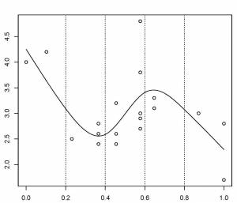

# Le fonctionnement des GAMs {#fonctionnement}

Nous allons maintenant prendre quelques minutes pour regarder comment fonctionnent les GAMs. Commençons en considérant d'abord un modèle qui contient une fonction lisse $f$ d'une covariable, $x$ :

$$y_i = f(x_i) + \epsilon_i$$

Pour estimer la fonction $f$, nous avons besoin de représenter l'équation ci-dessus de manière à ce qu'elle devienne un modèle linéaire. Cela peut être fait en définissant des fonctions de base, $b_j(x)$, dont est composée $f$ :

$$f(x) = \sum_{j=1}^q b_j(x) \times \beta_j$$

## Exemple: une base polynomiale

Supposons que $f$ est considérée comme un polynôme d'ordre 4, de sorte que l'espace des polynômes d'ordre 4 et moins contient $f$. Une base de cet espace serait alors :

$$b_0(x)=1 \ , \quad b_1(x)=x \ , \quad b_2(x)=x^2 \ , \quad b_3(x)=x^3 \ , \quad b_4(x)=x^4$$

Alors $f(x)$ devient :

$$f(x) = \beta_0 + x\beta_1 +  x^2\beta_2 + x^3\beta_3 + x^4\beta_4$$

.. et le modèle complet devient :

$$y_i = \beta_0 + x_i\beta_1 +  x^2_i\beta_2 + x^3_i\beta_3 + x^4_i\beta_4 + \epsilon_i$$

Chaque fonction de base est multipliée par un paramètre à valeur réelle, $\beta_j$, et est ensuite additionnée pour donner la courbe finale $f(x)$.

En faisant varier le coefficient $\beta_j$, on peut faire varier la forme de $f(x)$ pour produire une fonction polynomiale d'ordre 4 ou moins.

## Exemple: une base de spline cubique

Un spline cubique est une courbe construite à partir de sections d'un polynôme cubique reliées entre elles de sorte qu'elles sont continues en valeur. Chaque section du spline a des coefficients différents.

Voici une représentation d'une fonction lisse utilisant une base de régression spline cubique de rang 5 avec des nœuds situés à incréments de 0.2:

Dans cet exemple, les nœuds sont espacés uniformément à travers la gamme des valeurs observées de x. Le choix du degré de finesse du modèle est pré-déterminé par le nombre de nœuds, qui était arbitraire.

:::puzzle
Y a-t-il une meilleure façon de sélectionner les emplacements des nœuds?
:::

### Contrôler le degré de lissage avec des splines de régression pénalisés

Au lieu de contrôler le lissage (donc, la non linéarité de la courbe) en modifiant le nombre de nœuds, nous gardons celui-ci fixé à une taille un peu plus grande que raisonnablement nécessaire et on contrôle le lissage du modèle en ajoutant une pénalité sur le niveau de courbure. Donc, plutôt que d'ajuster le modèle en minimisant (comme avec la méthode des moindres carrés) :

$$||y - XB||^{2}$$

Le modèle peut être ajusté en minimisant :

$$||y - XB||^{2} + \lambda \int_0^1[f^{''}(x)]^2dx$$

Quand $\lambda$ tend vers $\infty$, le modèle devient linéaire.

Si $\lambda$ est trop élevé, les données seront trop lissées et si elle est trop faible, les données ne seront pas assez lissées. Idéalement, il serait bon de choisir une valeur $\lambda$ de sorte que le $\hat{f}$ prédit est aussi proche que possible du $f$ observé. Un critère approprié pourrait être de choisir $\lambda$ pour minimiser :

$$M = 1/n \times \sum_{i=1}^n (\hat{f_i} - f_i)^2$$

Étant donné que $f$ est inconnue, $M$ doit être estimé. Les méthodes recommandées pour ce faire sont le maximum de vraisemblance (maximum likelihood, *ML*) ou l'estimation par maximum de vraisemblance restreint (restricted maximum likelihood, *REML*). La validation croisée généralisée (*GCV*) est une autre possibilité. Il s'agit d'une technique qui élimine tour à tour chaque donnée des données et considère la capacité prédictive moyenne des modèles adaptés aux données restantes pour prédire la donnée éliminée. Pour plus de détails sur ces méthodes, voir [@wood_2006].

:::explanation
__Le principe de validation croisée__

Dans le premier panneau, la courbe correspond à un ajustement faible par
rapport aux données et ne fait pas mieux avec le point manquant. Dans le
troisième panneau, la courbe ajuste le bruit aussi bien que le signal et
la variabilité supplémentaire induite l'amène à prédire la donnée
manquante plutôt mal. Dans le deuxième panneau, cependant, nous voyons
que l'ajustement de la courbe du signal sous-jacent est très bien, le
lissage passe à travers le bruit et la donnée manquante est
raisonnablement bien prédite.

Dans le premier panneau, $\lambda$ est trop élevé, et la courbe est trop lissée. Ici, la courbe est mal ajustée aux données et prédit donc très difficilement le point manquant. 

Dans le troisième panneau, $\lambda$ est trop élevé, et la courbe est surajustée. Ici, la courbe s'ajuste très étroitement aux données, suivant le signal aussi bien que le bruit qui l'entoure. L'influence de cette variabilité supplémentaire (non informative) fait que le modèle prédit difficilement la donnée manquante. 

Dans le deuxième panneau, $\lambda$ est à peu près parfait. La courbe s'ajuste assez bien au signal sous-jacent, tout en lissant le bruit. La donnée manquante est raisonnablement bien prédite.
:::
