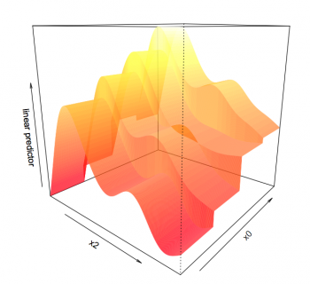
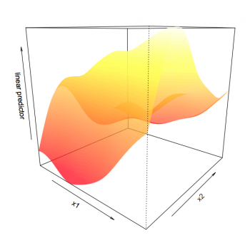

# Interactions

Il y a deux façons de modéliser une interaction entre deux variables:

-   si une variable est quantitative et l'autre est qualitative, on
    utilise l'argument `by` &#8594; `s(x, by=facteur)`,
-   si les deux variables sont quantitatives, on inclut les deux termes
    sous une même fonction non linéaire &#8594; `s(x1, x2)`.

L'argument `by` permet de faire varier un terme non linéaire selon les
différents niveaux d'un facteur. Nous allons examiner ceci en utilisant
notre variable qualitative `x0` et examiner si la non-linérité de
`s(x2)` varie selon les différents niveaux de `x0`. Pour déterminer si
les courbes diffèrent significativement entre les niveaux du facteur,
nous allons utiliser une ANOVA sur l'interaction.

```{r, echo = TRUE, eval = FALSE}
categorical_interact <- gam(y~x0+s(x1)+s(x2,by=x0),data=gam_data)
categorical_interact_summary <- summary(categorical_interact)
print(categorical_interact_summary$s.table)
plot(categorical_interact,page=1)
# ou nous pouvons utiliser la fonction vis.gam où theta représente la rotation du plan x-y
vis.gam(categorical_interact,view=c("x2","x0"),theta=40,n.grid=500,border=NA) 
anova(two_smooth_model, categorical_interact,test="Chisq")
```

{width="350"}

Nous pouvons constater à partir du graphique que les formes des termes
non linéaires sont comparables entre les quatre niveaux de `x0`.
L'ANOVA le confirme également (déviance = 98,6, *p* = 0,2347).

Ensuite, nous allons examiner l'interaction non linéaire entre deux
termes quantitatifs, `x1` et `x2`. Cette fois-ci, l'argument `by` est
supprimé.

```{r, echo = TRUE, eval = FALSE}
smooth_interact <- gam(y~x0+s(x1,x2),data=gam_data)
smooth_interact_summary <- summary(smooth_interact)
print(smooth_interact_summary$s.table)
plot(smooth_interact,page=1,scheme=3)
# plot(smooth_interact,page=1,scheme=1) donne un graphique comparable à vis.gam()
vis.gam(smooth_interact,view=c("x1","x2"),theta=40,n.grid=500,border=NA) 
anova(two_smooth_model,smooth_interact,test="Chisq")
```

{width="350"}

L'interaction entre `s(x1)` et `s(x2)` est significative et le
graphique en deux dimensions illustre très bien cette interaction non
linéaire. La relation entre y et x1 change en fonction de la valeur de
`x2`. Vous pouvez changez la valeur de l'argument `theta` pour tourner
l'axe du graphique. Si vous prévoyez exécuter un grand nombre de
graphiques, supprimez l'argument `n.grid = 500`, car ceci fait appel à
des calculs intensifs et ralentit R.
