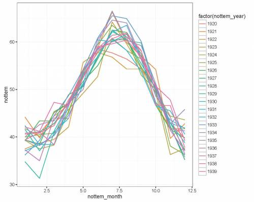
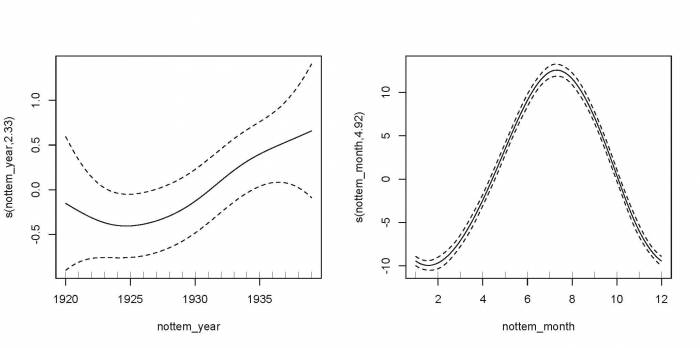

# (PART\*) Concepts Avancés {-}

# Changer la fonction de base

Sans entrer dans le détail, sachez qu'il est possible de modifier le
modèle de base que nous avons vu avec :

-   des fonctions plus complexes en modifiant la fonction de base (par
    exemple, cyclique),
-   d'autres distributions : tout ce que vous pouvez faire avec un GLM
    (tel que spécifier l'argument `family`) est possible avec les GAMs,
-   des modèles à effets mixtes en utilisant la fonction `gamm` ou la
    fonction `gamm4` de la librairie `gamm4`.

Nous allons d'abord jeter un coup d'œil au changement de la fonction de
base puis une introduction rapide aux autres distributions et les GAMMs
(modèles additifs généralisés à effets mixtes) suivra. Commençons par
regarder un cas où modifier la fonction de base peut être utile, soit
avec des données cycliques.

Imaginez que vous avez une série temporelle de données climatiques,
divisées en mesures mensuelles, et que vous voulez déterminer s'il y a
une tendance de température annuelle. Nous allons utiliser la série
temporelle de température de Nottingham pour cette section :

```{r, echo = TRUE, eval = FALSE}
data(nottem)
n_years <- length(nottem)/12
nottem_month <- rep(1:12, times=n_years)
nottem_year <- rep(1920:(1920+n_years-1),each=12)
nottem_plot <- qplot(nottem_month,nottem, 
                    colour=factor(nottem_year), 
                    geom="line") + theme_bw()
print(nottem_plot)
```

En utilisant les données nottem, nous avons créé trois nouveaux
vecteurs ; `n_years` correspond au nombre d'années de données (20 ans),
`nottem_month` est un codage qualitatif pour les 12 mois de l'année,
pour chaque année échantillonnée (série de 1 à 12, répétée 20 fois) et
`nottem_year` est une variable où l'année correspondant à chaque mois
est fournie.

Données mensuelles des années 1920 à 1940:

{width="500"}

Pour modéliser cela, nous devons utiliser ce qu'on appelle un spline
cubique cyclique, ou `"cc"`, pour modéliser les effets du mois et de
l'année.

```{r, echo = TRUE, eval = FALSE}
year_gam <- gam(nottem~s(nottem_year)+s(nottem_month, bs="cc"))
summary(year_gam)$s.table
plot(year_gam,page=1, scale=0)
```

{width="700"}

Il y a une hausse d'environ 1 - 1,5ºC au cours de la série, mais au
cours d'une année, il y a une variation d'environ 20ºC. Les données
réelles varient autour de ces valeurs prédites et ceci représente donc
la variance inexpliquée. Ici, nous pouvons voir l'un des avantages très
intéressants de l'utilisation des GAMs. Nous pouvons soit tracer la
surface réponse (valeurs prédites) ou les termes (contribution de chaque
covariable) tel qu'indiqué ci-haut. Vous pouvez imaginer ce dernier en
tant qu'une illustration de la variation des coefficients de régression
et comment leur contribution (ou taille de leur effet) varie au fil du
temps. Dans le premier graphique, nous voyons que les contributions
positives de la température sont survenues après 1930.

Sur des échelles de temps plus longues, en utilisant par exemple des
données paléolimnologiques, d'autres ([Simpson & Anderson 2009;. Fig
3c](http://www.aslo.info/lo/toc/vol_54/issue_6_part_2/2529.pdf)) ont
utilisé des GAMs pour tracer la contribution (effet) de la température
sur la composition d'algues dans les lacs afin d'illustrer comment les
contributions significatives ont seulement eu lieu au cours de deux
périodes extrêmement froides (c'est-à-dire, la contribution est
importante lorsque les intervalles de confiance ne recoupent pas la
valeur de zéro à environ 300 et 100 ans AVJC). Cela a permis aux auteurs
de non seulement déterminer combien de variance est expliquée par la
température au cours des derniers siècles, mais aussi de repérer dans le
temps cet effet significatif. Si cela vous intéresse, le code pour
tracer soit la surface de réponse (`type = "response"`) ou les termes
(`type = "terms"`) est disponible ci-dessous. Lorsque les termes sont
sélectionnés, vous obtiendrez la même figure que celle ci-dessus.

Graphique de contribution vs réponse ajustée:

```{r, echo = TRUE, eval = FALSE}
pred<-predict(year_gam, type = "terms", se = TRUE)
I<-order(nottem_year)
plusCI<-I(pred$fit[,1] + 1.96*pred$se[,1])
minusCI<-I(pred$fit[,1] - 1.96*pred$se[,1])
xx <- c(nottem_year[I],rev(nottem_year[I]))
yy <- c(plusCI[I],rev(minusCI[I]))
plot(xx,yy,type="n",cex.axis=1.2)
polygon(xx,yy,col="light grey",border="light grey")
lines(nottem_year[I], pred$fit[,1][I],lty=1)
abline(h=0)
```
