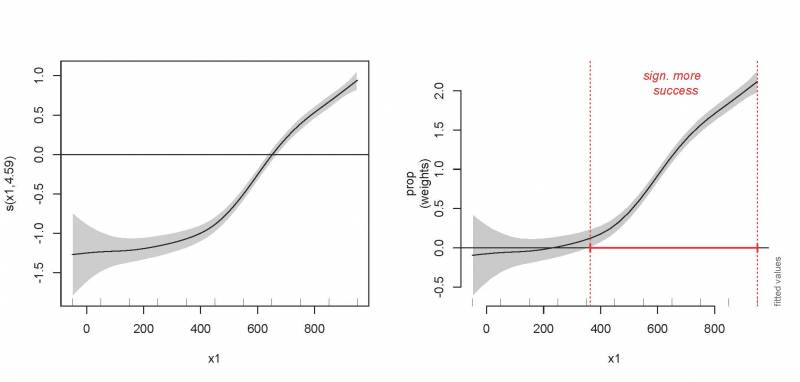

# Autres distributions

Pour vous donner un bref aperçu de l'utilisation des GAMs lorsque la
variable réponse ne suit pas une distribution normale ou que les données
sont des abondances ou proportions (par exemple, distribution Gamma,
binomiale, Poisson, binomiale négative), l'exemple qui suit utilise un
ensemble de données où une répartition binomiale sera nécessaire, y
compris une modélisation d'une relation non linéaire. La variable
réponse représente le nombre de succès (l'événement a eu lieu) en
fonction des défaillances au cours d'une expérience.

```{r, echo = TRUE, eval = FALSE}
gam_data3 <- read.csv("other_dist.csv")
summary(gam_data3)
str(gam_data3)
```

    'data.frame': 514 obs. of  4 variables:
     $ prop : num  1 1 1 1 0 1 1 1 1 1 ...
     $ total: int  4 20 20 18 18 18 20 20 20 20 ...
     $ x1   : int  550 650 750 850 950 650 750 850 950 550 ...
     $ fac  : Factor w/ 4 levels "f1","f2","f3",..: 1 1 1 1 1 1 1 1 1 1 ...

`prop` est la variable réponse, égal à la proportion de *succès /
(succès + échecs)*. Notez qu'il existe de nombreux cas où la proportion
est égal à 1 ou 0 qui indique que les résultats ont toujours été des
succès ou des échecs, respectivement, à ce moment mesuré durant
l'expérience.

`x1` est le temps écoulé depuis le début de l'expérience (variable
explicative).

`total` représente le nombre de *succès + échecs* observé au moment `x1`~i~
de l'expérience.

`fac` est un facteur qui code pour l'essai 1 à 4 de l'expérience (nous
n'utiliserons pas cette variable dans cette section).

Commençons par la visualisation des données. Nous sommes intéressés par
le nombre de succès par rapport aux échecs à mesure que `x1` augmente.
Étant donné qu'il y a des mesures répétées pour la valeur de `x1` (essais
1 à 4, avec nombreuses observations par essai), nous pouvons d'abord
présenter la proportion de succès en moyenne par boîte de temps (`x1`):

```{r, echo = TRUE, eval = FALSE}
emptyPlot(range(gam_data3$x1), c(0,1), h=.5,
          main="Probability of successes", ylab="Probability",xlab="x1")

avg <- aggregate(prop ~ x1, data=gam_data3, mean, na.rm=TRUE)
lines(avg$x1, avg$prop, col="orange",lwd=2)
```

{width="450"}

Notez comment la probabilité de succès augmente avec `x1`. D'après vous,
est-ce que cette tendance est linéaire ou non linéaire? Nous allons
tester cela en utilisant un GAM logistique (nous utilisons une
distribution `binomiale` puisque la variable réponse représente des
proportions).

```{r, echo = TRUE, eval = FALSE}
prop_model <- gam(prop~ s(x1), data=gam_data3, weights=total, family="binomial")
prop_summary <- summary(prop_model)
print(prop_summary$p.table)
print(prop_summary$s.table)

plot(prop_model)
```

                 Estimate  Std. Error  z value   Pr(>|z|)
    (Intercept)  1.173978  0.02709613  43.32641  0

            edf       Ref.df    Chi.sq     p-value
    s(x1)   4.591542  5.615235  798.9407   2.027751e-164

Qu'est-ce que l'ordonnée représente dans ce modèle?

-   Rappel : le modèle utilise le nombre de succès vs échecs pour
    calculer le *logit*, qui est le logarithme du rapport entre les
    succès et échecs:

\$$logit = log(\frac{N_{success}}{N_{failures}})$$

- Si succès = échecs, le rapport est de 1 et le logit est 0 (log (1) =
0).

- Si les succès ont un nombre plus grand que les échecs, le ratio est
supérieur à 1 et le logit a une valeur positive (par exemple, log(2) =
0,69).
- Si les succès ont un nombre plus petit que les échecs, le ratio est
inférieur à 1 et le logit a une valeur négative (par exemple, log(0,5) =
-0.69).

Donc, l'ordonnée est le *logit*, et indique s'il y a en moyenne plus
de succès que d'échecs. Ici, l'estimé est positif ce qui signifie,
qu'en moyenne, il n'y a plus de succès que d'échecs.

Qu'est-ce que le terme de lissage indique?

-   Ceci représente la façon dont les chances de succès vs échecs
    changent sur l'échelle de `x1` (l'échelle du temps dans cet
    exemple). Donc, puisque l'*edf > 1*, la proportion de succès
    augmente plus rapidement au fil du temps (si par exemple, la réponse
    représente le nombre d'individus de l'espèce A vs l'espèce B et
    que nous augmentons la concentration des nutriments au fil du temps,
    ces résultats indiqueront que l'espèce A est de plus en plus
    observée alors que les concentrations de nutriments approchent de
    l'optimum de cette espèce au cours de l'expérience).

## Visualiser la tendance au fil du temps

Enfin, nous allons voir les différentes façons de représenter ces
relations graphiquement.

```{r, echo = TRUE, eval = FALSE}
par(mfrow=c(1,2))
plot(prop_model, select=1, scale=0, shade=TRUE)
abline(h=0)

plot_smooth(prop_model, view="x1",main="")
(diff <- find_difference(out$fv$fit, out$fv$CI, xVals=out$fv$x1))
addInterval(0, lowVals=diff$start, highVals = diff$end, col='red', lwd=2)
abline(v=c(diff$start, diff$end), lty=3, col='red')
text(mean(c(diff$start, diff$end)), 2.1, "sign. more \n success", col='red', font=3)
```

{width="800"}

Quels renseignements ces graphiques nous apportent-ils vis à vis les
succès et échecs ?

-   Graphique de gauche : contribution (ou effet partiel si nous
    avions plus qu'une variable explicative) au fil du temps. La valeur
    logit augmente, donc les succès augmentent et les échecs diminuent.
-   Graphique de droite : valeurs ajustées, ordonnée incluse (somme
    des effets si nous avions plus d'une variable explicative dans le
    modèle). Nous voyons ici que la valeur logit est estimée près de
    zéro au début de l'expérience ; cela signifie qu'il y a des
    quantités égales de succès et d'échecs. Peu à peu, les succès
    augmentent et à environ `x1` = 400 il y a beaucoup plus de succès que
    d'échecs (l'effet est significativement différent de zéro). Nous
    avons également montré comment nous pouvons utiliser le graphique
    pour déterminer à quelle valeur de `x1` cela se produit.

Enfin, pour nous aider à interpréter les résultats, nous pouvons
re-transformer l'effet sur une échelle de proportions avec la fonction
`plot_smooth` de la librairie `itsadug`:

```{r, echo = TRUE, eval = FALSE}
par(mfrow=c(1,1))
plot_smooth(prop_model, view="x1", main="",
            transform=plogis, ylim=c(0,1))
abline(h=.5, v=diff$start, col='red', lty=2)
```

{width="450"}

Comme nous l'avons déjà vu avec le graphique précédent des valeurs
logits, nous voyons qu'à approximativement `x1` = 400 la proportion de
succès augmente de façon significative au-dessus de 0,5.
