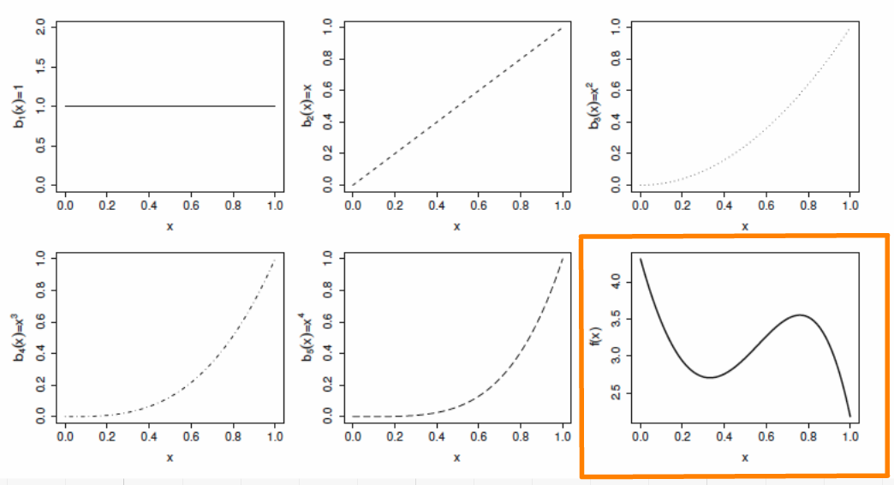
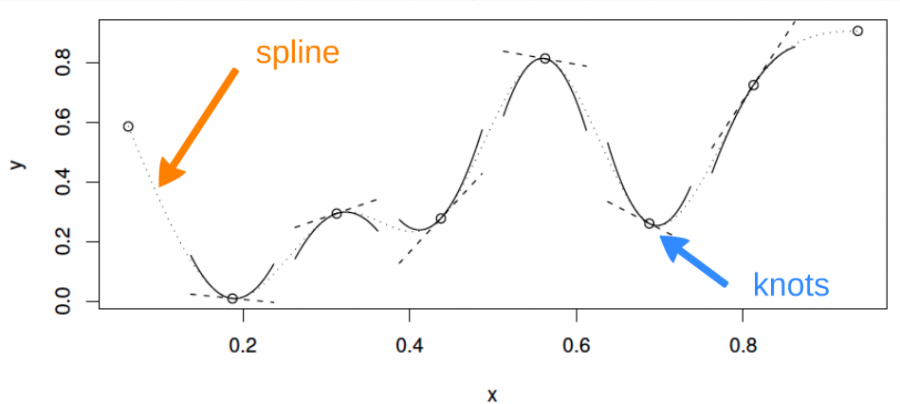
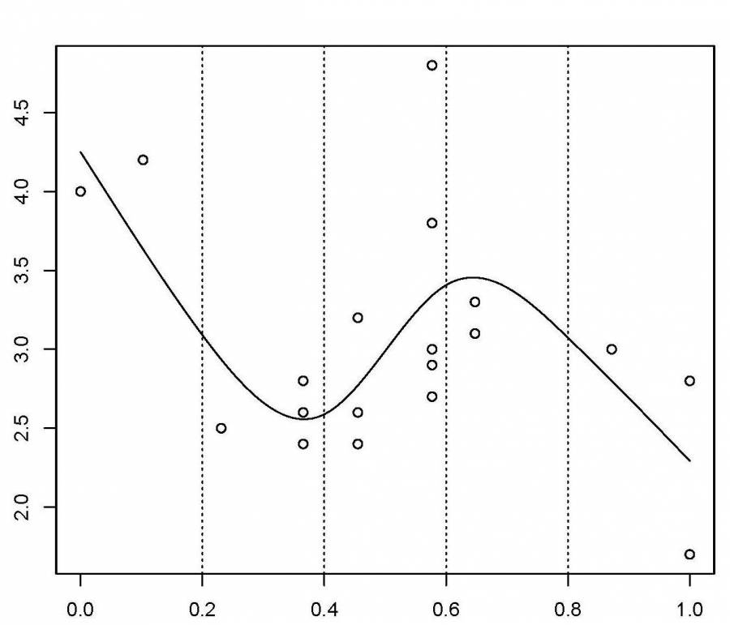
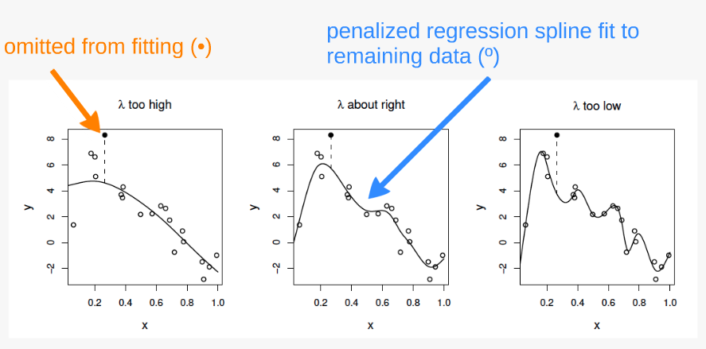
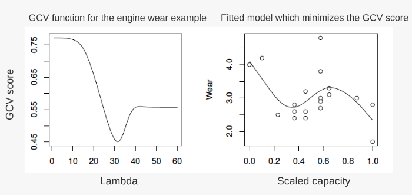

```{r setup, echo = FALSE}
knitr::opts_chunk$set(
  comment = "#",
  collapse = TRUE,
  warning = FALSE,
  message = FALSE,
  cache = FALSE,
  fig.width = 6, fig.height = 6,
  fig.retina = 3,
  fig.align = 'center'
)
options(repos = structure(c(CRAN="http://cran.r-project.org")))
```

```{r output-lines, echo = FALSE}
# Function to control the lines shown in code chunk outputs, to avoid overflow
# note: sometimes cache needs to be set to true in the knitr setup chunk for this to take effect in xaringan::infinite_moon_reader()
library(knitr)
hook_output <- knit_hooks$get("output")
knit_hooks$set(output = function(x, options) {
   lines <- options$output.lines
   if (is.null(lines)) {
     return(hook_output(x, options))  # pass to default hook
   }
   x <- unlist(strsplit(x, "\n"))
   more <- "..."
   if (length(lines)==1) {        # first n lines
     if (length(x) > lines) {
       # truncate the output, but add ....
       x <- c(head(x, lines), more)
     }
   } else {
     x <- c(more, x[lines], more)
   }
   # paste these lines together
   x <- paste(c(x, ""), collapse = "\n")
   hook_output(x, options)
 })
```

class: inverse, center, middle

```{r install_pkgs, message=FALSE, warning=FALSE, include=FALSE, results=0}
# Standard procedure to check and install packages and their dependencies, if needed.

list.of.packages <- c("ggplot2", "itsadug", "mgcv")

new.packages <- list.of.packages[!(list.of.packages %in% installed.packages()[,"Package"])]

if(length(new.packages) > 0) {
  install.packages(new.packages, dependencies = TRUE) 
  print(paste0("The following package was installed:", new.packages)) 
} else if(length(new.packages) == 0) {
    print("All packages were already installed previously")
}

# Load all required libraries at once
lapply(list.of.packages, require, character.only = TRUE, quietly = TRUE)
```

# About this workshop

[](https://r.qcbs.ca/workshop08/pres-en/workshop08-pres-en.html)    [](https://r.qcbs.ca/workshop08/book-en/workshop08-script-en.R) 
[](https://r.qcbs.ca/workshop08/book-en/index.html)
[](https://r.qcbs.ca/workshops/r-workshop-08/)
[](https://github.com/QCBSRworkshops/workshop08) 

---

# Required packages and datasets

For this workshop, we will be working with the following datasets:

* [ISIT.csv](https://r.qcbs.ca/workshop08/pres-en/data/ISIT.csv) 
* [other_dist.csv](https://r.qcbs.ca/workshop08/pres-en/data/other_dist.csv) 

<br>

You should also make sure you have downloaded, installed, and loaded the following packages:

* [ggplot2](https://cran.r-project.org/package=ggplot2)
* [itsadug](https://cran.r-project.org/package=itsadug)
* [mgcv](https://cran.r-project.org/package=mgcv)

<br>

```R
install.packages(c('ggplot2', 'itsadug', 'mgcv'))
```

---

# Prerequisites

To follow this workshop, we recommend:

+ Enough previous experience in R to run scripts and to examine data and R objects;
+ A basic knowledge of linear regression.

---

# Workshop overview

1. The linear model... and where it fails
2. Introduction to GAM
3. GAM with multiple smooth terms
4. Interactions
5. Generalization of the additive model
6. Changing basis
7. Quick intro to GAMM

---

# Learning objectives

1. Use the mgcv package to fit non-linear relationships,
2. Understand the output of a GAM to help you understand your data,
3. Use tests to determine if a non-linear model fits better than a linear one,
4. Include smooth interactions between variables,
5. Understand the idea of a basis function, and why it makes GAMs so powerful,
6. Account for dependence in data (autocorrelation, hierarchical structure) using GAMMs.

---
class: inverse, center, middle
# 1. The linear model

## ...and where it fails

---
# Linear regression

Regression is the workhorse of statistics. It allows us to model a response variable as a function of predictors plus error.

--

As we saw in the [linear models workshop](http://qcbs.ca/wiki/r_workshop4), a linear model is based on 4 major assumptions:

1. Linear relationship between response and predictor variables: $$y_i = \beta_0 + \beta_1 \times x_i + \epsilon_i$$
2. Normally distributed error: $$\epsilon_i \sim \mathcal{N}(0,\,\sigma^2)$$
3. Homogeneity of the variance
4. Independance of the errors

<br>

--

*Linear model with multiple predictors:*

$$y_i = \beta_0 + \beta_1x_{1,i}+\beta_2x_{2,i}+\beta_3x_{3,i}+...+\beta_kx_{k,i} + \epsilon_i$$

???
- A linear model can easily accomodate certain types of non-linear responses (e.g. $x^2$) but this approach strongly relies on (arbitrary or well-informed) choices, and is less flexible than using an additive model.

---
# Linear regression

There's only one way for the linear model to be right:

.center[

]


---
# Linear regression

And yet so many ways for it to fail:

.center[

]

---
# Linear regression

**What's the problem and do we fix it?**

A **linear model** tries to fit the best **straight line** that passes through the data, so it doesn't work well for all datasets.

In contrast, a **GAM** can capture complexe relationships by fitting a **non-linear smooth function** through the data, while controlling how wiggly the smooth can get (more on this later).

---
class: inverse, center, middle

## 2. Introduction to GAM

---
# Generalized Additive Models (GAM)

Let's look at an example. First, we will load the `ISIT` datasets.

```{r, eval = FALSE, echo = TRUE}
isit <- read.csv("data/ISIT.csv")
head(isit)
```

This datasets is comprised of bioluminescence levels (`Sources`) in relation to depth, seasons and different stations.
```{r, eval = TRUE, echo = FALSE}
isit <- read.csv("data/ISIT.csv")
```

For now, let's focus on Season 2.
```{r, eval=TRUE,echo = FALSE}
library(ggplot2)
library(mgcv)
```

```{r, eval=TRUE}
isit2 <- subset(isit, Season==2)
```

---
# GAM

Trying to fit `Sources` to `SampleDepth` as a linear regression model, we would violate the assumptions listed above.
```{r, eval=TRUE,echo = TRUE,fig.height=4.5}
linear_model <- gam(Sources ~ SampleDepth, data = isit2)
data_plot <- ggplot(isit2, aes(y = Sources, x = SampleDepth)) + geom_point() +
             geom_line(colour = "red", size = 1.2,aes(y = fitted(linear_model))) + theme_bw()
data_plot
```

---
exclude:true
# Generalized Additive Models (GAM)

Let's look at an example. First, we'll generate some data, and plot it.

```{r, eval = FALSE, echo = TRUE}
library(ggplot2)
set.seed(10)
n <- 250
x <- runif(n,0,5)
y_model <- 3*x/(1+2*x)
y_obs <- rnorm(n,y_model,0.1)
data_plot <- qplot(x, y_obs) +
  geom_line(aes(y=y_model)) +
  theme_bw()
data_plot
```

---
exclude:true
# GAM

```{r, eval = FALSE, echo = FALSE}
library(ggplot2)
set.seed(10)
n <- 250
x <- runif(n,0,5)
y_model <- 3*x/(1+2*x)
y_obs <- rnorm(n,y_model,0.1)
data_plot <- qplot(x, y_obs) +
  geom_line(aes(y=y_model)) +
  theme_bw()
data_plot
```

---
exclude:true
# GAM

Trying to fit these data as a linear regression model, we would violate the assumptions listed above.

```{r, eval=FALSE,echo = FALSE}
library(mgcv)
linear_model <- gam(y_obs ~ x)
model_summary <- summary(linear_model)
data_plot <- data_plot +
             geom_line(colour = "red", size = 1.2, aes(y = fitted(linear_model)))
data_plot
```

---
# GAM

**Relationship between the response variable and predictor variables**

One predictor variable:
$$y_i = \beta_0 + f(x_i) + \epsilon$$

Multiple predictor variables:
$$y_i = \beta_0 + f_1(x_{1,i}) + f_2(x_{2,i}) + ... + \epsilon$$

One big advantage of using a GAM over a manual specification of the model is that the optimal shape, i.e. *the degree of smoothness* of $f(x)$, is determined automatically depending on the fitting method (usually maximum likelihood).

???

- Strictly speaking, the equations are for a Gaussian GAM with identity link, which is also called "additive model" (without "generalized").

---
#GAM

Let's try to fit a model to the data using a smooth function `s()` with `mgcv::gam()`

```{r, eval = FALSE, echo = TRUE}
gam_model <- gam(Sources ~ s(SampleDepth), data = isit2)
```
--

```{r, eval=TRUE, echo = FALSE, output.lines = -c(1,4,5,6,11,12)}
gam_model <- gam(Sources ~ s(SampleDepth), data = isit2)
summary(gam_model)
```

---
# GAM

```{r, eval=TRUE,echo = FALSE}
data_plot <- data_plot +
     geom_line(colour = "blue", size = 1.2, 
               aes(y = fitted(gam_model)))
data_plot
```

Note: as opposed to one fixed coefficient, $\beta$ in linear regression, the smooth function can continually change over the range of the predictor $x$.

---
exclude:true
# GAM

Let's try to fit the data using a smooth function `s()` with `mgcv::gam()`


```{r, eval = FALSE}
library(mgcv)
gam_model <- gam(y_obs ~ s(x))
summary(gam_model)

data_plot <- data_plot +
     geom_line(colour = "blue", size = 1.2, 
               aes(y = fitted(gam_model)))
data_plot
```

---
exclude:true
# GAM

```{r, eval=FALSE, echo = FALSE}
gam_model <- gam(y_obs ~ s(x))
summary(gam_model)
```

---
exclude:true
# GAM

```{r, eval=FALSE,echo = FALSE}
data_plot <- data_plot +
     geom_line(colour = "blue", size = 1.2, 
               aes(y = fitted(gam_model)))
data_plot
```

.comment[Note: as opposed to one fixed coefficient, \beta in linear regression, the smooth function can continually change over the range of the predictor x]


---
# GAM

The `mgcv` package also includes a default plot to look at the smooths:

```{r}
plot(gam_model)
```

---
# Test for linearity using GAM

We can use `gam()` and `AIC()` to test whether an assumption of linearity is justified. To do so, we must simply set our smoothed model so that it is nested in our linear model.

```{r}
linear_model <- gam(Sources ~ SampleDepth, data = isit2) # fit a regular linear model using gam()
nested_gam_model <- gam(Sources ~ s(SampleDepth), data = isit2)
AIC(linear_model, nested_gam_model)
```

**AIC of the nested gam is lower, so linearity is not justified**

.comment[Note that the model `y ~ s(x)` is nested in the model `y ~ x`.]

---
exclude:true
# Test for linearity using GAM

We can use `gam()` and `anova()` to test whether an assumption of linearity is justified. To do so, we must simply set our smoothed model so that it is nested in our linear model.

```{r,eval=FALSE}
linear_model <- gam(y_obs ~ x) # fit a regular linear model using gam()
nested_gam_model <- gam(y_obs ~ s(x) + x)
anova(linear_model, nested_gam_model, test = "Chisq")
```

.comment[Note that the model `y_obs~s(x)` gives exactly the same results as `y_obs~s(x)+x`. We used the s(x)+x to illustrate the nestedness of the model, but the +x can be omitted.]

---
# Challenge 1 

We will now try this comparison test with the data recorded in the first season, just to get a handle on it.

```{r}
isit1 <- subset(isit, Season==1)
```

1. Fit a linear and smoothed GAM model to the relation between `SampleDepth` and `Sources`.
2. Determine if linearity is justified for this data.
3. How many effective degrees of freedom does the smoothed term have?


<!-- we didn't talk about **edf** before... -->
---
# Challenge 1 - Solution 

```{r,eval=TRUE}
linear_model_s1 <- gam(Sources ~ SampleDepth, data = isit1)
gam_model_s1 <- gam(Sources ~ s(SampleDepth), data = isit1)

```

---
# Challenge 1 - Solution 

```{r,echo=F}
ggplot(isit1,aes(x = SampleDepth, y = Sources)) +
  geom_point() +
  geom_line(colour = "red", size = 1.2,
            aes(y = fitted(linear_model_s1))) +
  geom_line(colour = "blue", size = 1.2,
            aes(y = fitted(gam_model_s1))) +
  theme_bw()
```

---
# Challenge 1 - Solution 

```{r}
linear_model_s1 <- gam(Sources ~ SampleDepth,data = isit1)
nested_gam_model_s1 <- gam(Sources ~ s(SampleDepth),data = isit1)

AIC(linear_model_s1, nested_gam_model_s1)
```


---
# Challenge 1 - Solution 

```{r}
nested_gam_model_s1
```

**Answer** Yes, non-linearity is justified. The effective degrees of freedom (**EDF**) are >> 1 (we'll get back to this soon).

---
exclude:true
# Challenge 1 

We will now try this comparison test with some new simulated data, just to get a handle on it.

```{r,eval=FALSE}
n <- 250
x_test <- runif(n, -5, 5)
y_test_fit <- 4 * dnorm(x_test)
y_test_obs <- rnorm(n, y_test_fit, 0.2)
```

1. Fit a linear and smoothed GAM model to the relation between `x_test` and `y_test_obs`.
2. Determine if linearity is justified for this data.
3. What is the estimated degrees of freedom of the smoothed term?


<!-- we didn't talk about **edf** before... -->

---
exclude:true
# Challenge 1 - Solution 

```{r,eval=FALSE}
linear_model_test <- gam(y_test_obs ~ x_test)
nested_gam_model_test <- gam(y_test_obs ~ s(x_test) + x_test)

anova(linear_model_test, nested_gam_model_test, test="Chisq")
```

---
exclude:true
# Challenge 1 - Solution 

```{r,eval=FALSE}
qplot(x_test, y_test_obs) +
  geom_line(aes(y = y_test_fit)) +
  theme_bw()
```

---
exclude:true
# Challenge 1 - Solution 

```{r,eval=FALSE}
nested_gam_model_test
```

**Answer** Yes non-linearity is justified. The estimated degrees of freedom (**edf**) are >> 1 (we'll get back to this soon).

---
# How GAMs work

We will now take a few minutes to look at what GAMs are doing behind the scenes. Let us first consider a simple model containing one smooth function $f$ of one covariate, $x$:

$$y_i = f(x_i) + \epsilon_i$$

To estimate the smooth function $f$, we need to represented the above equation in such a way that it becomes a linear model. This can be done by defining basis functions, $b_j(x)$, of which $f$ is composed:

$$f(x) = \sum_{j=1}^q b_j(x) \times \beta_j$$
---
# Example: a polynomial basis

Suppose that $f$ is believed to be a 4th order polynomial, so that the space of polynomials of order 4 and below contains $f$. A basis for this space would then be:

$$b_0(x)=1 \ , \quad b_1(x)=x \ , \quad b_2(x)=x^2 \ , \quad b_3(x)=x^3 \ , \quad b_4(x)=x^4$$

so that $f(x)$ becomes:

$$f(x) = \beta_0 + x\beta_1 +  x^2\beta_2 + x^3\beta_3 + x^4\beta_4$$

and the full model now becomes:

$$y_i = \beta_0 + x_i\beta_1 +  x^2_i\beta_2 + x^3_i\beta_3 + x^4_i\beta_4 + \epsilon_i$$
---
# Example: a polynomial basis


The basis functions are each multiplied by a real valued parameter, $\beta_j$, and are then summed to give the <font color="orange">final curve $f(x)$</font>.

.center[

]


By varying the $\beta_j$ we can vary the form of $f(x)$ to produce any polynomial function of order 4 or lower.

---
# Example: a cubic spline basis

A cubic spline is a curve constructed from sections of a cubic polynomial joined together so that they are continuous in value. Each section of cubic has different coefficients.

.center[

]

---
# Example: a cubic spline basis

Here is a representation of a smooth function using a rank 5 cubic spline basis with knot locations at increments of 0.2:

.center[

]

Here, the knots are evenly spaced through the range of observed x values. However, the choice of the degree of model smoothness is controlled by the the number of knots, which was arbitrary.

.comment[Is there a better way to select the knot locations?]

---
# Controlling the degree of smoothing with penalized regression splines

Instead of controlling smoothness by altering the number of knots, we keep that fixed to size a little larger than reasonably necessary, and control the model’s smoothness by adding a “wiggleness” penalty.

So, rather than fitting the model by minimizing (as with least squares regression):

$$||y - XB||^{2}$$

it can be fit by minimizing:

$$||y - XB||^{2} + \lambda \int_0^1[f^{''}(x)]^2dx$$

As $\lambda$ goes to infinity, the model becomes linear.

---
# Controlling the degree of smoothing with penalized regression splines

If $\lambda$ is too high then the data will be over smoothed, and if it is too low then the data will be under smoothed.

Ideally, it is best to choose $\lambda$ so that the predicted $\hat{f}$ is as close as possible to $f$. A suitable criterion might be to choose $\lambda$ to minimize:

$$M = 1/n \times \sum_{i=1}^n (\hat{f_i} - f_i)^2$$

Since $f$ is unknown, $M$ must be estimated. The recommend methods for this are maximum likelihood (*ML*) or restricted maximum likelihood estimation (*REML*). Generalized cross validation (*GCV*) is another possibility.

---
exclude:true
# The principle behind cross validation

.center[

]

1. fits many of the data poorly and does no better with the missing point.


2. fits the underlying signal quite well, smoothing through the noise and the missing datum is reasonably well predicted.


3. fits the noise as well as the signal and the extra variability induced causes it to predict the missing datum rather poorly.


---
exclude:true
# Principle behind cross validation

.center[

]


---

class: inverse, center, middle

## 3. GAM with multiple smooth terms

---
# GAM with multiple variables

GAMs make it easy to include both smooth and linear terms, multiple smoothed terms, and smoothed interactions.

For this section, we will use the `ISIT` data again.

```{r,eval=FALSE}
head(isit)
isit$Season <- as.factor(isit$Season)
```

We will try to model the response `Sources` using the predictors `Season` and `SampleDepth` simultaneously.

.comment[`Season` needs to be converted into a factor] 

---
# GAM with multiple variables

Let us start with a basic model, with one smoothed term (`SampleDepth`) and one categorical predictor (`Season`, which has 2 levels).
```{r,eval=TRUE,echo=FALSE}
isit$Season <- as.factor(isit$Season)
```

```{r}
isit$Season <- as.factor(isit$Season)
basic_model <- gam(Sources ~ Season + s(SampleDepth), data = isit, method = "REML")
basic_summary <- summary(basic_model)
```

The `p.table` provides information on the linear terms:

```{r}
basic_summary$p.table
```

The `s.table` provides information on the smooth term:

```{r}
basic_summary$s.table
```


---
exclude:true
# GAM with multiple variables

GAMs make it easy to include both smooth and linear terms, multiple smoothed terms, and smoothed interactions.

For this section, we will use simulated data generated using `mgcv::gamSim()`.

```{r,eval=FALSE}
# ?gamSim
gam_data <-  gamSim(eg = 5)
head(gam_data)
```

We will try to model the response `y` using the predictors `x0` to `x3`.

---
exclude:true
# GAM with multiple variables

Let's start with a basic model, with one smoothed term (x1) and one categorical predictor (x0, which has 4 levels).

```{r,eval=FALSE}
basic_model <- gam(y ~ x0 + s(x1), data = gam_data)
basic_summary <- summary(basic_model)
basic_summary$p.table

basic_summary$s.table
```

.comment[The `p.table` provides the significance table for each linear term

The `s.table` provides the significance table for each smoothed term.
]

---

# GAM with multiple variables

```{r,fig.width=12}
plot(basic_model, all.terms = TRUE,page=1)
```

--

There is a pronounced difference in bioluminescence between the seasons.

???
Bioluminescence varies non-linearly across the `SampleDepth` gradient, with highest levels of bioluminescence at the surface, followed by a second but smaller peak just above a depth of 1500, with declining levels at deeper depths.

There is also a pronounced difference in bioluminescence between the seasons, with high levels during Season 2, compared to Season 1.

---
# Effective degrees of freedom (EDF)

```{r}
basic_summary$s.table
```

The `edf` shown in the `s.table` are the **effective degrees of freedom** (EDF) of the the smooth term - essentially, more EDF imply more complex, wiggly splines.

- A value close to 1 tends to be close to a linear term.

- A higher value means that the spline is more wiggly (non-linear).

> In our basic model the EDF of the smooth function `s(SampleDepth)` are ~9, which suggests a highly non-linear curve.

---
# Effective degrees of freedom (EDF)

The **EDF** of a GAM are estimated differently from the degrees of freedom in a linear regression.

In linear regression, the *model* degrees of freedom are equivalent to the number of non-redundant free parameters $p$ in the model (and the *residual* degrees of freedom are given by $n-p$).

Because the number of free parameters in GAMs is difficult to define, the **EDF** are related to the smoothing parameter $\lambda$, such that the greater the penalty, the smaller the **EDF**.

---
# Basis dimension and EDF

An upper bound on the **EDF** is determined by the basis dimension $k$ for each smooth function (the **EDF** cannot exceed $k-1$)

In practice, the exact choice of $k$ is arbitrary, but it should be **large enough** to accommodate a sufficiently complex smooth function.

We will talk about choosing $k$ in section 5.

---
# GAM with multiple linear and smooth terms

We can add a second term, `RelativeDepth`, but specify a linear relationship with `Sources`

```{r}
two_term_model <- gam(Sources ~ Season + s(SampleDepth) + RelativeDepth, 
                      data = isit, method = "REML")
two_term_summary <- summary(two_term_model)
```

Information on parametric effects (linear terms):

```{r}
two_term_summary$p.table
```

Information on additive effects (non-linear terms):

```{r}
two_term_summary$s.table
```

???
The regression coefficient which is estimated for this new linear term, `RelativeDepth`, will appear in the `p.table`. Remember, the `p.table` shows information on the parametric effects (linear terms)

In the `s.table`, we will once again find the non-linear smoother, `s(SampleDepth)`, and its wiggleness parameter (`edf`). Remember, the `s.table` shows information on the additive effects (non-linear terms)

---

# GAM with multiple variables

We can add a second term (`RelativeDepth`) to our basic model, but specify a linear relationship with `Sources`.

```{r,fig.width=10,fig.height=6}
plot(two_term_model, page = 1, all.terms = TRUE)
```

---
# GAM with multiple variables

If we want to know whether the relationship between `Sources` and `RelativeDepth` is
non-linear, we can model `RelativeDepth` as a smooth term instead.

```{r}
two_smooth_model <- gam(Sources ~ Season + s(SampleDepth) + s(RelativeDepth), 
                        data = isit, method = "REML")
two_smooth_summary <- summary(two_smooth_model)
```

Information on parametric effects (linear terms):

```{r}
two_smooth_summary$p.table
```

Information on additive effects (non-linear terms):

```{r}
two_smooth_summary$s.table
```

---
# GAM with multiple variables

```{r,fig.width=10,fig.height=6}
plot(two_smooth_model, page = 1, all.terms = TRUE)
```

---
# GAM with multiple variables

As before, we can compare our models with AIC to test whether the smoothed term improves our model's performance.

```{r}
AIC(basic_model, two_term_model, two_smooth_model)
```

.alert[The best fit model is the model with both smooth terms for `SampleDepth` and `RelativeDepth`]
---
exclude:true
# GAM with multiple variables

We can add a second term, `x2`, but specify a linear relationship with `y`

```{r,eval=FALSE}
two_term_model <- gam(y ~ x0 + s(x1) + x2, data = gam_data)
two_term_summary <- summary(two_term_model)
two_term_summary$p.table

two_term_summary$s.table
```

---
exclude:true
# GAM with multiple variables

We can add a second term, `x2`, but specify a linear relationship with `y`

```{r,eval=FALSE}
plot(two_term_model)
```


---
exclude:true
# GAM with multiple variables

We can also explore whether the relationship between `y` and `x2` is non-linear

```{r,eval=FALSE}
two_smooth_model <- gam(y ~ x0 + s(x1) + s(x2), data = gam_data)
two_smooth_summary <- summary(two_smooth_model)
two_smooth_summary$p.table

two_smooth_summary$s.table
```

---
exclude:true
# GAM with multiple variables

We can also explore whether the relationship between `y` and `x2` is non-linear

```{r, fig.width=10,eval=FALSE}
plot(two_smooth_model, page = 1)
```

---
exclude:true
# GAM with multiple variables

As before, we can perform an ANOVA to test if the smoothed term is necessary

```{r,eval=FALSE}
anova(basic_model, two_term_model, two_smooth_model,test='Chisq')
```

.alert[The best fit model is the model with both smooth terms for `x1` and `x2`]
---
# Challenge 2 

<br>

For our second challenge, we will be building onto our model by adding variables which we think might be ecologically significant predictors to explain bioluminescence. 

1. Create two new models: Add `Latitude` to `two_smooth_model`, first as a linear term, then as a smooth term.
2. Is `Latitude` an important term to include? Does `Latitude` have a linear or additive effect? 

Use plots, coefficient tables, and the `AIC()` function to help you answer this question.

---
exclude:true
# Challenge 2 

<br>

1. Create 2 new models, with `x3` as a linear and smoothed term.
2. Determine if `x3` is an important term to include using plots, coefficient tables and the anova function.
---
# Challenge 2 - Solution 

<br>
```{r,eval=TRUE}
# Add Latitude as a linear term
three_term_model <- gam(Sources ~ 
                          Season + s(SampleDepth) + s(RelativeDepth) + 
                          Latitude, 
                        data = isit, method = "REML")
three_term_summary <- summary(three_term_model)

# Add Latitude as a smooth term
three_smooth_model <- gam(Sources ~ 
                            Season + s(SampleDepth) + s(RelativeDepth) + 
                            s(Latitude),
                          data = isit, method = "REML")
three_smooth_summary <- summary(three_smooth_model)
```

---
exclude:true
# Challenge 2 - Solution 

<br>
```{r,eval=FALSE}
three_term_model <- gam(y ~ x0 + s(x1) + s(x2) + x3, data = gam_data)
three_smooth_model <- gam(y ~ x0 + s(x1) + s(x2) + s(x3), data = gam_data)
three_smooth_summary <- summary(three_smooth_model)
```

---
# Challenge 2 - Solution 

__2.__ Is `Latitude` an important term to include? Does `Latitude` have a linear or additive effect?

Let us begin by plotting the the 4 effects that are now included in each model.

---
# Challenge 2 - Solution 

```{r, eval = FALSE}
plot(three_term_model, page = 1, all.terms = TRUE)
```

```{r, fig.width = 8, fig.height = 7, echo = FALSE}
par(mar=c(3.8,3.8,.2,.2))
plot(three_term_model, page = 1, all.terms = TRUE)
```

---
# Challenge 2 - Solution 

```{r, eval = FALSE}
plot(three_smooth_model, page = 1, all.terms = TRUE)
```

```{r, fig.width = 8, fig.height = 7, echo = FALSE}
par(mar=c(3.8,3.8,.2,.2))
plot(three_smooth_model, page = 1, all.terms = TRUE)
```

---
# Challenge 2 - Solution 

We should also look at our coefficient tables. What can the EDF tell us about the _wiggliness_ of our predictors' effects?

```{r}
three_smooth_summary$s.table
```

--

The EDF are all quite high for all of our smooth variables, including `Latitude`. 

This tells us that `Latitude` is quite _wiggly_, and probably should not be included as a linear term.

---
# Challenge 2 - Solution 

Before deciding which model is "best", we should test whether `Latitude` is best included as a linear or as a smooth term, using `AIC()`:

```{r}
AIC(three_smooth_model, three_term_model)
```

--
Our model including Latitude as a _smooth_ term has a lower AIC score, meaning it performs better than our model including Latitude as a _linear_ term. 

--
But, does adding `Latitude` as a smooth predictor actually improve on our last "best" model (`two_smooth_model`)?

---
# Challenge 2 - Solution 

```{r}
AIC(two_smooth_model, three_smooth_model)
```

Our `three_smooth_model` has a lower AIC score than our previous best model (`two_smooth_model`), which did not include `Latitude`. 

--

This implies that `Latitude` is indeed an informative non-linear predictor of bioluminescence.


---
exclude:true
# Challenge 2 

<br>

1. Create 2 new models, with `x3` as a linear and smoothed term.
2. Determine if `x3` is an important term to include using plots, coefficient tables and the AIC function.

---
exclude:true
# Challenge 2 - Solution 

<br>
```{r,eval=FALSE}
three_term_model <- gam(y ~ x0 + s(x1) + s(x2) + x3, data = gam_data)
three_smooth_model <- gam(y~x0 + s(x1) + s(x2) + s(x3), data = gam_data)
three_smooth_summary <- summary(three_smooth_model)
```

---
exclude:true
# Challenge 2 - Solution 

```{r, eval = FALSE}
plot(three_smooth_model, page = 1)
```

```{r, fig.width = 8, fig.height = 7, echo = FALSE}
par(mar=c(3.8,3.8,.2,.2))
plot(three_smooth_model, page = 1)
```

---
exclude:true
# Challenge 2 - Solution 

```{r,eval=FALSE}
three_smooth_summary$s.table

# edf = 1 therefore term is linear.

AIC(two_smooth_model, three_term_model, test = "Chisq")

# term x3 is not significant, it should be dropped!
```


---

class: inverse, center, middle

## 4. Interactions

---
# GAM with interaction terms
<br>

There are two ways to include interactions between variables:
<br><br>

- for __two smoothed variables__ : `s(x1, x2)`
<br><br>

- for __one smoothed variable and one linear variable__ (either factor or continuous): use the `by` argument `s(x1, by = x2)`
  - When `x2` is a factor, you have a smooth term that vary between different levels of `x2`
  - When `x2` is continuous, the linear effect of `x2` varies smoothly with `x1`
  - When `x2` is a factor, the factor needs to be added as a main effect in the model

---
# Interaction: smoothed and factor variables

We will examine interaction effects to determine whether the non-linear smoother `s(SampleDepth)` varies across different levels of `Season`.
<br><br>

```{r}
factor_interact <- gam(Sources ~ Season + 
                         s(SampleDepth, by=Season) + 
                         s(RelativeDepth), 
                       data = isit, method = "REML")

summary(factor_interact)$s.table
```

---
exclude:true
# GAM with interaction terms

We will examine interaction effect using our categorical variable `x0` and ask whether the non-linear smoother `s(x2)` varies across different levels of `x0`.

```{r,eval=FALSE,fig.width=10,fig.height=6.5}
factor_interact <- gam(y ~ x0 + s(x1) + s(x2, by = x0), data = gam_data)

summary(factor_interact)$s.table
```

---
# Interaction: smoothed and factor variables

```{r, fig.width = 10,fig.height=6.5}
plot(factor_interact, page = 1)
```

???
The first two panels show the interaction effect of the `SampleDepth` smooth and each level of our factor variable, `Season`. 

A good question to ask participants: Do you see a difference between the two smooth curves?

The plots show some differences between the shape of the smooth terms among the two levels of `Season`. The most notable difference is the peak in the second panel, which tells us that there is an effect of `SampleDepth` between 1000 and 2000 that is important in Season 2, but does not occur in Season 1.

This hints that the interaction effect could be important to include in our model.

---
# Interaction: smoothed and factor variables

We can also visualise our model in 3D using `vis.gam()`, where `theta` is the degree rotation on the x-y plane.

```{r, fig.width = 6, fig.height = 6}
vis.gam(factor_interact, theta = 120, n.grid = 50, lwd = .4)
```

???
When we plot the interaction terms, we saw differences in the shape of the `SampleDepth` smooth among the two levels of `Season`. This hints that the interaction effect could be important to include in our model.

---
# Interaction: smoothed and factor variables

These plots hint that the interaction effect could be important to include in our model.

We will perform a model comparison using AIC to determine whether the interaction term improves our model's performance.

```{r}
AIC(two_smooth_model, factor_interact)
```

The AIC of our model with a factor interaction between the `SampleDepth` smooth and `Season` has a lower AIC score. 

<br>
> Together, the AIC and the plots confirm that including this interaction improves our model's performance.


---
# Interaction: two smoothed variables

Next, we'll look at the interactions between two smoothed terms, `SampleDepth` and `RelativeDepth`.

```{r}
smooth_interact <- gam(Sources ~ Season + s(SampleDepth, RelativeDepth), 
                       data = isit, method = "REML")
summary(smooth_interact)$s.table
```

--

```{r, fig.width=7, fig.height=5.5,echo=FALSE}
plot(smooth_interact, page = 1, scheme = 2)
```

---
exclude:true
# GAM with interaction terms

Finally we'll look at the interactions between 2 smoothed terms, `x1` and `x2`.

```{r,eval=FALSE}
smooth_interact <- gam(y~x0 + s(x1, x2), data = gam_data)
summary(smooth_interact)$s.table
```

```{r, fig.width=7, fig.height=5.5,echo=FALSE}
plot(smooth_interact, page = 1, scheme = 3)
```


---

# Interaction: two smoothed variables


```{r, fig.width=8, fig.height=8}
vis.gam(smooth_interact, view = c("SampleDepth", "RelativeDepth"), 
        theta = 50, n.grid = 50, lwd = .4)
```

???
We can see a non-linear interaction clearly, where `Sources` is lowest at high values of `SampleDepth` and `RelativeDepth`, but increases with `RelativeDepth` while `SampleDepth` is low.

Remember, this plot can be rotated by changing the value of the `theta` argument.
You can change the colour of the 3D plot using the `color` argument. Try specifying `color = "cm"` in `vis.gam()` above!

---
# Interaction: two smoothed variables

So, we can see an interaction effect between these smooth terms in these plots. 

Does including the interaction between `s(SampleDepth)` and `s(RelativeDepth)` improve our `two_smooth_model` model?

```{r}
AIC(two_smooth_model, smooth_interact)
```

The model with the interaction between `s(SampleDepth)` and `s(RelativeDepth)` has a lower AIC.

> This means that the non-linear interaction improves our model's performance, and our ability to understand the drivers of bioluminescence!

---
class: inverse, center, middle

## 5. Generalization of the additive model

---

# Generalization of the additive model

The basic additive model can be extended in the following ways:

1. Using other **distributions** for the response variable with the `family` argument (just as in a GLM),
2. Using different kinds of **basis functions**,
3. Using different kinds of **random effects** to fit mixed effect models.

We will now go over these aspects.

---

# Generalized additive models

We have so far worked with simple (Gaussian) additive models, the non-linear equivalent to a linear model.

--

But, what can we do if:
- the observations of the response variable do **not follow a normal distribution**?
- the **variance is not constant**? (heteroscedasticity)

--

.comment[These cases are very common!]

Just like generalized linear models (GLM), we can formulate **generalized** additive models to deal with these issues.

---

# Generalized additive models


Let us return to our smooth interaction model for the bioluminescence data:

```{r}
smooth_interact <- gam(Sources ~ Season + s(SampleDepth, RelativeDepth), 
                       data = isit, method = "REML")

summary(smooth_interact)$p.table

summary(smooth_interact)$s.table
```

---

# GAM model checking

As with a GLM, it is essential to check whether the model is correctly specified, especially in regards to the *distribution* of the response variable.

We need to verify:

1. The choice of basis dimension `k`.
2. The residuals plots (just as for a GLM).


--

<br>
Useful functions included in `mgcv`:

- `k.check()` performs a basis dimension check.
- `gam.check()` produces residual plots (and also calls `k.check()`).

---

# GAM model checking

##### First step:

Have we chosen a `k` that is large enough? 

.comment[The default for smooth interactions is `k = 30`]

```{r}
k.check(smooth_interact)
```

--

The **EDF are very close to** `k`, this could be problematic.

---

# GAM model checking

Let's refit the model with a larger `k`:

```{r}
smooth_interact_k60 <- gam(Sources ~ Season + s(SampleDepth, RelativeDepth, k = 60), 
                           data = isit, method = "REML")
summary(smooth_interact_k60)$p.table
summary(smooth_interact_k60)$s.table
```

--

Is `k` large enough this time?

```{r}
k.check(smooth_interact_k60)
```

--

Looks better, let's replace the old model:

```{r}
smooth_interact <- smooth_interact_k60
```

---

# GAM model checking

##### Second Step:

Let's look at the residual plots, using `gam.check()`:

```{r, eval = FALSE}
par(mfrow = c(2,2)) # Show all 4 plots side by side
gam.check(smooth_interact)
```

.comment[In addition to the plots, `gam.check()` also provides the output of `k.check()`.]

---

# GAM model checking

```{r, echo=FALSE, results = FALSE, fig.height=6, fig.width=8}
par(mfrow=c(2,2), mar = c(4,4,2,1.1), oma =c(0,0,0,0))
gam.check(smooth_interact)
```

--
<br>

.alert[Pronounced heteroscedasticity and patterns in the residuals]


???

- These plots are a little different than those produced by `plot` for a linear model (e.g. no leverage plot)
- Participants should already be familiar with residual plots (they are explaned more in detail in workshops 4 and 6)
- Obvious problem: heteroscedasticity, visible in residuals vs. linear predictor.
- Another problem: a few strong outliers (visible in QQ plot, response vs. fitted)

---

# Other distributions


For our interaction model, we need a probability distribution that allows the **variance to increase with the mean**.

--

One family of distributions that has this property and that works well in a GAM is the **Tweedie** family.

A common link function for *Tweedie* distributions is the $log$.

--

<br>

As in a GLM, we can use the `family = ` argument in `gam()` to fit models with other distributions (including distributions such as `binomial`, `poisson`, `gamma` etc.).

To get an overview of families available in `mgcv`:
```{r, eval = FALSE}
?family.mgcv
```


---

# Challenge 3 

1. Fit a new model `smooth_interact_tw` with the same formula as the `smooth_interact` model but with a distribution from the *Tweedie* family (instead of the normal distribution) and `log` link function. You can do so by using `family = tw(link = "log")` inside `gam()`.
2. Check the choice of `k` and the residual plots for the new model.
3. Compare `smooth_interact_tw` with `smooth_interact`. Which one would you choose?

--

<br>

.comment[Hint:]

```{r}
# Normal distribution
smooth_interact <- gam(Sources ~ Season + s(SampleDepth, RelativeDepth, k = 60), 
                          data = isit, method = "REML")
# Tweedie family with log link
smooth_interact_tw <- gam(Sources ~ Season + s(SampleDepth, RelativeDepth, k = 60), 
                          family = tw(link = "log"),
                          data = isit, method = "REML")
```


---

# Challenge 3 - Solution 

Fit the model:

```{r}
smooth_interact_tw <- gam(Sources ~ Season + s(SampleDepth, RelativeDepth, k = 60), 
                          family = tw(link = "log"),
                          data = isit, method = "REML")
summary(smooth_interact_tw)$p.table
summary(smooth_interact_tw)$s.table
```

--

Check the basis dimension:

```{r}
k.check(smooth_interact_tw)
```

---

# Challenge 3 - Solution 

Residual plots:

```{r, eval = FALSE}
par(mfrow=c(2,2))
gam.check(smooth_interact_tw)
```


```{r, echo = FALSE, results = FALSE, fig.height = 6, fig.width = 8}
par(mfrow=c(2,2), mar = c(4,4,2,1.1), oma =c(0,0,0,0))
gam.check(smooth_interact_tw)
```


???
- The residuals look much better, but it is clear that something is missing from the model. This could be a spatial affect (longtitude and latitude), or a random effect (e.g. based on `Station`).

---

# Challenge 3 - Solution 

Compare the models:

```{r}
AIC(smooth_interact, smooth_interact_tw)
```

.comment[AIC allows us to compare models that are based on different distributions!]

--

Using a *Tweedie* instead of a *normal* distribution greatly improves our model!


---
class: inverse, center, middle

## 6. Changing the basis


---
# Other smooth functions

To model a non-linear smooth variable or surface, smooth functions can be built in different ways:

`s()`  for modelling a 1-dimensional smooth or for modeling interactions among variables measured using the same unit and the same scale

`te()`   for modelling 2- or n-dimensional interaction surfaces of variables that are not on the same scale. Includes main effects.

`ti()`  for modelling 2- or n-dimensional interaction surfaces that do not include the main effects.

---
# Parameters of smooth functions

The smooth functions have several parameters that can be set to change their behaviour. The most common parameters are :

`k`  basis dimension
  - determines the upper bound of the number of base functions used to build the curve.
  - constrains the wigglyness of a smooth.
  - k should be < the number of unique data points.
  - the complexity (i.e. non-linearity) of a smooth function in a fitted model is reflected by its effective degrees of freedom (**EDF**).


---
# Parameters of smooth functions

The smooth functions have several parameters that can be set to change their behavior. The most often-used parameters are :

`bs`  specifies the type of basis functions.
  - the default for `s()` is `tp` (thin plate regression spline) and for `te()` and `ti()` is `cr` (cubic regression spline).

`d`  specifies that predictors in the interaction are on the same scale or dimension (only used in `te()` and `ti()`).
  - For example, in `te(Time, width, height, d=c(1,2))`, indicates that `width` and `height` are one the same scale, but not `Time`.

<!--last 2 slides were a copy-paste from this websites: http://www.sfs.uni-tuebingen.de/~jvanrij/Tutorial/GAMM.html. However, as I'm not a specialist of GAM, I let them asis, but we should modify them or at least site the website-->

---
# Example smooth for cyclical data

Cyclical data is a good example where changing basis is useful: you want the predictor to match at the ends.

Let's use a time series of climate data, with monthly measurements, and see if there's a temporal trend in yearly temperature.

```{r, eval = FALSE}
data(nottem) # Nottingham temperature time series
n_years <- length(nottem)/12
nottem_month <- rep(1:12, times = n_years)
nottem_year <- rep(1920:(1920 + n_years - 1), each = 12)
qplot(nottem_month, nottem, colour = factor(nottem_year), geom = "line") +
  theme_bw()
```

---
# Example smooth for cyclical data

```{r, echo = FALSE, fig.height=8, fig.width=12}
data(nottem)
n_years <- length(nottem)/12
nottem_month <- rep(1:12, times = n_years)
nottem_year <- rep(1920:(1920 + n_years - 1), each = 12)
qplot(nottem_month, nottem, colour = factor(nottem_year), geom = "line") +
  theme_bw()
```

???

Using the nottem data, we have created three new vectors: 
- `n_years` corresponds to the number of years of data (20 years)
- `nottem_month` is a categorical variable coding for the 12 months of the year, for every
year sampled (so, a sequence 1 to 12 repeated for 20 years).
- `nottem_year` is a variable containing the year corresponding to each month in nottem_month.

---
# Example smooth for cyclical data

We can model both the cyclic change of temperature across months and the non-linear trend through years, using a cyclical cubic spline, or `cc`, for the month variable and a regular smooth for the year variable.

```{r, fig.height=4, fig.width=8}
year_gam <- gam(nottem ~ s(nottem_year) + s(nottem_month, bs = "cc"), method = "REML")
summary(year_gam)$s.table
```

---
# Example smooth for cyclical data

```{r, fig.height = 5, fig.width = 8}
plot(year_gam, page = 1, scale = 0)
```

There is about 1-1.5 degree rise in temperature over the period, but within a given year there is about 20 degrees variation in temperature, on average. The actual data vary around these values and that is the unexplained variance.

???

Here we can see one of the very interesting bonuses of using GAMs. We can either plot the response surface (fitted values) or the terms (contribution of each covariate) as shown here. You can imagine these as plots of the changing regression coefficients, and how their contribution (or effect size) varies over time. In the first plot, we see that positive contributions of temperature occurred post-1930.

---
class: inverse, center, middle

# 7. Quick intro to GAMM

---
# Dealing with non-independence

When observations are not independent, GAMs can be used to either incorporate:

- a serial correlation structure to model residual autocorrelation (autoregressive AR, moving average MA, or a combination of the two ARMA),
- random effects that model independence among observations from the same site.

---
# Model with correlated errors

Let's have a look at a model with temporal autocorrelation in the residuals. We will revisit the Nottingham temperature model and test for correlated errors using the (partial) autocorrelation function.

```{r, eval = FALSE, fig.width=9, fig.height=4.5}
par(mfrow = c(1,2))
acf(resid(year_gam), lag.max = 36, main = "ACF")
pacf(resid(year_gam), lag.max = 36, main = "pACF")
```

---
# Model with correlated errors

```{r, echo = F, fig.width=9, fig.height=4.5}
par(mfrow = c(1,2))
acf(resid(year_gam), lag.max = 36, main = "ACF")
pacf(resid(year_gam), lag.max = 36, main = "pACF")
```

.comment[ACF evaluates the cross correlation and pACF the partial correlation of a time series with itself at different time lags]

ACF and pACF are used to identify after how many time steps observations start to be independent.

--

The ACF plot of our model residuals suggests a significant lag of 1, and perhaps a lag of 2. Therefore, a low-order AR model is likely needed.

---
# Model with correlated errors

We can add AR structures to the model: 

- **AR(1)**: correlation at 1 time step, or 
- **AR(2)** correlation at 2 time steps.

--

```{r}
year_gam <- gamm(nottem ~ s(nottem_year) + s(nottem_month, bs = "cc"))
year_gam_AR1 <- gamm(nottem ~ s(nottem_year) + s(nottem_month, bs = "cc"),
                     correlation = corARMA(form = ~ 1|nottem_year, p = 1),
                   data = data.frame(nottem, nottem_year, nottem_month))
year_gam_AR2 <- gamm(nottem ~ s(nottem_year) + s(nottem_month, bs = "cc"),
                     correlation = corARMA(form = ~ 1|nottem_year, p = 2),
                   data = data.frame(nottem, nottem_year, nottem_month))
```


---

# Model with correlated errors

```{r}
AIC(year_gam$lme, year_gam_AR1$lme, year_gam_AR2$lme)
```

AR(1) provides a better fit over the naive model. But there is little improvement with AR(2).


---
# Random effects

As we saw in the section about changing the basis, `bs` specifies the type of underlying base function. For random intercepts and linear random slopes we use `bs = "re"`, but for random smooths we use `bs = "fs"`.

--

**3 different types of random effects** in GAMMs (`fac`  factor coding for the random effect; `x0`  continuous fixed effect):

- **random intercepts** adjust the height of other model terms with a constant value: `s(fac, bs = "re")`
- **random slopes** adjust the slope of the trend of a numeric predictor: `s(fac, x0, bs = "re")`
- **random smooths** adjust the trend of a numeric predictor in a nonlinear way: `s(x0, fac, bs = "fs", m = 1)`, where the argument m=1 sets a heavier penalty for the smooth moving away from 0, causing shrinkage to the mean.

---
# GAMM with a random intercept

We will use the `gamSim()` function to generate a dataset with a random effect, then run a model with a random intercept using `fac` as the random factor.

```{r}
gam_data2 <- gamSim(eg = 6)
str(gam_data2)
```


---
# GAMM with a random intercept

```{r, fig.height=5, fig.width=5.5, echo = -1}
par(mar=c(4,4,1,1))
gamm_intercept <- gam(y ~ s(x0) + s(fac, bs = "re"), data = gam_data2, method = "REML")
summary(gamm_intercept)$s.table
plot(gamm_intercept, select = 2)
```

---
# GAMM with a random intercept

We can plot the summed effects for the `x0` without random effects, and then plot the predictions of all 4 levels of the random `fac` effect:

```{r, eval = FALSE}
par(mfrow = c(1,2), cex = 1.1)

# Plot the summed effect of x0 (without random effects)
plot_smooth(gamm_intercept, view = "x0", rm.ranef = TRUE, 
            main = "intercept + s(x1)")

# Plot each level of the random effect
plot_smooth(gamm_intercept, view = "x0", rm.ranef = FALSE,
            cond = list(fac="1"),
            main = "... + s(fac)", col = 'orange', ylim = c(0,25))
plot_smooth(gamm_intercept, view = "x0", rm.ranef = FALSE,
            cond = list(fac = "2"), 
            add = TRUE, col = 'red')
plot_smooth(gamm_intercept, view="x0", rm.ranef = FALSE,
            cond = list(fac = "3"), 
            add = TRUE, col = 'purple')
plot_smooth(gamm_intercept, view="x0", rm.ranef = FALSE,
            cond = list(fac = "4"), 
            add = TRUE, col = 'turquoise')
```

---
# GAMM with a random intercept

<br>

```{r, echo = F, fig.width=12, fig.height=6, results='hide'}
par(mfrow = c(1,2), cex = 1.1)

# Plot the summed effect of x0 (without random effects)
plot_smooth(gamm_intercept, view = "x0", rm.ranef = TRUE, 
            main = "intercept + s(x1)")

# Plot each level of the random effect
plot_smooth(gamm_intercept, view = "x0", rm.ranef = FALSE,
            cond = list(fac="1"),
            main = "... + s(fac)", col = 'orange', ylim = c(0,25))
plot_smooth(gamm_intercept, view = "x0", rm.ranef = FALSE,
            cond = list(fac = "2"), 
            add = TRUE, col = 'red')
plot_smooth(gamm_intercept, view="x0", rm.ranef = FALSE,
            cond = list(fac = "3"), 
            add = TRUE, col = 'purple')
plot_smooth(gamm_intercept, view="x0", rm.ranef = FALSE,
            cond = list(fac = "4"), 
            add = TRUE, col = 'turquoise')
```

.pull-right[
&nbsp; <font color="orange">fac1</font> &nbsp; <font color="red">fac2</font> &nbsp; <font color="purple">fac3</font> &nbsp; <font color="turquoise">fac4</font>
]


---
# GAMM with a random slope

Next, we will run and plot a model with a random slope:

```{r}
gamm_slope <- gam(y ~ s(x0) + s(x0, fac, bs = "re"), data = gam_data2, method = "REML")

summary(gamm_slope)$s.table
```


---
# GAMM with a random slope

```{r, eval = FALSE}
par(mfrow = c(1,2), cex = 1.1)

# Plot the summed effect of x0 (without random effects)
plot_smooth(gamm_slope, view = "x0", rm.ranef = TRUE, 
            main = "intercept + s(x1)")

# Plot each level of the random effect
plot_smooth(gamm_slope, view = "x0", rm.ranef = FALSE,
            cond = list(fac="1"),
            main = "... + s(fac)", col = 'orange', ylim = c(0,25))
plot_smooth(gamm_slope, view = "x0", rm.ranef = FALSE,
            cond = list(fac = "2"), 
            add = TRUE, col = 'red')
plot_smooth(gamm_slope, view="x0", rm.ranef = FALSE,
            cond = list(fac = "3"), 
            add = TRUE, col = 'purple')
plot_smooth(gamm_slope, view="x0", rm.ranef = FALSE,
            cond = list(fac = "4"), 
            add = TRUE, col = 'turquoise')
```

---
# GAMM with a random slope

<br>

```{r, echo = FALSE, fig.width=12, fig.height=6, results='hide'}
par(mfrow = c(1,2), cex = 1.1)

# Plot the summed effect of x0 (without random effects)
plot_smooth(gamm_slope, view = "x0", rm.ranef = TRUE, 
            main = "intercept + s(x1)")

# Plot each level of the random effect
plot_smooth(gamm_slope, view = "x0", rm.ranef = FALSE,
            cond = list(fac="1"),
            main = "... + s(fac, x0)", col = 'orange', ylim = c(0,25))
plot_smooth(gamm_slope, view = "x0", rm.ranef = FALSE,
            cond = list(fac = "2"), 
            add = TRUE, col = 'red')
plot_smooth(gamm_slope, view="x0", rm.ranef = FALSE,
            cond = list(fac = "3"), 
            add = TRUE, col = 'purple')
plot_smooth(gamm_slope, view="x0", rm.ranef = FALSE,
            cond = list(fac = "4"), 
            add = TRUE, col = 'turquoise')
```

---
# GAMM with a random intercept and slope

```{r}
gamm_int_slope <- gam(y ~ s(x0) + s(fac, bs = "re") + s(fac, x0, bs = "re"),
                      data = gam_data2, method = "REML")

summary(gamm_int_slope)$s.table
```

---
# GAMM with a random intercept and slope

```{r, eval = FALSE}
par(mfrow = c(1,2), cex = 1.1)

# Plot the summed effect of x0 (without random effects)
plot_smooth(gamm_int_slope, view = "x0", rm.ranef = TRUE, 
            main = "intercept + s(x1)")

# Plot each level of the random effect
plot_smooth(gamm_int_slope, view = "x0", rm.ranef = FALSE,
            cond = list(fac="1"),
            main = "... + s(fac) + s(fac, x0)", col = 'orange', ylim = c(0,25))
plot_smooth(gamm_int_slope, view = "x0", rm.ranef = FALSE,
            cond = list(fac = "2"), 
            add = TRUE, col = 'red')
plot_smooth(gamm_int_slope, view="x0", rm.ranef = FALSE,
            cond = list(fac = "3"), 
            add = TRUE, col = 'purple')
plot_smooth(gamm_int_slope, view="x0", rm.ranef = FALSE,
            cond = list(fac = "4"), 
            add = TRUE, col = 'turquoise')
```

---
# GAMM with a random intercept and slope

<br>

```{r, echo = F, fig.width=12, fig.height=6, results='hide'}
par(mfrow = c(1,2), cex = 1.1)

# Plot the summed effect of x0 (without random effects)
plot_smooth(gamm_int_slope, view = "x0", rm.ranef = TRUE, 
            main = "intercept + s(x1)")

# Plot each level of the random effect
plot_smooth(gamm_int_slope, view = "x0", rm.ranef = FALSE,
            cond = list(fac="1"),
            main = "... + s(fac) + s(fac, x0)", col = 'orange', ylim = c(0,25))
plot_smooth(gamm_int_slope, view = "x0", rm.ranef = FALSE,
            cond = list(fac = "2"), 
            add = TRUE, col = 'red')
plot_smooth(gamm_int_slope, view="x0", rm.ranef = FALSE,
            cond = list(fac = "3"), 
            add = TRUE, col = 'purple')
plot_smooth(gamm_int_slope, view="x0", rm.ranef = FALSE,
            cond = list(fac = "4"), 
            add = TRUE, col = 'turquoise')
```

---
# GAMM with a random intercept and slope

Note that the random slope is static in this case:

```{r}
plot(gamm_int_slope, select = 3)
```

---
# GAMM with a random smooth

Lastly, we will examine a model with a random smooth.

```{r}
gamm_smooth <- gam(y ~ s(x0) + s(x0, fac, bs = "fs", m = 1), 
                   data = gam_data2, method = "REML")

summary(gamm_smooth)$s.table
```

---
# GAMM with a random smooth

Here, if the random slope varied along `x0`, we would see different curves for each level:

```{r, echo = -1, fig.height=5.5, fig.width=5.5}
par(mar=c(4,4,.5,.5), lwd = 2)
plot(gamm_smooth, select = 1)
```

---
# GAMM with a random smooth

```{r, eval = FALSE}
par(mfrow = c(1,2), cex = 1.1)

# Plot the summed effect of x0 (without random effects)
plot_smooth(gamm_smooth, view = "x0", rm.ranef = TRUE, 
            main = "intercept + s(x1)")

# Plot each level of the random effect
plot_smooth(gamm_smooth, view = "x0", rm.ranef = FALSE,
            cond = list(fac="1"),
            main = "... + s(fac) + s(fac, x0)", col = 'orange', ylim = c(0,25))
plot_smooth(gamm_smooth, view = "x0", rm.ranef = FALSE,
            cond = list(fac = "2"), 
            add = TRUE, col = 'red')
plot_smooth(gamm_smooth, view="x0", rm.ranef = FALSE,
            cond = list(fac = "3"), 
            add = TRUE, col = 'purple')
plot_smooth(gamm_smooth, view="x0", rm.ranef = FALSE,
            cond = list(fac = "4"), 
            add = TRUE, col = 'turquoise')
```

---
# GAMM with a random smooth

<br>

```{r, echo = F, fig.width=12, fig.height=6, results='hide'}
par(mfrow = c(1,2), cex = 1.1)

# Plot the summed effect of x0 (without random effects)
plot_smooth(gamm_smooth, view = "x0", rm.ranef = TRUE, 
            main = "intercept + s(x1)")

# Plot each level of the random effect
plot_smooth(gamm_smooth, view = "x0", rm.ranef = FALSE,
            cond = list(fac="1"),
            main = "... + s(fac) + s(fac, x0)", col = 'orange', ylim = c(0,25))
plot_smooth(gamm_smooth, view = "x0", rm.ranef = FALSE,
            cond = list(fac = "2"), 
            add = TRUE, col = 'red')
plot_smooth(gamm_smooth, view="x0", rm.ranef = FALSE,
            cond = list(fac = "3"), 
            add = TRUE, col = 'purple')
plot_smooth(gamm_smooth, view="x0", rm.ranef = FALSE,
            cond = list(fac = "4"), 
            add = TRUE, col = 'turquoise')
```

.comment[Here, if the random slope varied along `x0`, we would see different curves for each level.]

---
# GAMM

All of the mixed models from this section can be compared using `AIC()` to determine the best fit model

```{r}
AIC(gamm_intercept, gamm_slope, gamm_int_slope, gamm_smooth)
```

???
The best model among those we have built here would be a GAMM with a random effect on the intercept.

---
# Resources

This workshop was a brief introduction to basic concepts, and popular packages to help you estimate, evaluate, and visualise GAMs in R, but there is so much more to explore!
<br><br>
* The book [Generalized Additive Models: An Introduction with R](https://www.routledge.com/Generalized-Additive-Models-An-Introduction-with-R-Second-Edition/Wood/p/book/9781498728331) by Simon Wood (the author of the `mgcv` package). 
* Simon Wood's website, [maths.ed.ac.uk/~swood34/](https://www.maths.ed.ac.uk/~swood34/).
* Gavin Simpson's blog, [From the bottom of the heap](https://fromthebottomoftheheap.net/). 
* Gavin Simpson's package [`gratia`](https://cran.r-project.org/web/packages/gratia/index.html) for GAM visualisation in `ggplot2`.
* [Generalized Additive Models: An Introduction with R](https://noamross.github.io/gams-in-r-course/) course by Noam Ross.
* [Overview GAMM analysis of time series data](https://jacolienvanrij.com/Tutorials/GAMM.html) tutorial by Jacolien van Rij.
* [Hierarchical generalized additive models in ecology: an introduction with mgcv](https://peerj.com/articles/6876/) by Pedersen et al. (2019).

Finally, the help pages, available through `?gam` in R, are an excellent resource.


---
class: inverse, center, bottom

# Thank you for attending this workshop!


---
class: inverse, center, middle

# Additional example with other distributions


---
# GAM using other distributions

Let's now take a look on how to use GAMs when the response variable does not follow a normal distributions and is either count or proportion data (e.g., Gamma, binomial, Poisson, negative binomial).

We will use an example dataset where a binomial distribution is needed; the response variable represents the number of successes vs failures over the course of an experiment.

```{r}
gam_data3 <- read.csv("data/other_dist.csv")
str(gam_data3)
```

<!-- should change the name of the variables in the csv files, to make them meaningful-->

---
# GAM using other distributions

```{r, fig.height=5, fig.width=5}
plot(range(gam_data3$x1), c(0,1), type = "n",
     main = "Probability of successes over time",
     ylab = "Probability", xlab = "x1 (time)")
abline(h = 0.5)

avg <- aggregate(prop ~ x1, data = gam_data3, mean)
lines(avg$x1, avg$prop, col = "orange", lwd = 2)
```

---
# GAM using other distributions

We will test if this trend is linear or not using a logistic GAM (we use a binomial family distribution given that our response is proportion data).

```{r, warning=F}
prop_model <- gam(prop ~ s(x1), data = gam_data3, weights = total, 
                  family = "binomial", method = "REML")
prop_summary <- summary(prop_model)
```

<!--Warning messages:
1: In eval(family$initialize) : non-integer #successes in a binomial glm!??-->

--

.comment[What does the intercept represent in this model?]

```{r}
prop_summary$p.table

```

--

.comment[What does the smooth term indicate?]

```{r}
prop_summary$s.table
```


---
# GAM using other distributions

.comment[What does the intercept represent in this model?]

```{r, echo = FALSE}
prop_summary$p.table
```

Recall that the model uses the count data to calculate the logit, which is the log odds ratio between successes and failures:
.small[
- If successes = failures, the ratio = 1 and the logit is 0 (log(1) = 0).
- If successes > failures, the ratio > 1 and the logit has a positive value (log(2) = 0.69).
- If successes < failures, the ratio < 1 and the logit has a negative value (log(.5) = -0.69).
]

--

> Here, the estimated intercept coefficient is positive, which means that there are more successes than failures overall.

---
# GAM using other distributions

.comment[What does the smooth term indicate?]

```{r, echo = FALSE}
prop_summary$s.table
```

This represents how the log odds of successes vs failures change over time (x1).

--

> As the **EDF** > 1, the proportion of successes increases faster over time

```{r, fig.height=4.3, fig.width=4.3, eval = FALSE}
plot(prop_model)
```

```{r, fig.height=4.3, fig.width=4.3, echo = FALSE}
par(mar = c(4,4,0,0))
plot(prop_model)
```


---
# Visualizing the trend over time

There are different ways this relationship can be represented graphically:

- **partial effects** are the isolated effects of one particular predictor or interaction. If you visualize your GAM model with `plot()`, you get the partial effects.
- **summed effects** are the predicted response measures for a given value or level of predictors. If you visualize your GAM model with `itsadug::plot_smooth()`, you get the summed effects.


---
# Visualizing the trend over time

What do these plots tell us about successes vs failures?

```{r, echo = FALSE, fig.height=4.5, fig.width=9}
library(itsadug)
par(mfrow=c(1,2), mar = c(4,4,0,0))
plot(prop_model, select = 1, scale = 0, shade=TRUE)
abline(h=0)

out <- plot_smooth(prop_model, view = "x1",main = "", print.summary = F)
diff <- find_difference(out$fv$fit, out$fv$CI, xVals=out$fv$x1)
addInterval(0, lowVals = diff$start, highVals = diff$end, col = 'red', lwd = 2)
abline(v=c(diff$start, diff$end), lty = 3, col = 'red')
text(mean(c(diff$start, diff$end)), 2.1, "successes > failures", col = 'red', font = 2)
```


.pull-left[
**Contribution / partial effect**

Over time the log odds increases, so over time successes increase and failures decrease.]

.pull-right[
**Fitted values, summed effect, intercept included**

Equal amounts of successes and failures up to x1=400.
]

<!-- this code should be shown but it is not well explained...-->
---
# Visualizing the trend over time

Lastly, to help interpret the results, we could transform the summed effects back to proportions with the function `itsadug::plot_smooth()`:

```{r, echo = -1, fig.height=4, fig.width==4}
par(mar=c(3.8,4,0,0))
plot_smooth(prop_model, view = "x1", main = "",
            transform = plogis, ylim = c(0,1), print.summary = F)
abline(h = 0.5, v = diff$start, col = 'red', lty = 2)
```

As in the logit plot, the proportion of successes increases above 0.5 at x1=400.

<!-- again, lack of explanation here...-->

