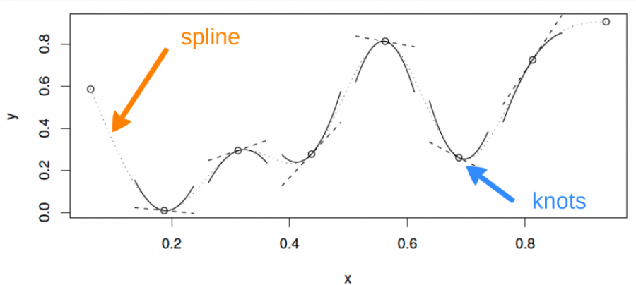

```{r setup, echo = FALSE}
knitr::opts_chunk$set(
  comment = "#",
  collapse = TRUE,
  warning = FALSE,
  message = FALSE,
  cache = FALSE,
  fig.width = 6, fig.height = 6,
  fig.retina = 3,
  fig.align = 'center'
)
options(repos=structure(c(CRAN="http://cran.r-project.org")))
```

```{r output-lines, echo = FALSE}
# Function to control the lines shown in code chunk outputs, to avoid overflow
# note: sometimes cache needs to be set to true in the knitr setup chunk for this to take effect in xaringan::infinite_moon_reader()
library(knitr)
hook_output <- knit_hooks$get("output")
knit_hooks$set(output = function(x, options) {
   lines <- options$output.lines
   if (is.null(lines)) {
     return(hook_output(x, options))  # pass to default hook
   }
   x <- unlist(strsplit(x, "\n"))
   more <- "..."
   if (length(lines)==1) {        # first n lines
     if (length(x) > lines) {
       # truncate the output, but add ....
       x <- c(head(x, lines), more)
     }
   } else {
     x <- c(more, x[lines], more)
   }
   # paste these lines together
   x <- paste(c(x, ""), collapse = "\n")
   hook_output(x, options)
 })
```

class: inverse, center, middle

```{r install_pkgs, message=FALSE, warning=FALSE, include=FALSE, results=0}
# Standard procedure to check and install packages and their dependencies, if needed.

list.of.packages <- c("ggplot2", "itsadug", "mgcv")

new.packages <- list.of.packages[!(list.of.packages %in% installed.packages()[,"Package"])]

if(length(new.packages) > 0) {
  install.packages(new.packages, dependencies = TRUE)
  print(paste0("The following package was installed:", new.packages))
} else if(length(new.packages) == 0) {
    print("All packages were already installed previously")
}

# Load all required libraries at once
lapply(list.of.packages, require, character.only = TRUE, quietly = TRUE)
```

# À propos de cet atelier

[](https://r.qcbs.ca/workshop08/pres-fr/workshop08-pres-fr.html)    [](https://r.qcbs.ca/workshop08/book-fr/workshop08-script-fr.R) 
[](https://r.qcbs.ca/workshop08/book-fr/index.html)
[](https://r.qcbs.ca/fr/workshops/r-workshop-08/)
[](https://github.com/QCBSRworkshops/workshop08) 

---

# Librairies et jeux de données 

Pour cet atelier, nous travaillerons avec les jeux de données suivants :

* [ISIT.csv](https://r.qcbs.ca/workshop08/pres-en/data/ISIT.csv) 

<br>

Vous devriez également vous assurer que vous avez téléchargé, installé et chargé les librairies R suivants:

* [ggplot2](https://cran.r-project.org/package=ggplot2)
* [itsadug](https://cran.r-project.org/package=itsadug)
* [mgcv](https://cran.r-project.org/package=mgcv)
<br>

```R
install.packages(c('ggplot2', 'itsadug', 'mgcv'))
```

---

# Prérequis

Pour suivre cet atelier, nous recommandons:

+ Assez d'expérience avec le logiciel R pour exécuter un script et examiner les données et les objets R;
+ Une connaissance de base de la régression linéaire.

---
# Aperçu de l'atelier

Nous commencerons par les bases de comment spécifier et implémenter des GAMs en R:

1. Le modèle linéaire... et où il échoue
2. Introduction aux GAMs
3. Le fonctionnement des GAMs
4. GAM avec plusieurs termes non-linéaires
5. GAM avec des termes d'interaction

<br>

Nous discuterons ensuite de la généralisation du modèle additif, incluant: 

6. La validation d'un GAM
7. Choisir une autre distribution
8. Changer la fonction de base
9. Introduction rapide aux GAMMs

---
# Objectifs d'apprentissage

1. Utiliser la librairie `mgcv` pour modéliser les relations non linéaires,
2. Évaluer la sortie d'un Modèle Additif Généralisé (GAM) afin de mieux comprendre nos données,
3. Utiliser des tests pour déterminer si nos relations correspondent à des modèles non linéaires ou linéaires,
4. Ajouter des interactions non linéaires entre les variables explicatives,
5. Comprendre l'idée d'une fonction de base (basis function) et pourquoi ça rend les GAMs si puissants,
6. Comment modéliser la dépendance dans les données (autocorrélation, structure hiérarchique) en utilisant les GAMMs.

---
class: inverse, center, middle
# 1. Le modèle linéaire

<hr>

## ... et où il échoue

---
# La régression linéaire

La régression linéaire est ce que la plupart des gens apprennent avant tout en statistiques et est parmi les méthodes les plus performantes. Elle nous permet de modéliser une variable réponse en fonction de facteurs prédictifs et d'une erreur résiduelle.

--

Comme on a vu dans l'[Atelier 4: Modèles linéaires](https://r.qcbs.ca/fr/workshops/r-workshop-04/), le modèle linéaire fait quatre suppositions importantes:

1. Relation linéaire entre les variables de réponse et les variables prédicteurs:  $$y_i = \beta_0 + \beta_1 \times x_i + \epsilon_i$$
2. L'erreur est distribuée normalement: $$\epsilon_i \sim \mathcal{N}(0,\,\sigma^2)$$
3. La variance des erreurs est constante
4. Chaque erreur est indépendante des autres (homoscédasticité)

<br>

--

*Modèle linéaire avec plusieurs prédicteurs:*

$$y_i = \beta_0 + \beta_1x_{1,i}+\beta_2x_{2,i}+\beta_3x_{3,i}+...+\beta_kx_{k,i} + \epsilon_i$$
???
Un modèle linéaire peut parfois s'adapter à certains types de réponses non linéaires (par exemple $x^2$), mais cette approche repose fortement sur des décisions qui peuvent être soit arbitraires, soit bien informées, et est beaucoup moins flexible que l'utilisation d'un modèle additif. 

---
# La régression linéaire

Les modèles linéaires fonctionnent très bien dans certains cas spécifiques où tous ces critères sont respectés:

.center[

]


---
# La régression linéaire

En réalité, il est souvent impossible de respecter ces critères. Dans de nombreux cas, les modèles linéaires sont inappropriés:

.center[

]

---
# La régression linéaire

**Quel est le problème et comment le régler?**

Un **modèle linéaire** essaye d'ajuster la meilleure **droite** qui passe au milieu des données, cela ne fonctionne donc pas pour tous les jeux de données.

En revanche, les **GAM** font cela en ajustant une **fonction de lissage non-linéaire** à travers les données, mais tout en contrôlant le degré de courbure de la ligne (*plus d'informations suivront*).

---
class: inverse, center, middle

## 2. Introduction aux GAMs
---
# Modèle Additif Généralisé (GAM)

Utilisons un exemple pour démontrer la différence entre une régression linéaire et un modèle additif. Nous allons utiliser le jeu de données `ISIT`.

<br>

```{r, eval = FALSE, echo = TRUE}
isit <- read.csv("data/ISIT.csv")
head(isit)
```

> Ce jeu de donnée comporte des mesures de bioluminescence en relation à la profondeur (*depth*), la station de rechercher et la saison (*Season*).

```{r, eval = FALSE, echo = FALSE}
isit <- read.csv("data/ISIT.csv")
head(isit)
```

Prenons que les données de la deuxième saison pour l'instant:

```{r, echo = FALSE}
isit <- read.csv("data/ISIT.csv")
library(ggplot2)
library(mgcv)
```

```{r, echo = TRUE}
isit2 <- subset(isit, Season==2)
```

---
# Modèle Additif Généralisé (GAM)

Commençons par essayer d'ajuster un modèle de régression linéaire à la relation entre `Sources` et `SampleDepth`.

```{r, eval=TRUE, echo = TRUE, output.lines = -c(1:6,12,13)}
linear_model <- gam(Sources ~ SampleDepth, data = isit2)
summary(linear_model)
```

Le modèle linéaire explique une bonne partie de la variance de notre jeu de données ( $R_{adj}$ = 0.588), ce qui veut dire que notre modèle est super bon, non?

???

Nous pouvons utiliser la commande `gam()` de la librairie `mgcv` pour modéliser une régression par les moindres carrés. Nous verrons plus loin comment utiliser `gam()` pour spécifier un terme lissé et non linéaire.

---
# Modèle Additif Généralisé (GAM)

Voyons comment notre modèle cadre avec les données:

```{r, fig.height = 5}
data_plot <- ggplot(data = isit2, aes(y = Sources, x = SampleDepth)) + 
  geom_point() +
  geom_line(aes(y = fitted(linear_model)),
            colour = "red", size = 1.2) + 
  theme_bw()
data_plot
```

???

Les suppositions de la régression linéaire sont-elles satisfaites dans ce cas? Comme vous l'avez peut-être remarqué, nous ne respectons pas les conditions du modèle linéaire:

1.  Il existe une forte relation _non linéaire_ entre `Sources` et `SampleDepth`.
2.  L'erreur n'est _pas_ normalement distribuée.
3.  La variance de l'erreur n'est _pas_ homoscédastique.
4.  Les erreurs ne sont _pas_ indépendantes les unes des autres.

---
exclude:true
# Modèles Additifs Généralisés (GAMs)

Examinons un exemple! Premièrement, nous allons générer des données et les représenter graphiquement.

```{r, eval = FALSE, echo = TRUE}
library(ggplot2)
set.seed(10)
n <- 250
x <- runif(n,0,5)
y_model <- 3*x/(1+2*x)
y_obs <- rnorm(n,y_model,0.1)
data_plot <- qplot(x, y_obs) +
  geom_line(aes(y=y_model)) +
  theme_bw()
data_plot
```

---
exclude:true
# GAM

```{r, eval = FALSE, echo = FALSE}
library(ggplot2)
set.seed(10)
n <- 250
x <- runif(n,0,5)
y_model <- 3*x/(1+2*x)
y_obs <- rnorm(n,y_model,0.1)
data_plot <- qplot(x, y_obs) +
  geom_line(aes(y=y_model)) +
  theme_bw()
data_plot
```


---
exclude:true
# GAM

Si nous modélisions cette relation par une régression linéaire, les résultats ne respecteraient pas les suppositions énumérées ci-dessus.

```{r,eval=FALSE,echo = FALSE}
library(mgcv)
linear_model <- gam(y_obs ~ x)
model_summary <- summary(linear_model)
data_plot <- data_plot +
             geom_line(colour = "red", size = 1.2, aes(y = fitted(linear_model)))
data_plot
```

---
# Modèles Additifs Généralisés (GAMs)

**Relation entre la variable réponse et le prédicteur**

Une variable prédicteur:
$$y_i = \beta_0 + f(x_i) + \epsilon$$

Plusieurs variables prédicteurs:
$$y_i = \beta_0 + f_1(x_{1,i}) + f_2(x_{2,i}) + ... + \epsilon$$


Un des grands avantages d'utiliser un GAM est que la forme optimale de la non-linéarité, i.e. **le degré de lissage** de $f(x)$ est contrôlée en utilisant une régression pénalisée qui est déterminée automatiquement est déterminée automatiquement selon la méthode d'ajustement (généralement le *maximum de vraisemblance* ou *maximum likelihood*).

???

Au sens strict, les équations concernent un GAM gaussien avec lien d'identité, qui est aussi appelé "modèle additif" (sans "généralisé").

Étant donné que la fonction de lissage $f(x_i)$ est non linéaire et
locale, l'ampleur de l'effet de la variable explicative peut varier en
fonction de la relation entre la variable et la réponse. 

Autrement dit, contrairement à un coefficient fixe $\beta x_i$, la fonction $f$
peut changer tout au long du gradient $x_i$. Le degré de lissage de $f$
est contrôlée en utilisant une régression pénalisée qui est déterminée
automatiquement à l'aide d'une méthode de validation croisée
généralisée (GCV) de la librairie `mgcv`.

---
# Modèles Additifs Généralisés (GAMs)

Essayons de modéliser les données à l'aide d'une fonction de lissage `s(x)` avec `mgcv::gam()`

```{r, eval = FALSE, echo = TRUE}
gam_model <- gam(Sources ~ s(SampleDepth), data = isit2)
```
--


```{r, eval=TRUE, echo = FALSE, output.lines = -c(1,4,5,6,11,12)}
gam_model <- gam(Sources ~ s(SampleDepth), data = isit2)
summary(gam_model)
```

???

Nous pouvons essayer de construire un modèle plus approprié en ajustant les données avec un terme lissé (non-linéaire). Dans `mgcv::gam()`, les termes lissés sont spécifiés par des expressions de la forme `s(x)`, où $x$ est la variable prédictive non linéaire que nous voulons lisser. Dans ce cas, nous voulons appliquer une fonction de lissage à `SampleDepth`.

La variance expliquée par notre modèle a augmenté de plus de 20% ($R_{adj}$ = 0.81)!

---
# Modèles Additifs Généralisés (GAMs)

```{r, eval=TRUE,echo = FALSE,fig.height=5.5}
data_plot <- data_plot +
     geom_line(colour = "blue", size = 1.2, aes(y = fitted(gam_model)))
data_plot
```

Note: contrairement à un coefficient fixe $\beta$, la fonction de lissage peut changer tout au long du gradient $x$.

???

Lorsque nous comparons l'ajustement des modèles linéaire (rouge) et non linéaire (bleu), il est clair que ce dernier cadre mieux avec nos données

---
exclude:true
# GAM

Essayons de modéliser les données à l'aide d'une fonction de lissage `s(x)` avec `mgcv::gam()`

```{r, eval = FALSE}
library(mgcv)
gam_model <- gam(y_obs ~ s(x))
summary(gam_model)

data_plot <- data_plot +
     geom_line(colour = "blue", size = 1.2, aes(y = fitted(gam_model)))
data_plot
```

---
exclude:true
# GAM

```{r, echo = FALSE,eval=FALSE}
gam_model <- gam(y_obs ~ s(x))
summary(gam_model)
```

---
exclude:true
# GAM

```{r, echo = FALSE,eval=FALSE}
data_plot <- data_plot +
     geom_line(colour = "blue", size = 1.2, aes(y = fitted(gam_model)))
data_plot
```

.comment[Note: contrairement à un coefficient fixe $\beta$, la fonction de lissage peut changer tout au long du gradient $x$]


---
# GAM

La librairie `mgcv` comprend également une fonction `plot` qui, par
défaut, nous permet de visualiser la non-linéarité du modèle.

```{r, fig.width=6.5, fig.height=6.5}
plot(gam_model)
```

---
# Test de linéarité avec GAM

Comment tester si le modèle non linéaire offre une amélioration significative par rapport au modèle linéaire?

On peut utiliser `gam()` et `AIC()` pour comparer la performance d'un modèle linéaire contenant `x` comme prédicteur linéaire à la performance d'un modèle non linéaire contenant `s(x)` comme prédicteur lisse. 

```{r}
linear_model <- gam(Sources ~ SampleDepth, data = isit2)
smooth_model <- gam(Sources ~ s(SampleDepth), data = isit2)
AIC(linear_model, smooth_model)
```

Ici, l'AIC du GAM lissé est plus bas, ce qui indique que l'ajout d'une fonction de lissage améliore la performance du modèle. _La linéarité n'est donc pas soutenue par nos données._

???

En d'autres termes, on demande si l'ajout d'une fonction lisse au modèle linéaire améliore l'ajustement du modèle à nos données.

Pour expliquer brièvement, le critère d'information d'Akaike (AIC) est une mesure comparative de la performance d'un modèle, où des valeurs plus basses indiquent qu'un modèle est "plus performant" par rapport aux autres modèles considérés.

---
exclude:true
# Test de linéarité avec GAM

On peut utiliser `gam()` et `AIC()` pour tester si une supposition de linéarité est justifiée. Ici, on demande si l'ajout d'une fonction lisse au modèle linéaire améliore l'ajustement du modèle à nos données:

```{r,eval=FALSE}
linear_model <- gam(y_obs ~ x) # ajuster un modèle linéaire régulier avec gam()
nested_gam_model <- gam(y_obs ~ s(x) + x)
AIC(linear_model, nested_gam_model, test = "Chisq")
```

---
exclude:true
# Test de linéarité avec GAM

```{r,eval=FALSE}
linear_model <- gam(y_obs ~ x) # ajuster un modèle linéaire régulier avec gam()
nested_gam_model <- gam(y_obs ~ s(x) + x)
anova(linear_model, nested_gam_model, test = "Chisq")
```

.comment[Notez que le modèle `y_obs ~ s(x)` donne exactement les même résultats que `y_obs ~ s(x) + x`. Nous utilisons $s(x) + x$ pour illustrer l'imbrication du modèle, mais le $+ x$ peut être omis.]

---
# Défi 1 

Essayons maintenant de déterminer si les données enregistrées lors de la première saison doivent être modélisées par une régression linéaire ou par un modèle additif. 

Répétons le test de comparaison avec `gam()` et `AIC()` en utilisant les données de la première saison seulement:

```{r}
isit1 <- subset(isit, Season == 1)
```

1. Ajustez un modèle linéaire et un GAM à la relation entre `Sources` et `SampleDepth`.
2. Déterminez si l'hypothèse de linéarité est justifiée pour ces données.
3. Quels sont les degrés de liberté effectifs du terme non-linéaire?

???

Nous n'avons pas encore discuté des degrés de liberté effectifs (**EDF**), mais ils sont un outil clé pour nous aider à interpréter l'ajustement d'un GAM. Gardez ce terme en tête. Plus sur ce sujet dans les prochaines sections!

---
# Défi 1 - Solution 

__1.__ Ajustez un modèle linéaire et un GAM à la relation entre `Sources` et `SampleDepth`.

```{r}
linear_model_s1 <- gam(Sources ~ SampleDepth, data = isit1)
smooth_model_s1 <- gam(Sources ~ s(SampleDepth), data = isit1)
```

---
# Défi 1 - Solution 

__2.__ Déterminez si l'hypothèse de linéarité est justifiée pour ces données.

Comme ci-dessus, la visualisation de la courbe du modèle sur notre ensemble de données est une excellente première étape pour déterminer si notre modèle est bien conçu.

```{r, eval = FALSE}
ggplot(isit1, aes(x = SampleDepth, y = Sources)) +
  geom_point() +
  geom_line(colour = "red", size = 1.2,
            aes(y = fitted(linear_model_s1))) +
  geom_line(colour = "blue", size = 1.2,
            aes(y = fitted(smooth_model_s1))) +
  theme_bw()
```

---
# Défi 1 - Solution 

__2.__ Déterminez si l'hypothèse de linéarité est justifiée pour ces données.

Comme ci-dessus, la visualisation de la courbe du modèle sur notre ensemble de données est une excellente première étape pour déterminer si notre modèle est bien conçu.

```{r, echo = FALSE}
ggplot(isit1, aes(x = SampleDepth, y = Sources)) +
  geom_point() +
  geom_line(colour = "red", size = 1.2,
            aes(y = fitted(linear_model_s1))) +
  geom_line(colour = "blue", size = 1.2,
            aes(y = fitted(smooth_model_s1))) +
  theme_bw()
```


---
# Défi 1 - Solution 

On peut compléter cela par une comparaison quantitative des performances du modèle en utilisant `AIC()`.

```{r}
AIC(linear_model_s1, smooth_model_s1)
```

> Le score AIC moins élevé indique que le modèle lissé est plus performant que le modèle linéaire, ce qui confirme que la linéarité n'est pas appropriée pour notre ensemble de données.

---
# Défi 1 - Solution 

__3.__ Quels sont les degrés de liberté effectifs du terme non-linéaire?

Pour obtenir les degrés de liberté effectifs, il suffit d'imprimer notre objet du modèle:

```{r}
smooth_model_s1
```

Les degrés de liberté effectifs (EDF) sont >> 1. 

> Gardez cela à l'esprit, car nous reviendrons bientôt sur les EDF!

---
exclude:true
# Défi 1 

Nous allons maintenant essayer cela avec d'autres données générées aléatoirement.

```{r,eval=FALSE}
n <- 250
x_test <- runif(n, -5, 5)
y_test_fit <- 4 * dnorm(x_test)
y_test_obs <- rnorm(n, y_test_fit, 0.2)
```

1. Ajustez un modèle linéaire et un GAM à la relation entre `x_test` et `y_test_obs`.
2. Déterminez si l'hypothèse de linéarité est justifiée pour ces données.
3. Quels sont les degrés de liberté effectifs du terme non-linéaire ?


<!-- nous n'avons pas parlé de degrés de liberté avant... -->

---
exclude:true
# Défi 1 - Solution 

```{r,eval=FALSE}
linear_model_test <- gam(y_test_obs ~ x_test)
nested_gam_model_test <- gam(y_test_obs ~ s(x_test) + x_test)

AIC(linear_model_test, nested_gam_model_test, test="Chisq")
```

---
exclude:true
# Défi 1 - Solution 

```{r,eval=FALSE}
qplot(x_test, y_test_obs) +
  geom_line(aes(y = y_test_fit)) +
  theme_bw()
```

---
exclude:true
# Défi 1 - Solution 

```{r,eval=FALSE}
nested_gam_model_test
```

**Réponse** Oui la non-linéarité est justifiée. Les degrés de liberté effectifs (**EDF**) sont >> 1 (on reviendra la dessus bientôt).

---
class: inverse, center, middle

## 3. Le fonctionnement des GAMs

---
# Le fonctionnement des GAMs

Nous allons maintenant prendre quelques minutes pour regarder comment fonctionnent les GAMs. Commençons en considérant d'abord un modèle qui contient une fonction lisse $f$ d'une covariable, $x$ :

$$y_i = f(x_i) + \epsilon_i$$

Pour estimer la fonction $f$, nous avons besoin de représenter l'équation ci-dessus de manière à ce qu'elle devienne un modèle linéaire. Cela peut être fait en définissant des fonctions de base, $b_j(x)$, dont est composée $f$ :

$$f(x) = \sum_{j=1}^q b_j(x) \times \beta_j$$

---
# Exemple: une base polynomiale

Supposons que $f$ est considérée comme un polynôme d'ordre 4, de sorte que l'espace des polynômes d'ordre 4 et moins contient $f$. Une base de cet espace serait alors :

$$b_0(x)=1 \ , \quad b_1(x)=x \ , \quad b_2(x)=x^2 \ , \quad b_3(x)=x^3 \ , \quad b_4(x)=x^4$$

Alors $f(x)$ devient :

$$f(x) = \beta_0 + x\beta_1 +  x^2\beta_2 + x^3\beta_3 + x^4\beta_4$$

... et le modèle complet devient :

$$y_i = \beta_0 + x_i\beta_1 +  x^2_i\beta_2 + x^3_i\beta_3 + x^4_i\beta_4 + \epsilon_i$$

---
# Exemple: une base polynomiale

Chaque fonction de base est multipliée par un paramètre à valeur réelle, $\beta_j$, et est ensuite additionnée pour donner la <font color="orange">courbe finale $f(x)$</font>.

.center[

]

En faisant varier le coefficient $\beta_j$, on peut faire varier la forme de $f(x)$ pour produire une fonction polynomiale d'ordre 4 ou moins.

---
# Exemple: une base de spline cubique

Un spline cubique est une courbe construite à partir de sections d'un polynôme cubique reliées entre elles de sorte qu'elles sont continues en valeur. Chaque section du spline a des coefficients différents.

.center[

]

---
# Exemple: une base de spline cubique

Voici une représentation d'une fonction lisse utilisant une base de régression spline cubique de rang 5 avec des nœuds situés à incréments de 0.2:

.center[

]

Dans cet exemple, les nœuds sont espacés uniformément à travers la gamme des valeurs observées de x. Le choix du degré de finesse du modèle est pré-déterminé par le nombre de nœuds, qui était arbitraire.

.comment[Y a-t-il une meilleure façon de sélectionner les emplacements des nœuds?]

---
# Contrôler le degré de lissage avec des splines de régression pénalisés

Au lieu de contrôler le lissage (non linéarité) en modifiant le nombre de nœuds, nous gardons celui-ci fixé à une taille un peu plus grande que raisonnablement nécessaire et on contrôle le lissage du modèle en ajoutant une pénalité sur le niveau de courbure. Donc, plutôt que d'ajuster le modèle en minimisant (comme avec la méthode des moindres carrés) :

$$||y - XB||^{2}$$

Le modèle peut être ajusté en minimisant:

$$||y - XB||^{2} + \lambda \int_0^1[f^{''}(x)]^2dx$$

Quand $\lambda$ tend vers $∞$, le modèle devient linéaire.

---
# Contrôler le degré de lissage avec des splines de régression pénalisés

Si $\lambda$ est trop élevé, les données seront trop lissées et si elle est trop faible, les données ne seront pas assez lissées. Idéalement, il serait bon de choisir une valeur $\lambda$ de sorte que le $\hat{f}$ prédit est aussi proche que possible du $f$ observé. Un critère approprié pourrait être de choisir $\lambda$ pour minimiser :

$$M = 1/n \times \sum_{i=1}^n (\hat{f_i} - f_i)^2$$

Étant donné que $f$ est inconnue, $M$ doit être estimé. Les méthodes recommandées pour ce faire sont le maximum de vraisemblance (maximum likelihood, *ML*) ou l'estimation par maximum de vraisemblance restreint (restricted maximum likelihood, *REML*). La validation croisée généralisée (*GCV*) est une autre possibilité.

---
exclude:true
# Principe de validation croisée

.center[

]

1. ajustement faible par rapport aux données et ne fait pas mieux avec le point manquant.


2. très bon ajustement de la courbe du signal sous-jacent, le lissage passe à travers le bruit et la donnée manquante est plutôt bien prédite.


3. la courbe ajuste le bruit aussi bien que le signal, la variabilité supplémentaire amène à prédire la donnée manquante plutôt mal.

---
exclude:true
# Principe de validation croisée

.center[

]


---

class: inverse, center, middle

## 4. GAM avec plusieurs termes non-linéaires

---

# GAM à variables linéaires et non linéaires

Avec les GAMs, il est facile d'ajouter des termes non linéaires et linéaires dans un seul modèle, plusieurs termes non linéaires ou même des interactions non linéaires.

Dans cette section, nous allons utiliser les données de `ISIT` de nouveau. Nous allons essayer de modéliser la réponse `Sources` avec les prédicteurs `Season` and `SampleDepth` simultanément.

Tout d'abord, nous devons convertir notre prédicteur qualitatif (`Season`) en facteur.

```{r, eval = TRUE, results='hide'}
head(isit)
isit$Season <- as.factor(isit$Season)
```

???

Rappelez-vous de ce jeu de données présenté dans les sections précédentes? Le jeu de données ISIT est composé des niveaux de bioluminescence (`Sources`) en fonction de la profondeur, des saisons et des différentes stations.

---
# GAM à variables linéaires et non linéaires

Commençons par un modèle de base comprenant un terme non linéaire (`SampleDepth`) et un facteur qualitatif (`Season` avec 2 niveaux).

```{r}
basic_model <- gam(Sources ~ Season + s(SampleDepth), data = isit, method = "REML")
basic_summary <- summary(basic_model)
```

Le tableau `p.table` donne des informations sur les termes linéaires:

```{r}
basic_summary$p.table
```

Le tableau `s.table` nous donne donne des informations sur le terme non linéaire:

```{r}
basic_summary$s.table
```

---
exclude:true
# GAM à plusieurs variables

Avec les GAMs, il est facile d'ajouter des termes non linéaires et linéaires dans un seul modèle, plusieurs termes non linéaires ou même des interactions non linéaires.

Dans cette section, nous allons utiliser un ensemble de données générées automatiquement par `mgcv::gamSim()`.

```{r,eval=FALSE}
# ?gamSim
gam_data <-  gamSim(eg = 5)
head(gam_data)
```

Nous allons essayer de modéliser la réponse `y` avec les prédicteurs `x0` à `x3`.

---
exclude:true
# GAM à plusieurs variables

Commençons par un modèle de base comprenant un terme non linéaire (`x1`) et un facteur qualitatif (`x0` avec 4 niveaux).

```{r,eval=FALSE}
basic_model <- gam(y ~ x0 + s(x1), data = gam_data)
basic_summary <- summary(basic_model)
basic_summary$p.table

basic_summary$s.table
```
.comment[La sortie de `p.table` fournit le tableau de résultats pour chaque terme paramétrique

Le tableau `s.table` nous donne les résultats du terme non linéaire.
]

---
# GAM à variables linéaires et non linéaires

Que nous montrent ces graphiques sur la relation entre la bioluminescence, la profondeur de l'échantillon et les saisons?

```{r, fig.width = 12}
par(mfrow = c(1,2))
plot(basic_model, all.terms = TRUE)
```

???

La bioluminescence varie de manière non-linéaire sur le gradient `SampleDepth`, avec des niveaux de bioluminescence les plus élevés à la surface, suivis d'un second maximum plus petit, juste au-dessus d'une profondeur de 1500, avec des niveaux décroissants à des profondeurs plus basses.

Il y a également une différence prononcée dans la bioluminescence entre les saisons, avec des niveaux élevés pendant la saison 2, par rapport à la saison 1.

---
# Degrés de liberté effectifs (EDF)

```{r}
basic_summary$s.table
```

Les `edf` indiqués dans le `s.table` sont les **degrés effectifs de liberté** (EDF) du terme lisse `s(SampleDepth)`.Plus le nombre de degrés de liberté est élevé, plus la courbe est complexe et ondulée.

- Une valeur proche de 1 se rapproche d'un terme linéaire.

- Une valeur elevée signifie que la courbe est plus ondulé, ou en d'autres termes, plus non-linéaire.

> Dans notre modèle de base, les **EDF** du terme non-linéaire `s(SampleDepth)` sont ~9, ce qui suggère une courbe fortement non-linéaire.

---
# Degrés de liberté effectifs (EDF)

Les degrés de liberté effectifs nous donnent beaucoup d'informations sur la relation entre les prédicteurs du modèle et les variables de réponse. 

> Vous reconnaissez peut-être le terme "degrés de liberté" suite à des ateliers précédents sur les modèles linéaires, mais attention! Les degrés de liberté effectifs d'un GAM sont estimés différemment des degrés de liberté d'une régression linéaire, et sont interprétés différemment.

Dans la régression linéaire, les degrés de liberté du *modèle* sont équivalents au nombre de paramètres libres non redondants, $p$, dans le modèle (et les degrés de liberté *résiduels* sont égaux à $n-p$).

Parce que le nombre de paramètres libres des fonctions de lissage est souvent difficile à définir, les **EDF** sont liés à $\lambda$, où l'effet de la pénalité est de réduire les degrés de liberté.

???

Revenons sur le concept de degrés de liberté effectifs (EDF). (Rappel: Défi 1)

---

# Degrés de liberté effectifs (EDF) et k

La limite supérieure d'**EDF** est déterminée par les dimensions de base $k$ de la fonction lisse (les **EDF** ne peut pas dépasser $k-1$)

En pratique, le choix exact de $k$ est arbitraire, mais il devrait être **suffisamment grand** pour permettre une fonction lisse suffisamment complexe.

Nous discuterons du choix de $k$ dans les sections qui suivent.

---

# GAM à plusieurs variables linéaires et lisses

```{r}
two_term_model <- gam(Sources ~ Season + s(SampleDepth) + RelativeDepth,
                      data = isit, method = "REML")
two_term_summary <- summary(two_term_model)
```

Informations sur les effets paramétriques (termes linéaires):

```{r}
two_term_summary$p.table
```

Informations sur les effets additifs (termes non linéaires):

```{r}
two_term_summary$s.table
```


???

L'estimation du coefficient de régression pour ce nouveau terme linéaire, `RelativeDepth`, sera présenté dans le tableau `p.table`. Rappelez-vous, le tableau `p.table` montre des informations sur les effets paramétriques (termes linéaires).

Dans `s.table`, nous trouverons encore une fois le terme non-linéaire, `s(SampleDepth)`, et son paramètre de courbure (`edf`). Rappelez-vous, le tableau `s.table` montre des informations sur les effets additifs (termes non-linéaires).

---

# GAM à plusieurs variables linéaires et lisses

```{r, fig.width=10, fig.height=7}
par(mfrow = c(2,2))
plot(two_term_model, all.terms = TRUE)
```

---

# GAM à plusieurs variables non linéaires

Si nous voulons vérifier que la relation entre `Sources` et `RelativeDepth` est non-linéaire, on peut modéliser `RelativeDepth` avec une fonction non-linéaire. 

```{r}
two_smooth_model <- gam(Sources ~ Season + s(SampleDepth) + s(RelativeDepth),
                        data = isit, method = "REML")
two_smooth_summary <- summary(two_smooth_model)
```

Informations sur les effets paramétriques (termes linéaires) :

```{r}
two_smooth_summary$p.table
```

Informations sur les effets additifs (termes non linéaires) :

```{r}
two_smooth_summary$s.table
```

???


---
# GAM à plusieurs variables non linéaires

Nous pouvons aussi vérifier que la relation entre `Sources` et `RelativeDepth` est non-linéaire.

```{r, fig.width=10, fig.height=6}
par(mfrow = c(2,2))
plot(two_smooth_model, all.terms = TRUE)
```

???

Pensez-vous que la performance de notre modèle est amélioré par l'ajout de ce nouveau terme non-linéaire, pour mieux représenter la relation entre la bioluminescence et la profondeur relative?

---
# GAM à plusieurs variables non linéaires

Comme précédemment, nous pouvons comparer nos modèles avec AIC pour tester si le terme non-linéaire améliore la performance de notre modèle:

```{r}
AIC(basic_model, two_term_model, two_smooth_model)
```

> On peut voir que `two_smooth_model` a la plus petite valeur AIC. 

Le modèle le mieux ajusté comprend donc deux fonctions non-linéaires pour `SampleDepth` et `RelativeDepth`, et un terme linéaire pour `Season`.

---
exclude:true
# GAM à plusieurs variables

Nous pouvons ajouter un second terme, `x2`, mais spécifier une relation linéaire avec `y`

```{r,eval=FALSE}
two_term_model <- gam(y ~ x0 + s(x1) + x2, data = gam_data)
two_term_summary <- summary(two_term_model)
two_term_summary$p.table

two_term_summary$s.table
```

---
exclude:true
# GAM à plusieurs variables

Nous pouvons ajouter un second terme, `x2`, mais spécifier une relation linéaire avec `y`

```{r, fig.width=5.5, fig.height=5.5,eval=FALSE}
plot(two_term_model, all.terms = TRUE)
```


---
exclude:true
# GAM à plusieurs variables

Nous pouvons aussi explorer si la relation entre `y` et `x2` est non-linéaire

```{r,eval=FALSE}
two_smooth_model <- gam(y ~ x0 + s(x1) + s(x2), data = gam_data)
two_smooth_summary <- summary(two_smooth_model)
two_smooth_summary$p.table

two_smooth_summary$s.table
```

---
exclude:true
# GAM à plusieurs variables

Nous pouvons aussi explorer si la relation entre `y` et `x2` est non-linéaire

```{r, fig.width=10,eval=FALSE}
plot(two_smooth_model, page = 1, all.terms = TRUE)
```

---
# Défi 2 

<br>

Pour notre deuxième défi, nous allons développer notre modèle en ajoutant des variables qui, selon nous, pourraient être des prédicteurs écologiquement significatifs pour expliquer la bioluminescence. 

1. Créez deux nouveaux modèles: Ajoutez la variable `Latitude` à `two_smooth_model`, premièrement comme paramètre linéaire, et ensuite comme fonction non-linéaire.

2. Est-ce que `Latitude` est un terme important à inclure dans le modèle? La `Latitude` a-t-elle un effet linéaire ou non-linéaire? 

> Utilisez des graphiques, les tables des coefficients et la fonction `AIC()` pour répondre à ces questions.


---
exclude:true
# Défi 2 

<br>

1. Créez deux nouveaux modèles avec la variable `x3` comme paramètre linéaire et non linéaire.
2. Utilisez des graphiques, les tables des coefficients et la fonction `AIC()` afin de déterminer s'il est nécessaire d'inclure `x3` dans le modèle.

---
# Défi 2 - Solution 

```{r, eval=TRUE}
# Ajouter Latitude comme terme linéaire
three_term_model <- gam(Sources ~ 
                          Season + s(SampleDepth) + s(RelativeDepth) + 
                          Latitude, 
                        data = isit, method = "REML")
three_term_summary <- summary(three_term_model)

# Ajouter Latitude comme terme non-linéaire
three_smooth_model <- gam(Sources ~ 
                            Season + s(SampleDepth) + s(RelativeDepth) + 
                            s(Latitude),
                          data = isit, method = "REML")
three_smooth_summary <- summary(three_smooth_model)
```

---
# Défi 2 - Solution 

__2.__ Est-ce que `Latitude` est un terme important à inclure dans le modèle? 

Commençons par visualiser les 4 effets qui sont maintenant inclus dans chaque modèle. 

---
exclude:true
# Défi 2 - Solution 

<br>
```{r,eval=FALSE}
three_term_model <- gam(y ~ x0 + s(x1) + s(x2) + x3, data = gam_data)
three_smooth_model <- gam(y~x0 + s(x1) + s(x2) + s(x3), data = gam_data)
three_smooth_summary <- summary(three_smooth_model)
```

---
# Défi 2 - Solution 

```{r, eval = FALSE}
par(mfrow = c(2,2))
plot(three_smooth_model, all.terms = TRUE)
```

```{r, fig.width = 8, fig.height = 7, echo = FALSE}
plot(three_smooth_model, page = 1, all.terms = TRUE)
```

---
# Défi 2 - Solution 

Nous devrions également examiner nos tableaux de coefficients. Qu'est-ce que les EDF nous disent à propos de _l'ondulation_, ou la non-linéarité, des effets de nos prédicteurs?

```{r}
three_smooth_summary$s.table
```

--

Les EDF sont tous élevés pour nos variables, y compris `Latitude`. 

Cela nous indique que `Latitude` est assez _ondulée_, et qu'elle ne devrait probablement pas être incluse comme terme linéaire.

---
# Défi 2 - Solution 

Avant de décider quel modèle est le "meilleur", nous devrions tester si l'effet `Latitude` est plus approprié comme terme linéaire ou lisse, en utilisant `AIC()`:

```{r}
AIC(three_smooth_model, three_term_model)
```

--

Notre modèle incluant la `Latitude` comme terme _non-linéaire_ a un score AIC inférieur, ce qui signifie qu'il est plus performant que notre modèle incluant la `Latitude` comme terme _linéaire_. 

--

Mais, est-ce que l'ajout de `Latitude` comme prédicteur non-linéaire améliore réellement notre "meilleur" modèle (`two_smooth_model`)?

---
# Défi 2 - Solution 

```{r}
AIC(two_smooth_model, three_smooth_model)
```

Notre `three_smooth_model` a un score AIC inférieur à notre meilleur modèle précédent (`two_smooth_model`), qui n'incluait pas `Latitude`. 

--

Ceci implique que `Latitude` est en effet un prédicteur informatif non-linéaire de la bioluminescence.

---
class: inverse, center, middle

## 4. Interactions

---
# GAM avec des termes d'interaction
<br>

Il y a deux façons de modéliser une interaction entre deux variables :
<br><br>

- pour __deux variables non-linéaires__ : `s(x1, x2)`
<br><br>

- pour __une variable non-linéaire et une variable linéaire__ (quantitative ou qualitative) : utiliser l'argument `by`, `s(x1, by = x2)`
  - Quand `x2` est qualitative, vous avez un terme non linéaire qui varie entre les différents niveaux de `x2`
  - Quand `x2` est quantitative, l'effet linéaire de `x2` varie avec `x1`
  - Quand `x2` est qualitative, le facteur doit être ajouté comme effet principal dans le modèle

---
# Interaction: variables non-linéaire et qualitatif

Nous allons examiner l'effet de l'interaction en utilisant notre variable qualitative `Season` et examiner si la non-linéarité de `s(SampleDepth)` varie selon les différents niveaux de `Season`.
<br><br>

```{r}
factor_interact <- gam(Sources ~ Season +
                         s(SampleDepth,by=Season) +
                         s(RelativeDepth),
                       data = isit, method = "REML")

summary(factor_interact)$s.table
```

---
exclude:true
# GAM avec des termes d'interaction

Nous allons examiner l'effet de l'interaction en utilisant notre variable qualitative `x0` et examiner si la non-linéarité de `s(x2)` varie selon les différents niveaux de `x0`.

```{r,eval=FALSE}
factor_interact <- gam(y ~ x0 + s(x1) + s(x2, by = x0), data = gam_data)

summary(factor_interact)$s.table
```

---
# Interaction: variables non-linéaire et qualitatif

```{r, eval = FALSE}
par(mfrow = c(2),2))
plot(factor_interact)
```

```{r, fig.width = 8, fig.height = 7, echo = FALSE}
plot(factor_interact, page = 1, all.terms = TRUE)
```

???

Les deux graphiques montrent l'effet d'interaction entre notre variable lisse `SampleDepth` et chaque niveau de notre variable factorielle, `Season`. 

Une bonne question pour les participants: Voyez-vous une différence entre les deux courbes?

Les graphiques montrent quelques différences entre la forme des termes lisses entre les deux niveaux de `Season`. La différence la plus notable est le pic dans le deuxième panneau, qui nous indique qu'il y a un effet de `SampleDepth` entre 1000 et 2000 qui est important dans la saison 2, mais qui ne se produit pas dans la saison 1. 

Ceci suggère que l'effet d'interaction pourrait être important à inclure dans notre modèle.

---
# Interaction: variables non-linéaire et qualitatif

Nous pouvons également représenter l'effet d'interaction en 3D sur un seul graphique, en utilisant `vis.gam()`.

```{r, fig.width = 6, fig.height = 6}
vis.gam(factor_interact, theta = 120, n.grid = 50, lwd = .4)
```

???

Nous pouvons modifier la rotation de ce graphique en utilisant l'argument `theta`.

Lorsqu'on visualise les termes d'interaction, on observe des différences dans la forme du lissage de `SampleDepth` entre les deux niveaux de `Season`. Ceci suggère que l'effet d'interaction pourrait être important à inclure dans notre modèle.

---
# Interaction: variables non-linéaire et qualitatif

Ces graphiques suggèrent que l'effet d'interaction pourrait être important à inclure dans notre modèle.

On peut faire une comparaison de modèles en utilisant l'AIC pour déterminer si le terme d'interaction améliore la performance de notre modèle.

```{r}
AIC(two_smooth_model, factor_interact)
```

L'AIC de notre modèle avec une interaction factorielle entre la variable non-linéair `SampleDepth` et le `Season` a un score AIC plus bas.

--

> Ensemble, l'AIC et les graphiques confirment que l'inclusion de cette interaction améliore la performance de notre modèle.

---
# Interaction entre variables non linéaires

Finalement, nous regardons les interactions entre deux termes non linéaires, `SampleDepth` et `RelativeDepth`.

```{r}
smooth_interact <- gam(Sources ~ Season + s(SampleDepth, RelativeDepth),
                       data = isit, method = "REML")
summary(smooth_interact)$s.table
```

--

```{r, fig.width=7, fig.height=5.5,echo=FALSE}
plot(smooth_interact, page = 1, scheme = 2)
```


---

# Interaction entre variables non linéaires

```{r, fig.width=8, fig.height=8}
vis.gam(smooth_interact,  view = c("SampleDepth", "RelativeDepth"), 
        theta = 50, n.grid = 50, lwd = .4)
```

???

Les graphiques illustrent une interaction non linéaire, où `Sources` est plus faible à des valeurs élevées de `SampleDepth` et `RelativeDepth`, mais augmente avec `RelativeDepth` alors que `SampleDepth` est faible.

Rappelez-vous, ce graphique peut être réorienté en changeant la valeur de l'argument `theta`.
On peut changer la couleur du graphique 3D en utilisant l'argument `color`. Essayez de spécifier `color = "cm"` dans `vis.gam()` ci-dessus, et consultez `?vis.gam` pour plus d'options de couleurs.

---
# Interaction entre variables non linéaires

Ainsi, il semble y avoir un effet d'interaction entre ces termes non linéaires. 

Est-ce que l'inclusion de l'interaction entre `s(SampleDepth)` et `s(RelativeDepth)` améliore notre modèle `two_smooth_model`?

```{r}
AIC(two_smooth_model, smooth_interact)
```

Le modèle avec l'intéraction entre `s(SampleDepth)` et `s(RelativeDepth)` a une plus petite valeur d'AIC.

> L'inclusion de cette interaction améliore la performance de notre modèle, et donc notre capacité à comprendre les déterminants de la bioluminescence.

---
class: inverse, center, middle

# 5. Généralisation du modèle additif


---

# Généralisation du modèle additif

Le modèle additif de base peut être étendu de plusieurs façons :

1. Utiliser d'autres __distributions__ pour la variable de réponse avec l'argument `family` (comme dans un GLM),
2. Utiliser de différents types de __fonctions de base__,
3. Utilisation de différents types d'__effets aléatoires__ pour ajuster des modèles à effets mixtes.


Nous allons maintenant examiner ces aspects.


---

# Modèle additif généralisé

Jusqu'à présent, nous avons utilisé des modèles additifs simples (gaussiens), l'équivalent non linéaire d'un modèle linéaire.

--

Mais que pouvons-nous faire si :
- les observations de la variable de réponse ne **suivent pas une distribution Normale**?
- la **variance n'est pas constante**? (hétéroscédasticité)

--

.comment[Ces situations se produisent fréquemment !]

Tout comme les modèles linéaires généralisés (GLM), nous pouvons formuler des modèles additifs **généralisés** pour répondre à ces problèmes.

---

# Modèle additif généralisé

Revenons au modèle d'interaction pour les données de bioluminescence :

```{r}
smooth_interact <- gam(Sources ~ Season + s(SampleDepth, RelativeDepth),
                       data = isit, method = "REML")

summary(smooth_interact)$p.table

summary(smooth_interact)$s.table
```

---

# Validation d'un GAM

Comme pour un GLM, il est essentiel de vérifier si nous avons correctement spécifié le modèle, en particulier la *distribution* de la réponse.

Il faut vérifier:

1. Le choix des dimensions de base `k`.
2. Les tracés des résidus (comme pour un GLM).


--

<br>
Fonctions incluses dans `mgcv` :

- `k.check()` effectue une vérification des dimensions de base.
- `gam.check()` produit des tracés de résidus (et fournit également la sortie de `k.check()`.


---
# Validation GAM: choisir $k$ dimensions de base

Vous vous rappelez du paramètre de lissage $\lambda$ qui restreint les _ondulations_ de nos fonctions de lissage? 

Cette _ondulation_ est également contrôlé par la dimension de base $k$, qui définit le nombre de fonctions de base utilisées pour créer une fonction lisse.

Plus le nombre de fonctions de base utilisées pour construire une fonction lisse est élevé, plus la fonction lisse est "ondulée":

```{r, echo = FALSE, fig.height = 4, fig.width = 10, results='hide', message=FALSE}
par(mfrow=c(1,3))
install.packages("patchwork", quiet = TRUE)
library(patchwork)

k_plot <- function(k_value){
    data("eeg")
    m <- mgcv::gam(Ampl ~ s(Time, k = k_value), data = eeg)
     p <- ggplot(eeg, aes(x = Time, y = Ampl)) +
     geom_point(alpha = .1, size = 1) +
     geom_line(aes(y = predict(m)),
               lwd = 2, col = "black") +
         labs(title = paste("k =", k_value), x = "", y = "") +
         theme_classic() +
         theme(text = element_text(size = 15),
               axis.text = element_blank(),
               plot.title = element_text(face = "bold", hjust = 0.5))
    return(p)
}

k_plot(3) + k_plot(6) + k_plot(10)
```

???

Dans les section précédents, nous avons discuté du rôle du paramètre de lissage $\lambda$ pour contrôler les _ondulations_ de nos fonctions de lissage. Cette _ondulation_ est également contrôlé par la dimension de base $k$, qui définit le nombre de fonctions de base utilisées pour créer une fonction lisse.

Chaque fonction lisse dans un GAM est essentiellement la somme pondérée de nombreuses fonctions plus petites, appelées fonctions de base. Plus le nombre de fonctions de base utilisées pour construire une fonction lisse est élevé, plus la fonction lisse est "ondulée". Comme vous pouvez le voir ci-dessous, une fonction lisse avec une petite dimension de base de $k$ sera moins ondulée qu'une fonction lisse avec une grande dimension de base de $k$.

---
# Validation GAM: choisir $k$ dimensions de base

La clé pour obtenir un bon ajustement du modèle consiste à __équilibrer__ le compromis entre deux éléments:

+ Le paramètre de lissage $\lambda$, qui _pénalise les _ondulations_ ;
+ La dimension de base $k$, qui permet plus de _flexibilité_ au modèle (plus d'ondulations) en fonction de nos données.

Avons-nous optimisé le compromis entre le lissage ( $\lambda$ ) et la flexibilité ( $k$ ) dans notre modèle?

En d'autres mots, est-ce que le `k` est assez grand?

```{r}
k.check(smooth_interact)
```

--

Les **EDF se rapprochent beaucoup de** `k`, donc la _flexibilité_ du modèle est trop restreinte par le `k` utilisé par défaut. En d'autres mots, .alert[nous n'avons pas un compromis équilibré entre le lissage et l'ondulation du modèle].

???

Ici, on se demande essentiellement: Est-ce que notre module est assez flexible? 

On n'a pas encore spécifié de valeur $k$ dans notre modèle, mais `gam()` définit un $k$ par défaut en fonction du nombre de variables sur lequel la fonction lisse est construite.

Les **EDF se rapprochent beaucoup de** `k`. Ceci signifie que la _flexibilité_ du modèle est restreint par le `k` utilisé par défaut, et que notre modèle pourrait mieux s'ajuster aux données si on permettait plus d'ondulations. En d'autres mots, nousn n'avons pas un compromis équilibré entre le lissage et l'ondulation du modèle.

---
# Validation GAM: choisir $k$ dimensions de base

Recommençons le modèle avec un `k` plus élevé:

```{r}
smooth_interact_k60 <- gam(Sources ~ Season + s(SampleDepth, RelativeDepth, k = 60),
                           data = isit, method = "REML")
summary(smooth_interact_k60)$p.table
summary(smooth_interact_k60)$s.table
```

--

Est-ce que `k` est assez grand maintenant?

```{r}
k.check(smooth_interact_k60)
```

--

Les EDF sont beaucoup plus petits que `k`. On peut remplacer notre modèle avec cette version plus flexible:

```{r}
smooth_interact <- smooth_interact_k60
```

???

Les EDF sont beaucoup plus petits que `k`, donc notre modèle s'adjuste mieux aux données avec plus d'ondulations. On peut donc remplacer notre modèle avec cette version plus flexible.

---
# Validation GAM: Choisir une autre distribution

Comme pour tout modèle Normal, nous devons vérifier certaines conditions avant de continuer. 

On peut visualiser les résidus du modèle avec `gam.check()`:

```{r, eval = FALSE}
par(mfrow = c(2,2))
gam.check(smooth_interact)
```

.comment[En plus des graphiques, `gam.check()` fournit également la sortie de `k.check()`].

???

Rappel: Nous pouvons évaluer la distribution des résidus du modèle pour vérifier ces conditions, tout comme nous le ferions pour un GLM (voir [Atelier 6](https://r.qcbs.ca/fr/workshops/r-workshop-06/)).

---
# Validation GAM: Choisir une autre distribution

```{r, echo=FALSE, results = FALSE, fig.height = 7, fig.width = 8}
par(mfrow=c(2,2), mar = c(4,4,2,1.1), oma =c(0,0,0,0))
gam.check(smooth_interact)
```

--
<br>

.alert[Hétéroscédasticité marquée et points extrêmes dans les résidus]

???

- Ces tracés sont un peu différents de ceux produits par `plot` pour un modèle linéaire (par exemple, pas de tracé de levier).

- Les participants devraient déjà être familiarisés avec les graphiques de résidus (ils sont expliqués plus en détail dans les [Atelier 4](https://r.qcbs.ca/fr/workshops/r-workshop-04/) et [Atelier 6](https://r.qcbs.ca/fr/workshops/r-workshop-06/).

La visualisation des résidus met quelques problèmes en évidence:
- Figure 2: La variance des erreurs n'est pas constante (hétéroscédasticité).
- Figures 1 et 4: Quelques observations extrêmes.

---
# Validation GAM: Choisir une autre distribution

Pour notre modèle d'interaction, nous avons besoin d'une distribution de probabilité qui permet à la **variance d'augmenter avec la moyenne**.

--

Une famille de distributions qui possède cette propriété et qui fonctionne bien dans un GAM est la famille **Tweedie**.

Une fonction de liaison commune pour les distributions *Tweedie* est le $log$.

--

<br>

Comme dans un GLM, nous pouvons utiliser l'argument `family = ` dans `gam()` pour ajuster des modèles avec d'autres distributions (y compris des distributions telles que `binomial`, `poisson`, `gamma` etc).

Pour en savoir plus sur les familles disponibles dans `mgcv` :
```{r, eval = FALSE}
?family.mgcv
```

---

# Défi 3 

1. Ajuster un nouveau modèle `smooth_interact_tw` avec la même formule que le modèle `smooth_interact` mais avec une distribution de la famille *Tweedie* (au lieu de la distribution normale) et `log` comme fonction de liaison. Pour ce faire, on peut utiliser `family = tw(link = "log")` dans `gam()`.
2. Vérifier le choix de `k` et les tracés de résidus pour le nouveau modèle.
3. Comparer `smooth_interact_tw` avec `smooth_interact`. Lequel est meilleur ?

--

<br>

.comment[Indice:]

```{r}
# Voici comment nous écririons le modèle pour spécifier la distribution normale :
smooth_interact <- gam(Sources ~ Season + s(SampleDepth, RelativeDepth, k = 60),
                       family = gaussian(link = "identity"),
                       data = isit, method = "REML")
```


---
# Défi 3 - Solution 

__1.__ Premièrement, construisons un nouveau modèle avec une distribution *Tweedie* un lien `log`.

```{r}
smooth_interact_tw <- gam(Sources ~ Season + s(SampleDepth, RelativeDepth, k = 60),
                          family = tw(link = "log"),
                          data = isit, method = "REML")
summary(smooth_interact_tw)$p.table
summary(smooth_interact_tw)$s.table
```

---
# Défi 3 - Solution 

__2.__ Vérifier le choix de `k` et la visualisation des résidus pour le nouveau modèle.

Ensuite, on devrait vérifier le choix des dimensions de bases `k`:

```{r}
k.check(smooth_interact_tw)
```

On a un équilibre entre $k$ et les EDF. Super!

---
# Défi 3 - Solution 

Ensuite la visualisation des résidus, pour valider la distribution Tweedie:

```{r, eval = FALSE}
par(mfrow=c(2,2))
gam.check(smooth_interact_tw)
```

```{r, echo = FALSE, results = FALSE, fig.height = 6, fig.width = 8}
par(mfrow=c(2,2), mar = c(4,4,2,1.1), oma =c(0,0,0,0))
gam.check(smooth_interact_tw)
```


???
Les résidus semblent mieux distribués, mais il est évident que le modèle manque encore quelque chose. Il pourrait s'agir d'un effet spatial (longitude et latitude), ou d'un effet aléatoire (par exemple basé sur `Station`).

---

# Défi 3 - Solution 

__3.__ Comparer `smooth_interact_tw` avec `smooth_interact`. Lequel est meilleur?

```{r}
AIC(smooth_interact, smooth_interact_tw)
```

.comment[L'AIC nous permet de comparer des modèles qui sont basés sur des distributions différentes!]

--

Utiliser une distribution *Tweedie* au lieu d'une distribution *Normale* améliore beaucoup notre modèle!

???

Le score AIC pour `smooth_interact_tw` est beaucoup plus petit que celui de `smooth_interact`. Utiliser une distribution *Tweedie* au lieu d'une distribution *Normale* améliore beaucoup notre modèle!

---
class: inverse, center, middle

## 6. Changer la fonction de base

---
# Autres fonctions lisses

Pour modéliser une surface lisse ou non-linéaire, nous pouvons construire des fonctions lisses de différentes manières:

`s()`  pour modéliser un terme lisse 1-dimensionnelle, ou pour modéliser une intéraction entre des variables mesurées sur la *même échelle*

`te()`   pour modéliser une surface d'interaction 2- ou n-dimensionnelle entre des variables qui *ne sont pas sur la même échelle*. Comprend les effets principaux.

`ti()`  pour modéliser une surface d'interaction 2- ou n-dimensionnelle *qui ne comprend pas les effets principaux*.

---
# Paramètres des fonctions lisses

Les fonctions lisses ont beaucoup de paramètres qui pourraient changer leur comportement. Les paramètres les plus souvent utilisés sont les suivants :

`k`  dimensions de base
  - détermine la limite supérieure du nombre de fonctions de base utilisées pour construire la courbe.
  - contraint l'ondulation d'une fonction lisse.
  - k devrait être < au nombre de données uniques.
  - la complexité (ou la non-linéarité) d'une fonction lisse dans un modèle ajusté est reflétée par ses degrés de liberté effectifs (**EDF**)

---
# Paramètres des fonctions lisses

Les fonctions lisses ont beaucoup de paramètres qui pourraient changer leur comportement. Les paramètres les plus souvent utilisés sont les suivants :

`bs`  spécifie la fonction de base sous-jacente.
  - pour `s()` on utilise `tp` (*thin plate regression spline*) et pour `te()` et `ti()` on utilise la base `cr` (*cubic regression spline*).
  
`d`  spécifie quelles variables d'une intéraction se trouvent sur la même échelle lorsqu'on utilise `te()` and `ti()`.
  - Par exemple, `te(Temps, largeur, hauteur, d=c(1,2))`, indique que la `largeur` et la `hauteur` sont sur la même échelle, mais que `temps` ne l'est pas.

---
# Exemple: Données cycliques

Lorsque l'on modélise des données cycliques, on souhaite généralement que le prédicteur soit identique aux deux bouts des phases. Pour y parvenir, nous devons modifier la fonction de base.

Utilisons une série chronologique de données climatiques, divisées en mesures mensuelles, afin de déterminer s'il y a une tendance de température annuelle. Nous utiliserons la série temporelle de la température de Nottingham dans `R`: 

```{r}
data(nottem)
```

```{r, warning = FALSE, message = FALSE}
# nombre d'années de données (20 ans)
n_years <- length(nottem)/12

# codage qualitatif pour les 12 mois de l'année,
# pour chaque année échantillonnée (série de 1 à 12, répétée 20 fois)
nottem_month <- rep(1:12, times = n_years)

# une variable où l'année correspondant à chaque mois dans nottem_month
nottem_year <- rep(1920:(1920 + n_years - 1), each = 12)
```

```{r, eval = FALSE}
# Visualiser la série temporelle
qplot(x = nottem_month, y = nottem, colour = factor(nottem_year), geom = "line") +
  theme_bw()
```

???

Voir `?nottem` pour plus de détails sur le jeu de données.

---
# Exemple: Données cycliques

```{r, echo = FALSE, fig.height=8, fig.width=12}
# Plot the time series
qplot(x = nottem_month, y = nottem, colour = factor(nottem_year), geom = "line") +
  theme_bw() + theme(text = element_text(size = 20))
```

---
# Exemple: Données cycliques

Nous pouvons modéliser le changement cyclique de température à travers les mois et la tendance non-linéaire à travers les années, en utilisant une spline cubique, ou `cc` pour modéliser les effets de mois ainsi qu'un terme non-linéaire pour la variable année.

```{r, fig.height=4, fig.width=8}
year_gam <- gam(nottem ~ s(nottem_year) + s(nottem_month, bs = "cc"), method = "REML")
summary(year_gam)$s.table
```

---
# Exemple: Données cycliques

```{r, fig.height=5, fig.width=8}
plot(year_gam, page = 1, scale = 0)
```

Il y a une augmentation d'environ 1-1.5 degrés au cours de la série, mais au cours d'une année, il y a une variation d'environ 20 degrés. Les données réelles varient autour de ces valeurs prédites et ceci représente donc la variance inexpliquée.

???

Ici, nous pouvons voir l'un des avantages très intéressants de l'utilisation des GAMs. Nous pouvons soit tracer la surface réponse (valeurs prédites) ou les termes (contribution de chaque covariable) tel qu'indiqué ci-haut. Vous pouvez imaginer ce dernier en tant qu'une illustration de la variation des coefficients de régression et comment leur contribution (ou taille de leur effet) varie au fil du temps. Dans le premier graphique, nous voyons que les contributions positives de la température sont survenues après 1930.

---
class: inverse, center, middle

# 7. Introduction rapide aux GAMMs

---

# La non-indépendance des données

Lorsque les observations ne sont pas indépendantes, les GAMs peuvent
être utilisés soit pour incorporer:

-   une structure de corrélation pour modéliser les résidus autocorrélés (autorégressif (AR), moyenne mobile (MA), ou une combinaison des deux (ARMA))
-   des effets aléatoires qui modélisent l'indépendance entre les observations d'un même site.

---
# L'autocorrelation des résidus

Pour commencer, nous allons jeter un coup d'œil à un modèle avec de l'autocorrélation temporelle dans les résidus.

Revenons au modèle de la température de Nottingham pour vérifier si les résidus sont corrélés en faisant appel à la fonction (partielle) d'autocorrélation.

```{r, eval = F, fig.width=9, fig.height=4.5}
par(mfrow = c(1,2))
acf(resid(year_gam), lag.max = 36, main = "ACF")
pacf(resid(year_gam), lag.max = 36, main = "pACF")
```

---
# L'autocorrelation des résidus

```{r, echo = F, fig.width=8.5, fig.height=4}
par(mfrow = c(1,2))
acf(resid(year_gam), lag.max = 36, main = "ACF")
pacf(resid(year_gam), lag.max = 36, main = "pACF")
```

.comment[__ACF__ évalue la corrélation croisée et __pACF__ la corrélation partielle d'une série temporelle entre points à différents décalages (donc, la similarité entre observations progressivement décalés).]

Les graphiques ACF et pACF sont donc utilisés pour identifier le temps nécessaire avant que les observations __ne sont plus autocorrélées__.

--
Un modèle AR de faible ordre semble nécessaire (donc, avec un ou deux intervalles de temps décalés).

???

La __fonction d'autocorrelaton__ (ACF; première figure) évalue la corrélation croisée d'une série temporelle entre points à différents décalages (donc, la similarité entre observations progressivement décalés).

En contraste, la __fonction partielle d'autocorrelation__ (PACF: deuxième figure) évalue la corrélation croisée d'une série temporelle entre points à différents décalages, après avoir contrôlé les valeurs de la série temporelle à tous les décalages plus courts.

---
# L'autocorrelation des résidus

Ajoutons des structures d'autocorrelation au modèle de température de Nottingham:

- **AR(1)** : corrélation avec un intervalle de temps décalé, ou
- **AR(2)** : corrélation à 2 intervalles de temps décalés

--
```{r}
df <- data.frame(nottem, nottem_year, nottem_month)

year_gam <- gamm(nottem ~ s(nottem_year) + s(nottem_month, bs = "cc"), data = df)

year_gam_AR1 <- gamm(nottem ~ s(nottem_year) + s(nottem_month, bs = "cc"),
                     correlation = corARMA(form = ~ 1|nottem_year, p = 1),
                     data = df)

year_gam_AR2 <- gamm(nottem ~ s(nottem_year) + s(nottem_month, bs = "cc"),
                     correlation = corARMA(form = ~ 1|nottem_year, p = 2),
                     data = df)
```

---

# L'autocorrelation des résidus

Quel modèle est mieux ajusté?

```{r}
AIC(year_gam$lme, year_gam_AR1$lme, year_gam_AR2$lme)
```

Le modèle avec la structure AR(1) donne un meilleur ajustement comparé au premier modèle (`year_gam`), il y a très peu d'amélioration en passant au `AR(2)`. 

Il est donc préférable d'inclure uniquement la structure `AR(1)` dans notre modèle.

---
# Effets aléatoires

Comme nous l'avons vu dans la section précédente, `bs` spécifie la fonction de base sous-jacente. Pour les facteurs aléatoires (origine et pente linéaire), nous utilisons `bs = "re"` et pour les pentes aléatoires non linéaires, nous utilisons `bs = "fs"`.

---
# Effets aléatoires

**3 types d'effets aléatoires différents** sont possibles lors de l'utilisation des GAMMs (où `fac`  variable qualitative utilisée pour l'effet aléatoire; `x0`  effet quantitatif fixe) :

- **interceptes aléatoires** ajustent la hauteur des termes du modèle avec une valeur constante de pente : `s(fac, bs = "re")`
- **pentes aléatoires** ajustent la pente d'une variable explicative numérique : `s(fac, x0, bs = "re")`
- **surfaces lisses aléatoires** ajustent la tendance d'une prédiction numérique de façon non linéaire: `s(x0, fac, bs = "fs", m = 1)`, où l'argument $m = 1$ met une plus grande pénalité au lissage qui s'éloigne de 0, ce qui entraîne un retrait vers la moyenne.

---
# GAMM avec un intercepte aléatoire

Nous allons utiliser `gamSim()` pour simuler un ensemble de données, cette fois-ci avec un effet aléatoire. Ensuite, nous construirons un modèle avec un intercepte aléatoire en utilisant `fac` comme facteur aléatoire.

```{r, eval = FALSE}
# Simuler des données
gam_data2 <- gamSim(eg = 6)
head(gam_data2)
```

```{r, echo = FALSE}
gam_data2 <- gamSim(eg = 6)
```

```{r}
# Rouler un modèle avec intercepte aléatoire
gamm_intercept <- gam(y ~ s(x0) + s(fac, bs = "re"), data = gam_data2, method = "REML")

# Voir la sortie du modèle
summary(gamm_intercept)$s.table
```

---
# GAMM avec un intercepte aléatoire

```{r}
plot(gamm_intercept, select = 2)
```

---
# GAMM avec un intercepte aléatoire

Nous allons premièrement tracer l'effet combiné de `x0` (sans les niveaux de l'effet aléatoire) et ensuite une courbe pour les 4 niveaux de `fac` :

```{r, eval = FALSE, results='hide'}
par(mfrow = c(1,2), cex = 1.1)

# Visualiser les effets combinés de x0 (sans effets aléatoires)
plot_smooth(gamm_intercept, view = "x0", rm.ranef = TRUE,
            main = "intercept + s(x1)")

# Visualiser chaque niveau de l'effet aléatoire
plot_smooth(gamm_intercept, view = "x0", rm.ranef = FALSE,
            cond = list(fac="1"),
            main = "... + s(fac)", col = 'orange', ylim = c(0,25))
plot_smooth(gamm_intercept, view = "x0", rm.ranef = FALSE,
            cond = list(fac = "2"),
            add = TRUE, col = 'red')
plot_smooth(gamm_intercept, view="x0", rm.ranef = FALSE,
            cond = list(fac = "3"),
            add = TRUE, col = 'purple')
plot_smooth(gamm_intercept, view="x0", rm.ranef = FALSE,
            cond = list(fac = "4"),
            add = TRUE, col = 'turquoise')
```

---
# GAMM avec un intercepte aléatoire

<br>

```{r, echo = FALSE, fig.width=12, fig.height=6, results='hide'}
par(mfrow = c(1,2), cex = 1.1)

# Visualiser les effets combinés de x0 (sans effets aléatoires)
plot_smooth(gamm_intercept, view = "x0", rm.ranef = TRUE,
            main = "intercept + s(x1)")

# Visualiser chaque niveau de l'effet aléatoire
plot_smooth(gamm_intercept, view = "x0", rm.ranef = FALSE,
            cond = list(fac="1"),
            main = "... + s(fac)", col = 'orange', ylim = c(0,25))
plot_smooth(gamm_intercept, view = "x0", rm.ranef = FALSE,
            cond = list(fac = "2"),
            add = TRUE, col = 'red')
plot_smooth(gamm_intercept, view="x0", rm.ranef = FALSE,
            cond = list(fac = "3"),
            add = TRUE, col = 'purple')
plot_smooth(gamm_intercept, view="x0", rm.ranef = FALSE,
            cond = list(fac = "4"),
            add = TRUE, col = 'turquoise')
```

.pull-right3[
&nbsp; <font color="orange">fac1</font> &nbsp; <font color="red">fac2</font> &nbsp; <font color="purple">fac3</font> &nbsp; <font color="turquoise">fac4</font>
]


---
# GAMM avec une pente aléatoire

Ensuite, spécifions un modèle avec une pente aléatoire:

```{r}
gamm_slope <- gam(y ~ s(x0) + s(x0, fac, bs = "re"), data = gam_data2, method = "REML")

summary(gamm_slope)$s.table
```

---
# GAMM avec une pente aléatoire

```{r, eval = FALSE, fig.width=12, fig.height=6, results='hide'}
par(mfrow = c(1,2), cex = 1.1)

# Visualiser les effets combinés de x0 (sans effets aléatoires)
plot_smooth(gamm_slope, view = "x0", rm.ranef = TRUE,
            main = "intercept + s(x1)")

# Visualiser chaque niveau de l'effet aléatoire
plot_smooth(gamm_slope, view = "x0", rm.ranef = FALSE,
            cond = list(fac="1"),
            main = "... + s(fac, x0)", col = 'orange', ylim = c(0,25))
plot_smooth(gamm_slope, view = "x0", rm.ranef = FALSE,
            cond = list(fac = "2"),
            add = TRUE, col = 'red')
plot_smooth(gamm_slope, view="x0", rm.ranef = FALSE,
            cond = list(fac = "3"),
            add = TRUE, col = 'purple')
plot_smooth(gamm_slope, view="x0", rm.ranef = FALSE,
            cond = list(fac = "4"),
            add = TRUE, col = 'turquoise')
```

---
# GAMM avec une pente aléatoire

<br>

```{r, echo = FALSE, fig.width=12, fig.height=6, results='hide'}
par(mfrow = c(1,2), cex = 1.1)

# Visualiser les effets combinés de x0 (sans effets aléatoires)
plot_smooth(gamm_slope, view = "x0", rm.ranef = TRUE,
            main = "intercept + s(x1)")

# Visualiser chaque niveau de l'effet aléatoire
plot_smooth(gamm_slope, view = "x0", rm.ranef = FALSE,
            cond = list(fac="1"),
            main = "... + s(fac, x0)", col = 'orange', ylim = c(0,25))
plot_smooth(gamm_slope, view = "x0", rm.ranef = FALSE,
            cond = list(fac = "2"),
            add = TRUE, col = 'red')
plot_smooth(gamm_slope, view="x0", rm.ranef = FALSE,
            cond = list(fac = "3"),
            add = TRUE, col = 'purple')
plot_smooth(gamm_slope, view="x0", rm.ranef = FALSE,
            cond = list(fac = "4"),
            add = TRUE, col = 'turquoise')
```

---
# GAMM avec un intercepte et une pente aléatoire

On peut aussi inclure un intercept et une pente aléatoire.

```{r}
gamm_int_slope <- gam(y ~ s(x0) + s(fac, bs = "re") + s(fac, x0, bs = "re"),
                      data = gam_data2, method = "REML")

summary(gamm_int_slope)$s.table
```

---
# GAMM avec un intercepte et une pente aléatoire

```{r, eval = FALSE, fig.width=12, fig.height=6, results='hide'}
par(mfrow = c(1,2), cex = 1.1)

# Visualiser les effets combinés de x0 (sans effets aléatoires)
plot_smooth(gamm_int_slope, view = "x0", rm.ranef = TRUE,
            main = "intercept + s(x1)")

# Visualiser chaque niveau de l'effet aléatoire
plot_smooth(gamm_int_slope, view = "x0", rm.ranef = FALSE,
            cond = list(fac="1"),
            main = "... + s(fac) + s(fac, x0)", col = 'orange', ylim = c(0,25))
plot_smooth(gamm_int_slope, view = "x0", rm.ranef = FALSE,
            cond = list(fac = "2"),
            add = TRUE, col = 'red')
plot_smooth(gamm_int_slope, view="x0", rm.ranef = FALSE,
            cond = list(fac = "3"),
            add = TRUE, col = 'purple')
plot_smooth(gamm_int_slope, view="x0", rm.ranef = FALSE,
            cond = list(fac = "4"),
            add = TRUE, col = 'turquoise')
```

---
# GAMM avec un intercepte et une pente aléatoire

<br>

```{r, echo = FALSE, fig.width=12, fig.height=6, results='hide'}
par(mfrow = c(1,2), cex = 1.1)

# Visualiser les effets combinés de x0 (sans effets aléatoires)
plot_smooth(gamm_int_slope, view = "x0", rm.ranef = TRUE,
            main = "intercept + s(x1)")

# Visualiser chaque niveau de l'effet aléatoire
plot_smooth(gamm_int_slope, view = "x0", rm.ranef = FALSE,
            cond = list(fac="1"),
            main = "... + s(fac) + s(fac, x0)", col = 'orange', ylim = c(0,25))
plot_smooth(gamm_int_slope, view = "x0", rm.ranef = FALSE,
            cond = list(fac = "2"),
            add = TRUE, col = 'red')
plot_smooth(gamm_int_slope, view="x0", rm.ranef = FALSE,
            cond = list(fac = "3"),
            add = TRUE, col = 'purple')
plot_smooth(gamm_int_slope, view="x0", rm.ranef = FALSE,
            cond = list(fac = "4"),
            add = TRUE, col = 'turquoise')
```

---
# GAMM avec un intercepte et une pente aléatoire

Notez que la pente aléatoire est statique dans ce cas :

```{r, fig.width=5, fig.height=5}
plot(gamm_int_slope, select = 3)
```

???

select = 3 parce que la pente aléatoire est sur la troisième ligne de notre tableau sommaire.

---
# GAMM avec une surface lisse aléatoire

Finalement, spécifions un modèle avec une surface lisse aléatoire.

```{r}
gamm_smooth <- gam(y ~ s(x0) + s(x0, fac, bs = "fs", m = 1),
                   data = gam_data2, method = "REML")

summary(gamm_smooth)$s.table
```

---
# GAMM avec une surface lisse aléatoire

```{r, echo = TRUE}
plot(gamm_smooth, select=1)
```

???
select = 1 parce que la surface lisse aléatoire est sur la première ligne de notre tableau sommaire.

---
# GAMM avec une surface lisse aléatoire

```{r, eval = FALSE, fig.width=12, fig.height=6, results='hide'}
par(mfrow = c(1,2), cex = 1.1)

# Visualiser les effets combinés de x0 (sans effets aléatoires)
plot_smooth(gamm_smooth, view = "x0", rm.ranef = TRUE,
            main = "intercept + s(x1)")

# Visualiser chaque niveau de l'effet aléatoire
plot_smooth(gamm_smooth, view = "x0", rm.ranef = FALSE,
            cond = list(fac="1"),
            main = "... + s(fac) + s(fac, x0)", col = 'orange', ylim = c(0,25))
plot_smooth(gamm_smooth, view = "x0", rm.ranef = FALSE,
            cond = list(fac = "2"),
            add = TRUE, col = 'red')
plot_smooth(gamm_smooth, view="x0", rm.ranef = FALSE,
            cond = list(fac = "3"),
            add = TRUE, col = 'purple')
plot_smooth(gamm_smooth, view="x0", rm.ranef = FALSE,
            cond = list(fac = "4"),
            add = TRUE, col = 'turquoise')
```

---
# GAMM avec une surface lisse aléatoire

<br>

```{r, echo = FALSE, fig.width=12, fig.height=6, results='hide'}
par(mfrow = c(1,2), cex = 1.1)

# Visualiser les effets combinés de x0 (sans effets aléatoires)
plot_smooth(gamm_smooth, view = "x0", rm.ranef = TRUE,
            main = "intercept + s(x1)")

# Visualiser chaque niveau de l'effet aléatoire
plot_smooth(gamm_smooth, view = "x0", rm.ranef = FALSE,
            cond = list(fac="1"),
            main = "... + s(fac) + s(fac, x0)", col = 'orange', ylim = c(0,25))
plot_smooth(gamm_smooth, view = "x0", rm.ranef = FALSE,
            cond = list(fac = "2"),
            add = TRUE, col = 'red')
plot_smooth(gamm_smooth, view="x0", rm.ranef = FALSE,
            cond = list(fac = "3"),
            add = TRUE, col = 'purple')
plot_smooth(gamm_smooth, view="x0", rm.ranef = FALSE,
            cond = list(fac = "4"),
            add = TRUE, col = 'turquoise')
```

???

Ici, si la pente aléatoire varie selon `x0`, nous aurions des courbes variables pour chaque niveau.

---
# Comparaison de GAMM

Tous les GAMMs de cette section peuvent être comparé avec `AIC()` pour trouver le modèle le mieux ajusté:

```{r}
AIC(gamm_intercept, gamm_slope, gamm_int_slope, gamm_smooth)
```

Le meilleur modèle de ces trois modèles serait donc le GAMM avec un intercept aléatoire.


---
# Ressources

Cet atelier présente une brève introduction aux concepts de base et aux librairies populaires pour vous aider à estimer, évaluer et visualiser les GAMs dans R, mais il y a beaucoup plus à explorer!
<br><br>
* Le livre [Generalized Additive Models: An Introduction with R](https://www.routledge.com/Generalized-Additive-Models-An-Introduction-with-R-Second-Edition/Wood/p/book/9781498728331) par Simon Wood (auteur de la librairie `mgcv`).
* Le site web de Simon Wood, [maths.ed.ac.uk/~swood34/](https://www.maths.ed.ac.uk/~swood34/).
* Le blogue de Gavin Simpson, [From the bottom of the heap](https://fromthebottomoftheheap.net/).
* La librairie [`gratia`](https://cran.r-project.org/web/packages/gratia/index.html) de Gavin Simpson for GAM visualisation in `ggplot2`.
* Le cours [Generalized Additive Models: An Introduction with R](https://noamross.github.io/gams-in-r-course/) de Noam Ross.
* [Overview GAMM analysis of time series data](https://jacolienvanrij.com/Tutorials/GAMM.html) tutoriel de Jacolien van Rij.
* [Hierarchical generalized additive models in ecology: an introduction with mgcv](https://peerj.com/articles/6876/) de Pedersen et al. (2019).

Enfin, les pages d'aide, disponibles via `?gam` dans R sont une excellente ressource.

---
class: inverse, center, bottom

# Merci pour votre participation à cet atelier!

<hr>
<br>


---
class: inverse, center, middle

# Exemple supplémentaire avec d'autres distributions

---
# GAM avec d'autres distributions

Un bref aperçu de l'utilisation des GAMs lorsque la variable réponse ne suit pas une distribution normale ou que les données sont des abondances ou proportions (par exemple, distribution Gamma, binomiale, Poisson, binomiale négative).

Nous allons utiliser un exemple de données où une répartition binomiale sera nécessaire; la variable réponse représente le nombre de succès (l'événement a eu lieu) en fonction des défaillances au cours d'une expérience.

```{r}
gam_data3 <- read.csv("data/other_dist.csv")
str(gam_data3)
```

<!-- should change the name of the variables in the csv files, to make them meaningful-->

---
# GAM avec d'autres distributions

```{r, fig.height=4, fig.width=4}
plot(range(gam_data3$x1), c(0,1), type = "n",
     main = "Probabilités de succès dans le temps",
     ylab = "Probabilité", xlab = "x1 (temps)")
abline(h = 0.5)

avg <- aggregate(prop ~ x1, data=gam_data3, mean)
lines(avg$x1, avg$prop, col = "orange", lwd = 2)
```

---
# GAM avec d'autres distributions

Nous allons tester si cette tendance est linéaire ou non avec un GAM logistique (nous utilisons une famille de distributions binomiales parce que nous avons des données de proportion).

```{r, warning=F}
prop_model <- gam(prop ~ s(x1), data = gam_data3, weights = total,
                  family = "binomial", method = "REML")
prop_summary <- summary(prop_model)
```

<!--Warning messages:
1: In eval(family$initialize) : non-integer #successes in a binomial glm!??-->

--

.comment[Qu'est ce que représente l'intercepte dans ce modèle?]

```{r}
prop_summary$p.table
```

--

.comment[Qu'est ce que le terme de lissage indique?]

```{r}
prop_summary$s.table
```

---
# GAM avec d'autres distributions

```{r, echo = FALSE}
prop_summary$p.table
```

.comment[Que représente l'intercepte dans ce modèle?]

**Rappel** le modèle utilise le nombre de succès vs échecs pour calculer le *logit*, qui est la logarithme du rapport entre les succès et échecs :

.small[
- Si succès = échecs, le rapport = 1 et le logit est de 0 (log(1) = 0).
- Si succès > échecs, le rapport > 1 et le logit a une valeur positive (log(2) = 0.69).
- Si succès < échecs, le rapport < 1 et le logit a une valeur négative (log(.5) = -0.69).
]

--

> Ici, l'estimé est positif ce qui signifie, qu'en moyenne, il y a plus de succès que d'échecs.

---
# GAM avec d'autres distributions

```{r, echo = FALSE}
prop_summary$s.table
```

.comment[Qu'est ce que le terme de lissage indique?]

Cela représente comment le ratio de succès vs échecs change sur l'échelle de $x1$.

--

> Puisque les **EDF** > 1, la proportion des succès augmente plus rapidement avec $x1$

```{r, fig.height=4.3, fig.width=4.3, eval = FALSE}
plot(prop_model)
```

```{r, fig.height=4.3, fig.width=4.3, echo = FALSE}
par(mar = c(4,4,0,0))
plot(prop_model)
```

---
# Visualiser la tendance au fil du temps

Il y a différente façon de représenter cette relation graphiquement :

- **Contribution/effet partiel** correspond aux effets isolés d'une interaction ou prédiction particulière. Si vous visualisez votre modèle GAM avec `plot()`, vous obtenez les effets partiels.
- **effets additionnés** correspond aux mesures réponse prédites pour une valeur ou niveau donné de prédicteurs. Si vous visualisez votre GAM avec `itsadug::plot_smooth()`, vous obtenez les effets additionnés.


---
# Visualiser la tendance au fil du temps

Que nous disent ces graphes sur les succès et échecs?

```{r, echo = FALSE, fig.height = 4.5, fig.width = 9}
library(itsadug)
par(mfrow=c(1,2), mar = c(4,4,0,0))
plot(prop_model, select = 1, scale = 0, shade=TRUE)
abline(h=0)

out <- plot_smooth(prop_model, view = "x1",main = "", print.summary = F)
diff <- find_difference(out$fv$fit, out$fv$CI, xVals = out$fv$x1)
addInterval(0, lowVals = diff$start, highVals = diff$end, col = 'red', lwd = 2)
abline(v=c(diff$start, diff$end), lty = 3, col = 'red')
text(mean(c(diff$start, diff$end)), 2.1, "succès > échecs", col = 'red', font = 2)
```


.pull-left[
**Contribution / effets partiels**

La valeur logit augmente, donc les succès augmentent et les échecs diminuent.]

.pull-right[
**Valeurs ajustées, effets additionnés, intercepte inclu**

Quantités égales de succès et d'échecs jusqu'à $x1 = 400$.
]

<!-- this code should be shown but it is not well explained...-->
---
# Visualiser la tendance au fil du temps

Enfin, pour nous aider à interpréter les résultats, nous pouvons re-transformer l'effet sur une échelle de proportions avec la fonction `itsadug::plot_smooth()` :

```{r, echo = -1, fig.height=3.5, fig.width==4}
par(mar=c(3.8,4,0,0))
plot_smooth(prop_model, view = "x1", main = "",
            transform = plogis, ylim = c(0,1), print.summary = F)
abline(h = 0.5, v = diff$start, col = 'red', lty = 2)
```

Comme précédemment, la proportion de succès augmente au-dessus de 0.5 à $x1 = 400$.

<!-- again, lack of explanation here...-->
