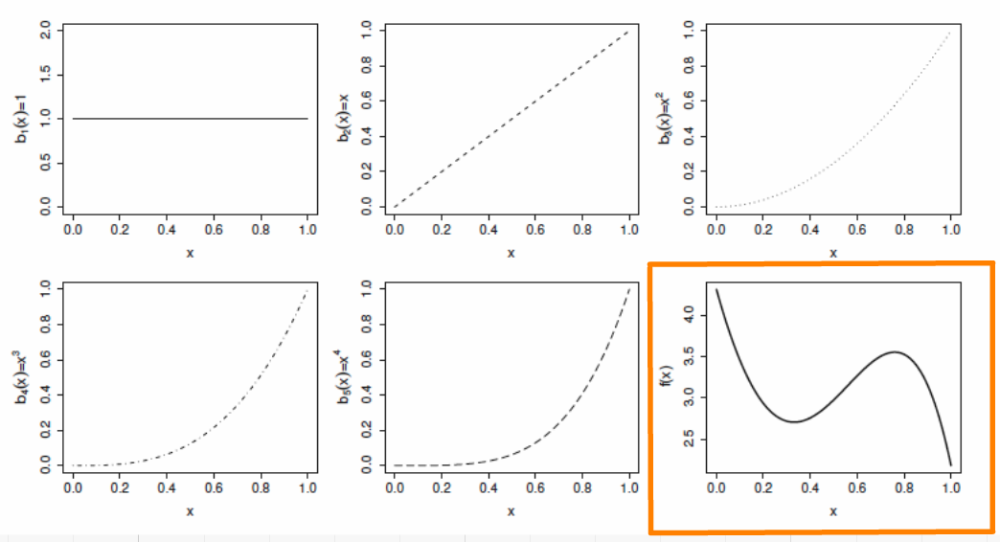
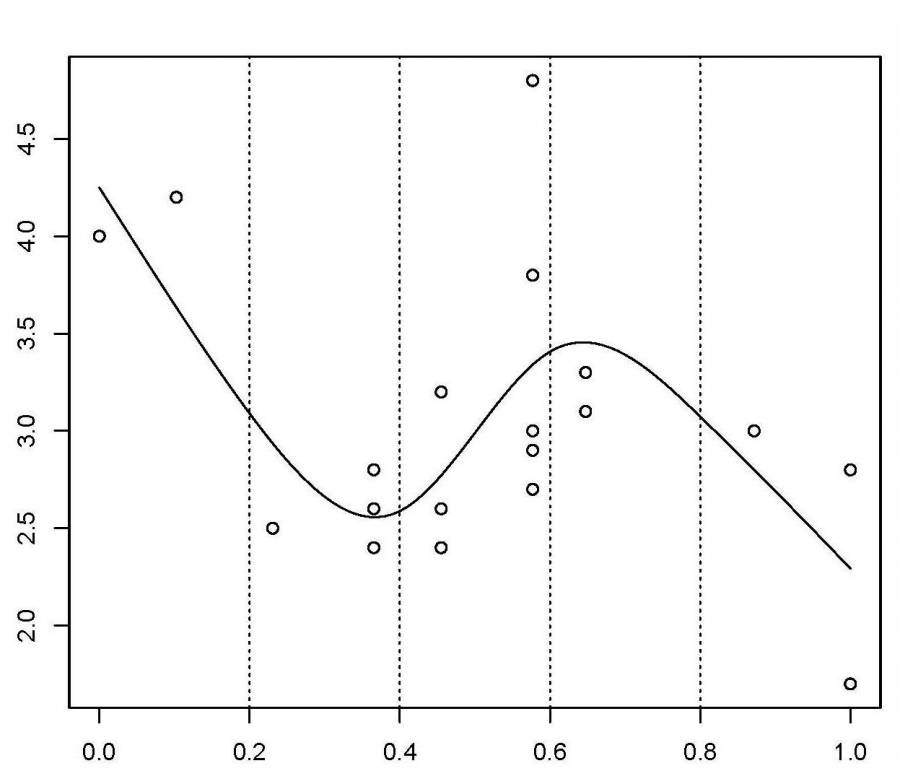

```{r setup, echo = F}
knitr::opts_chunk$set(
  comment = "#",
  collapse = TRUE,
  warning = FALSE,
  message = FALSE,
  cache = TRUE,
  fig.width=6, fig.height=6,
  fig.align = 'center'
)
```

```{r, include = FALSE}
if (!require(ggplot2)) install.packages("ggplot2")
library(ggplot2)
if (!require(mgcv)) install.packages("mgcv")
library(mgcv)
if (!require(itsadug)) install.packages("itsadug")
library(itsadug)
```

## Workshop overview

1. The linear model... and where if fails
2. Introduction to GAM
3. Multiple smooth terms
4. Interactions
5. Changing basis
6. Other distributions
7. Quick intro to GAMM
8. GAM behind the scene

---
## Learning objectives

1. Use the mgcv package to fit non-linear relationships,
2. Understand the output of a GAM to help you understand your data,
3. Use tests to determine if a non-linear model fits better than a linear one,
4. Include smooth interactions between variables,
5. Understand the idea of a basis function, and why it makes GAMs so powerful,
6. Account for dependence in data (autocorrelation, hierarchical structure) using GAMMs.

---
## Prerequisites

> Some experience in R (enough to be able to run a script and examine data and R objects)
> a basic knowledge of regression (you should know what we mean by linear regression and ANOVA).

---
class: inverse, center, middle
# 1. The linear model

## ...and where if fails

---
## Linear regression

Regression is the workhorse of statistics. It allows us to model a response variable as a function of predictors plus error.

--

As we saw in the [linear models workshop](http://qcbs.ca/wiki/r_workshop4), regression makes 4 major assumptions:

1. Normally distributed error
2. Homogeneity of the variance
3. Indenpendance of the errors
4. The response is linear : $y = β_0 + β_1x$

---
## Linear regression

There's only one way for the linear model to be right:

.center[

]


---
## Linear regression

And yet so many ways for it to fail:

.center[

]

---
## Linear regression

**What's the problem and do we fix it?**

A **linear model** tries to fit the best **straight line** that passes through the data, so it doesn't work well for all datasets.  

In contrast, a **GAM** can capture complexe relationships by fitting a **non-linear smooth function** through the data, while controlling how wiggly the smooth can get (more on this later).

---
class: inverse, center, middle

## 2. Introduction to GAM

---
## Generalized Additive Models (GAM)

Let's look at an example. First, we'll generate some data, and plot it.

```{r, eval = F, echo = T}
require(ggplot2)
set.seed(10)
n <- 250
x <- runif(n,0,5)
y_model <- 3*x/(1+2*x)
y_obs <- rnorm(n,y_model,0.1)
data_plot <- qplot(x, y_obs) +
  geom_line(aes(y=y_model)) +
  theme_bw()
data_plot
```

---
## GAM

```{r, eval = T, echo = F}
set.seed(10)
n <- 250
x <- runif(n,0,5)
y_model <- 3*x/(1+2*x)
y_obs <- rnorm(n,y_model,0.1)
data_plot <- qplot(x, y_obs) +
  geom_line(aes(y=y_model)) +
  theme_bw()
data_plot
```


---
## GAM

Trying to fit these data as a linear regression model, we would violate the assumptions listed above.

```{r, echo = F}
linear_model <- gam(y_obs ~ x)
model_summary <- summary(linear_model)
data_plot <- data_plot +
             geom_line(colour = "red", size = 1.2, aes(y = fitted(linear_model)))
data_plot
```

---
## GAM

In GAM, the relationship between the response variable and the predictors is:

$$y = \alpha + s(x_1) + s(x_2) + ... + \epsilon$$

One big advantage of using GAM over a manual specification of the model is that the optimal shape, i.e. the degree of smoothness of `s(x)`, is determined automatically using a generalized cross-validation

---
## GAM

Let's try to fit the data using a smooth function with the function `mgcv::gam()`


```{r, eval = F}
library(mgcv)
gam_model <- gam(y_obs ~ s(x))
summary(gam_model)

data_plot <- data_plot +  
     geom_line(colour = "blue", size = 1.2, aes(y = fitted(gam_model)))
data_plot
```

---
## GAM

```{r, echo = F}
gam_model <- gam(y_obs ~ s(x))
summary(gam_model)
```

---
## GAM

```{r, echo = F}
data_plot <- data_plot +  
     geom_line(colour = "blue", size = 1.2, aes(y = fitted(gam_model)))
data_plot
```

.comment[Note: as opposed to one fixed coefficient, \beta in linear regression, the smooth function can continually change over the range of the predictor x]


---
## GAM

The `mgcv` package also includes a default plot to look at the smooths:

```{r}
plot(gam_model)
```


---
## Test for linearity using GAM

We can use `gam()` and `anova()` to test whether an assumption of linearity is justified. To do so, we must simply set our smoothed model so that it is nested in our linear model.

```{r}
linear_model <- gam(y_obs ~ x) # fit a regular linear model using gam()
nested_gam_model <- gam(y_obs ~ s(x) + x)
anova(linear_model, nested_gam_model, test = "Chisq")
```

.comment[Note that the model `y_obs~s(x)` gives exactly the same results as `y_obs~s(x)+x`. We used the s(x)+x to illustrate the nestedness of the model, but the +x can be omitted.]

---
## Challenge 1 

We will now try this comparison test with some new simulated data, just to get a handle on it.

```{r}
n <- 250
x_test <- runif(n, -5, 5)
y_test_fit <- 4 * dnorm(x_test)
y_test_obs <- rnorm(n, y_test_fit, 0.2)
```

1. Fit a linear and smoothed GAM model to the relation between `x_test` and `y_test_obs`.
2. Determine if linearity is justified for this data.
3. What is the estimated degrees of freedom of the smoothed term?


<!-- we didn't talk about edf before... -->

---
## Challenge 1 - Solution 

```{r}
linear_model_test <- gam(y_test_obs ~ x_test)
nested_gam_model_test <- gam(y_test_obs ~ s(x_test) + x_test)

anova(linear_model_test, nested_gam_model_test, test="Chisq")
```

---
## Challenge 1 - Solution 

```{r}
qplot(x_test, y_test_obs) +
  geom_line(aes(y = y_test_fit)) +
  theme_bw()
```

---
## Challenge 1 - Solution 

```{r}
nested_gam_model_test
```

**Answer** Yes non-linearity is justified. The estimated degrees of freedom (edf) are >> 1 (we'll get back to this soon).

---
class: inverse, center, middle

## 3. Multiple smooth terms

---
## GAM with multiple variables

GAMs make it easy to include both smooth and linear terms, multiple smoothed terms, and smoothed interactions.

For this section, we will use simulated data generated using `mgcv::gamSim()`.

```{r}
# ?gamSim
gam_data <-  gamSim(eg = 5)
head(gam_data)
```

We will try to model the response `y` using the predictors `x0` to `x3`.

---
## GAM with multiple variables

Let's start with a basic model, with one smoothed term (x1) and one categorical predictor (x0, which has 4 levels).

```{r}
basic_model <- gam(y ~ x0 + s(x1), data = gam_data)
basic_summary <- summary(basic_model)
basic_summary$p.table

basic_summary$s.table
```

.comment[The `p.table` provides the significance table for each linear term

The `s.table` provides the significance table for each smoothed term.
]

---
## Note on estimated degrees of freedom

```{r}
basic_summary$s.table
```

The `edf` shown in the `s.table` is the estimated degrees of freedom – essentially, a larger edf value implies more complex wiggly splines.

- A value close to 1 tend to be close to a linear term.

- A high value (8–10 or higher) means that the spline is highly non-linear.

> In our basic model the edf of smooth function s(x1) is ~2, which suggests a non-linear curve.

---
## Note on estimated degrees of freedom

The edf in GAM is different from the degrees of freedom in a linear regression.

In linear regression, the *model* degrees of freedom is equivalent to the number of non-redundant free parameters, p, in the model (and the *residual* degrees of freedom are given by n-p).

We will revisit the edf later in this workshop.

---
## GAM with multiple variables

```{r}
plot(basic_model)
```

---
## GAM with multiple variables

We can add a second term, `x2`, but specify a linear relationship with `y`

```{r}
two_term_model <- gam(y ~ x0 + s(x1) + x2, data = gam_data)
two_term_summary <- summary(two_term_model)
two_term_summary$p.table

two_term_summary$s.table
```

---
## GAM with multiple variables

We can add a second term, `x2`, but specify a linear relationship with `y`

```{r}
plot(two_term_model)
```


---
## GAM with multiple variables

We can also explore whether the relationship between `y` and `x2` is non-linear

```{r}
two_smooth_model <- gam(y ~ x0 + s(x1) + s(x2), data = gam_data)
two_smooth_summary <- summary(two_smooth_model)
two_smooth_summary$p.table

two_smooth_summary$s.table
```

---
## GAM with multiple variables

We can also explore whether the relationship between `y` and `x2` is non-linear

```{r, fig.width=10}
plot(two_smooth_model, page = 1)
```

---
## GAM with multiple variables

As before, we can perform an ANOVA to test if the smoothed term is necessary

```{r}
anova(basic_model, two_term_model, two_smooth_model, test = "Chisq")
```

.alert[The best fit model is the model with both smooth terms for `x1` and `x2`]

---
## Challenge 2 

<br>

1. Create 2 new models, with `x3` as a linear and smoothed term.
2. Determine if `x3` is an important term to include using plots, coefficient tables and the anova function.

---
## Challenge 2 - Solution 

<br>
```{r}
three_term_model <- gam(y ~ x0 + s(x1) + s(x2) + x3, data = gam_data)
three_smooth_model <- gam(y~x0 + s(x1) + s(x2) + s(x3), data = gam_data)
three_smooth_summary <- summary(three_smooth_model)
```

---
## Challenge 2 - Solution 

```{r, eval = F}
plot(three_smooth_model, page = 1)
```

```{r, fig.width=8, fig.height=7, echo = F}
par(mar=c(3.8,3.8,.2,.2))
plot(three_smooth_model, page = 1)
```

---
## Challenge 2 - Solution 

```{r}
three_smooth_summary$s.table

# edf = 1 therefore term is linear.

anova(two_smooth_model, three_term_model, test = "Chisq")

# term x3 is not significant, it should be dropped!
```


---
class: inverse, center, middle

## 4. Interactions

---
## GAM with interaction terms

There are 2 ways to include interactions between variables:

- for 2 smoothed variables : `s(x1, x2)`
- for one smoothed variable and one linear variable (either factor or continuous): use the `by` argument `s(x1, by = x2)`
  - When `x2` is a factor, you have a smooth term that vary between different levels of `x2`
  - When `x2` is continuous, the linear effect of `x2` varies smoothly with `x1`
  - When `x2` is a factor, the factor needs to be added as a main effect in the model

---
## GAM with interaction terms

We will examine interaction effect using our categorical variable `x0` and ask whether the non-linear smoother `s(x2)` varies across different levels of `x0`.

```{r}
factor_interact <- gam(y ~ x0 + s(x1) + s(x2, by = x0), data = gam_data)

summary(factor_interact)$s.table
```

---
## GAM with interaction terms

```{r, fig.width=8}
plot(factor_interact, page = 1)
```

---
## GAM with interaction terms

We can also visualise our model in 3D using `vis.gam`, where `theta` is the degree rotation on the x-y plane

```{r,fig.width=6, fig.height=6}
vis.gam(factor_interact, view = c("x2","x0"), theta = 40, n.grid = 500, border = NA)
```

---
## GAM with interaction terms

Let's perform a model comparison using ANOVA to determine if the interaction term is necessary

```{r}
anova(two_smooth_model, factor_interact, test = "Chisq")
```

From the plots, we saw that the shape of the smooth terms were comparable among the 4 levels of `x0`. The anova test confirms this as well (p > 0.05).

---
## GAM with interaction terms

Finally we'll look at the interactions between 2 smoothed terms, `x1` and `x2`.

```{r}
smooth_interact <- gam(y~x0 + s(x1, x2), data = gam_data)
summary(smooth_interact)$s.table
```

---
## GAM with interaction terms

```{r, fig.width=7, fig.height=7}
plot(smooth_interact, page = 1, scheme = 3)
```


---
## GAM with interaction terms

```{r, fig.width=8, fig.height=8}
vis.gam(smooth_interact, view = c("x1", "x2"), theta=40, n.grid = 500, border = NA)
# similar to plot(smooth_interact, page = 1, scheme = 1)
```


---
## GAM with interaction terms

```{r}
anova(two_smooth_model, smooth_interact, test = "Chisq")
```

The interaction between `s(x1)` and `s(x2)` is significant and the 2D plot nicely illustrates this non-linear interactions, where `y` is large at high values of `x1` but low to mid-values of `x2`.

---
class: inverse, center, middle

## 5. Changing basis

---
## Expanding on the basic GAM

It is possible to expand further on the basic GAM model with:

1. more complicated smooths, by changing the basis,
2. other distributions: anything you can do with a GLM using the family argument,
3. mixed effect models, using `gamm` or the `gamm4` package.

We will now go over this 3 expansions.

---
## Other smooth functions

To model a non-linear smooth variable or surface, 3 different smooth functions are available:

`s()`  for modeling a 1-dimensional smooth or for modeling interactions among variables measured using the same unit and the same scale

`te()`   for modeling 2- or n-dimensional interaction surfaces of variables that are not on the same scale. Includes main effects.

`ti()`  for modeling 2- or n-dimensional interaction surfaces that do not include the main effects.

---
## Parameters of smooth functions

The smooth functions have several parameters that can be set to change their behavior. The most often-used parameters are :

`k`  number of ‘knots’
  - determines the upper bound of the number of base functions used to build the curve.
  - constrains the wigglyness of a smooth.
  - the number of base functions is reflected in the edf value.
  - the default k for `s()` is ~9, and for `te()` and `ti()` is 5 per dimension.
  - k should be < the number of unique data points.

---
## Parameters of smooth functions

The smooth functions have several parameters that can be set to change their behavior. The most often-used parameters are :

`d`  specifies that predictors in the interaction are on the same scale or dimension (only used in `te()` and `ti()`).
  - For example, in `te(Time, width, height, d=c(1,2))`, indicates that `width` and `height` are one the same scale, but not `Time`.

`bs`  specifies the type of underlying base functions.
  - the default for `s()` is `tp` (thin plate regression spline) and for `te()` and `ti()` is `cr` (cubic regression spline).

<!--last 2 slides were a copy-paste from this websites: http://www.sfs.uni-tuebingen.de/~jvanrij/Tutorial/GAMM.html. However, as I'm not a specialist of GAM, I let them asis, but we should modify them or at least site the website-->

---
## Example smooth for cyclical data

Cyclical data is a good example where changing tha basis is useful: you want the predictor to match at the ends.

Let's use a time series of climate data, with monthly measurements, and see if there's a temporal trend in yearly temperature.

```{r, eval = F}
data(nottem) # Nottingham temperature time series
n_years <- length(nottem)/12
nottem_month <- rep(1:12, times = n_years)
nottem_year <- rep(1920:(1920 + n_years - 1), each = 12)
qplot(nottem_month, nottem, colour = factor(nottem_year), geom = "line") +
  theme_bw()
```

---
## Example smooth for cyclical data

```{r, echo = F, fig.height=8, fig.width=12}
data(nottem)
n_years <- length(nottem)/12
nottem_month <- rep(1:12, times = n_years)
nottem_year <- rep(1920:(1920 + n_years - 1), each = 12)
qplot(nottem_month, nottem, colour = factor(nottem_year), geom = "line") +
  theme_bw()
```

---
## Example smooth for cyclical data

We can model both the cyclic change of temperature across months and the non-linear trend through years, using a cyclical cubic spline, or `cc`, for the month variable and a regular smooth for the year variable.

```{r, fig.height=4, fig.width=8}
year_gam <- gam(nottem ~ s(nottem_year) + s(nottem_month, bs = "cc"))
summary(year_gam)$s.table
```

---
## Example smooth for cyclical data

```{r, fig.height=5, fig.width=8}
plot(year_gam, page = 1, scale = 0)
```

There is about 1-1.5 degree rise in temperature over the period, but within a given year there is about 20 degrees variation in temperature, on average. The actual data vary around these values and that is the unexplained variance.

---
class: inverse, center, middle

## 6. Other distributions


---
## GAM using other distributions

Let's now take a look on how to use GAMs when the response variable does not follow a normal distributions and is either count or proportion data (e.g., Gamma, binomial, Poisson, negative binomial).

We will use an example dataset where a binomial distribution is needed; the response variable represents the number of successes vs failures over the course of an experiment.

```{r}
gam_data3 <- read.csv("data/other_dist.csv")
str(gam_data3)
```

<!-- should change the name of the variables in the csv files, to make them meaningful-->

---
## GAM using other distributions

```{r, fig.height=5, fig.width=5}
plot(range(gam_data3$x1), c(0,1), type = "n",
     main = "Probability of successes over time",
     ylab = "Probability", xlab = "x1 (time)")
abline(h = 0.5)

avg <- aggregate(prop ~ x1, data=gam_data3, mean)
lines(avg$x1, avg$prop, col = "orange", lwd = 2)
```

---
## GAM using other distributions

We will test if this trend is linear or not using a logistic GAM (we use a binomial family distribution given that our response is proportion data).

```{r, warning=F}
prop_model <- gam(prop ~ s(x1), data = gam_data3, weights = total, family = "binomial")
prop_summary <- summary(prop_model)
prop_summary$p.table
prop_summary$s.table
```

<!--Warning messages:
1: In eval(family$initialize) : non-integer #successes in a binomial glm!??-->
.comment[What does the intercept represent in this model?

What does the smooth term indicate?]

---
## GAM using other distributions

```{r, echo = F}
prop_summary$p.table
```

.comment[What does the intercept represent in this model?]

Recall that the model uses the count data to calculate the logit, which is the log odds ratio between successes and failures:
.small[
- If successes = failures, the ratio = 1 and the logit is 0 (log(1) = 0).
- If successes > failures, the ratio > 1 and the logit has a positive value (log(2) = 0.69).
- If successes < failures, the ratio < 1 and the logit has a negative value (log(.5) = -0.69).
]

--

> Here, the estimated intercept coefficient is positive, which means that there are more successes than failures overall.

---
## GAM using other distributions

```{r, echo = F}
prop_summary$s.table
```

.comment[What does the smooth term indicate?]

This represents how the log odds of successes vs failures changes over time (x1).

--

> As the edf > 1, the proportion of successes increases faster over time

```{r, fig.height=4.3, fig.width=4.3, echo = F}
par(mar = c(4,4,0,0))
plot(prop_model)
```

---
## Visualizing the trend over time

There are different ways this relationship can be represented graphically:

- **partial effects** are the isolated effects of one particular predictor or interaction. If you visualize your GAM model with `plot()`, you get the partial effects.
- **summed effects** are the predicted response measures for a given value or level of predictors. If you visualize your GAM model with `itsadug::plot_smooth()`, you get the summed effects.


---
## Visualizing the trend over time

What do these plots tell us about successes vs failures?

```{r, echo = F, fig.height=4.5, fig.width=9}
par(mfrow=c(1,2), mar = c(4,4,0,0))
plot(prop_model, select=1, scale=0, shade=TRUE)
abline(h=0)

out <- plot_smooth(prop_model, view="x1",main="", print.summary=F)
diff <- find_difference(out$fv$fit, out$fv$CI, xVals=out$fv$x1)
addInterval(0, lowVals = diff$start, highVals = diff$end, col='red', lwd=2)
abline(v=c(diff$start, diff$end), lty=3, col='red')
text(mean(c(diff$start, diff$end)), 2.1, "successes > failures", col = 'red', font = 2)
```


.pull-left[
**Contribution / partial effect**

Over time the log odds increases, so over time successes increase and failures decrease.]

.pull-right[
**Fitted values, summed effect, intercept included**

Equal amounts of successes and failures up to x1=400.
]

<!-- this code should be shown but it is not well explained...-->
---
## Visualizing the trend over time

Lastly, to help interpret the results, we could transform the summed effects back to proportions with the function `itsadug::plot_smooth()`:

```{r, echo = -1, fig.height=4, fig.width==4}
par(mar=c(3.8,4,0,0))
plot_smooth(prop_model, view = "x1", main = "",
            transform = plogis, ylim = c(0,1), print.summary = F)
abline(h = 0.5, v = diff$start, col = 'red', lty = 2)
```

As in the logit plot, the proportion of successes increases above 0.5 at x1=400.

<!-- again, lack of explanation here...-->


---
class: inverse, center, middle

# 7. Quick intro to GAMM

---
## Dealing with non-independence

When observations are not independent, GAMs can be used to either incorporate:

- a serial correlation structure to model residual autocorrelation (autoregressive AR, moving average MA, or a combination of the two ARMA),
- random effects that model independence among observations from the same site.

---
## Model with correlated errors

Let's have a look at a model with temporal autocorrelation in the residuals. We will revisit the Nottingham temperature model and test for correlated errors using the (partial) autocorrelation function.

```{r, eval = F, fig.width=9, fig.height=4.5}
par(mfrow = c(1,2))
acf(resid(year_gam), lag.max = 36, main = "ACF")
pacf(resid(year_gam), lag.max = 36, main = "pACF")
```

---
## Model with correlated errors

```{r, echo = F, fig.width=9, fig.height=4.5}
par(mfrow = c(1,2))
acf(resid(year_gam), lag.max = 36, main = "ACF")
pacf(resid(year_gam), lag.max = 36, main = "pACF")
```

.comment[ACF (and pACF) provide the cross correlation (and partial correlation) of a time series with itself at different time lags, and are used to identify after how many time steps observations start to be independent.]

The ACF plot of our model residuals suggests a significant lag of 1, and perhaps a lag of 2. Therefore, a low-order AR model is likely needed.

---
## Model with correlated errors

We can test for autocorrelation by adding AR structures to the model: AR(1) (correlation at 1 time step) and AR(2) (correlation at 2 time steps).

```{r}
year_gam <- gamm(nottem ~ s(nottem_year) + s(nottem_month, bs = "cc"))
year_gam_AR1 <- gamm(nottem ~ s(nottem_year) + s(nottem_month, bs = "cc"),
                     correlation = corARMA(form = ~ 1|nottem_year, p = 1))
year_gam_AR2 <- gamm(nottem ~ s(nottem_year) + s(nottem_month, bs = "cc"),
                     correlation = corARMA(form = ~ 1|nottem_year, p = 2))
anova(year_gam$lme, year_gam_AR1$lme, year_gam_AR2$lme)
```

.comment[AR(1) provides a significant increase in fit over the naive model (LRT = 10.69, p = 0.0011), but little improvement with AR(2) (LRT = 1.62, p = 0.203).]

---
## Mixed modelling

As we saw in the section changing basis, `bs` specifies the type of underlying base function. For random intercepts and linear random slopes we use `bs = "re"`, but for random smooths we use `bs = "fs"`.

--

**3 different types of random effects** in GAMMs (`fac`  factor coding for the random effect; `x0`  continuous fixed effect):

- **random intercepts** adjust the height of other model terms with a constant value: `s(fac, bs="re")`
- **random slopes** adjust the slope of the trend of a numeric predictor: `s(fac, x0, bs="re")`
- **random smooths** adjust the trend of a numeric predictor in a nonlinear way: `s(x0, fac, bs="fs", m=1)`, where the argument m=1 sets a heavier penalty for the smooth moving away from 0, causing shrinkage to the mean.

---
## GAMM with a random intercept

As before, we will use the `gamSim()` function to generate a dataset, here with a random effect, then run a model with a random intercept using `fac` as the random factor.

```{r}
gam_data2 <- gamSim(eg = 6)
str(gam_data2)
```


---
## GAMM with a random intercept

```{r, fig.height=5, fig.width=5.5, echo = -1}
par(mar=c(4,4,1,1))
gamm_intercept <- gam(y ~ s(x0) + s(fac, bs = "re"), data = gam_data2)
summary(gamm_intercept)$s.table
plot(gamm_intercept, select = 2)
```

---
## GAMM with a random intercept

We can plot the summed effects for the `x0` without random effects, and then plot the predictions of all 4 levels of the random `fac` effect:

```{r, eval = F}
par(mfrow = c(1,2), cex = 1.1)

plot_smooth(gamm_intercept, view = "x0", rm.ranef = T,
            main = "intercept + s(x1)")

plot_smooth(gamm_intercept, view = "x0", cond = list(fac="1"),
            main = "... + s(fac)", col = 'orange', ylim = c(8,21))

plot_smooth(gamm_intercept, view = "x0", cond = list(fac = "2"), add = T, col = 'red')

plot_smooth(gamm_intercept, view="x0", cond = list(fac = "3"), add = T, col = 'purple')

plot_smooth(gamm_intercept, view="x0", cond = list(fac = "4"), add = T, col = 'turquoise')
```

---
## GAMM with a random intercept

<br>

```{r, echo = F, fig.width=12, fig.height=6}
par(mfrow = c(1,2), cex = 1.1, mar=c(4,4,1,1))
plot_smooth(gamm_intercept, view = "x0", rm.ranef = T,
            main = "intercept + s(x1)", print.summary=F)
plot_smooth(gamm_intercept, view = "x0", cond = list(fac="1"),
            main = "... + s(fac)", col = 'orange', ylim = c(8,21), print.summary=F)
plot_smooth(gamm_intercept, view = "x0", cond = list(fac = "2"), add = T, col = 'red', print.summary=F)
plot_smooth(gamm_intercept, view="x0", cond = list(fac = "3"), add = T, col = 'purple', print.summary=F)
plot_smooth(gamm_intercept, view="x0", cond = list(fac = "4"), add = T, col = 'turquoise', print.summary=F)
```

.pull-right[
&nbsp; <font color="orange">fac1</font> &nbsp; <font color="red">fac2</font> &nbsp; <font color="purple">fac3</font> &nbsp; <font color="turquoise">fac4</font>
]


---
## GAMM with a random slope

```{r}
gamm_slope <- gam(y ~ s(x0) + s(x0, fac, bs = "re"), data = gam_data2)

summary(gamm_slope)$s.table
```


---
## GAMM with a random slope

```{r, eval = F}
par(mfrow = c(1,2), cex = 1.1)

plot_smooth(gamm_slope, view = "x0", rm.ranef = T, main = "intercept + s(x0)")

plot_smooth(gamm_slope, view = "x0", cond = list(fac = "1"),
            main = "... + s(fac)", col = 'orange', ylim = c(7,22))

plot_smooth(gamm_slope, view = "x0", cond = list(fac = "2"), add = T, col = 'red')

plot_smooth(gamm_slope, view = "x0", cond = list(fac = "3"), add = T, col = 'purple')

plot_smooth(gamm_slope, view = "x0", cond = list(fac = "4"), add = T, col = 'turquoise')
```

---
## GAMM with a random slope

<br>

```{r, echo = F, fig.width=12, fig.height=6}
par(mfrow = c(1,2), cex = 1.1, mar=c(4,4,1,1))
plot_smooth(gamm_slope, view = "x0", rm.ranef = T, main = "intercept + s(x0)",
            print.summary=F)
plot_smooth(gamm_slope, view = "x0", cond = list(fac = "1"),
            main = "... + s(fac)", col = 'orange', ylim = c(7,22), print.summary=F)
plot_smooth(gamm_slope, view = "x0", cond = list(fac = "2"), add = T, col = 'red',
            print.summary=F)
plot_smooth(gamm_slope, view = "x0", cond = list(fac = "3"), add = T, col = 'purple',
            print.summary=F)
plot_smooth(gamm_slope, view = "x0", cond = list(fac = "4"), add = T, col = 'turquoise',
            print.summary=F)
```

---
## GAMM with a random intercept and slope

```{r}
gamm_int_slope <- gam(y ~ s(x0) + s(fac, bs = "re") + s(fac, x0, bs = "re"),
                      data = gam_data2)

summary(gamm_int_slope)$s.table
```

---
## GAMM with a random intercept and slope

```{r, eval = F}
par(mfrow = c(1,2), cex = 1.1)

plot_smooth(gamm_int_slope, view = "x0", rm.ranef = T, main = "intercept + s(x0)")

plot_smooth(gamm_int_slope, view = "x0", cond = list(fac = "1"),
            main="... + s(fac) + s(fac, x0)", col = 'orange', ylim = c(7,22))

plot_smooth(gamm_int_slope, view = "x0", cond = list(fac = "2"), add = T, col='red')

plot_smooth(gamm_int_slope, view = "x0", cond = list(fac = "3"), add = T, col = 'purple')

plot_smooth(gamm_int_slope, view = "x0", cond = list(fac = "4"), add = T, col = 'turquoise')
```

---
## GAMM with a random intercept and slope

<br>

```{r, echo = F, fig.width=12, fig.height=6}
par(mfrow = c(1,2), cex = 1.1, mar=c(4,4,1,1))
plot_smooth(gamm_int_slope, view = "x0", rm.ranef = T, main = "intercept + s(x0)", print.summary=F)
plot_smooth(gamm_int_slope, view = "x0", cond = list(fac = "1"), print.summary=F,
            main="... + s(fac) + s(fac, x0)", col = 'orange', ylim = c(7,22))
plot_smooth(gamm_int_slope, view = "x0", cond = list(fac = "2"), add = T,
            col='red',print.summary=F)
plot_smooth(gamm_int_slope, view = "x0", cond = list(fac = "3"), add = T,
            col = 'purple', print.summary=F)
plot_smooth(gamm_int_slope, view = "x0", cond = list(fac = "4"), add = T,
            col = 'turquoise', print.summary=F)
```

---
## GAMM with a random intercept and slope

Note that the random slope is static in this case:

```{r}
plot(gamm_int_slope, select = 3)
```

---
## GAMM with a random smooth

```{r}
gamm_smooth <- gam(y ~ s(x0, fac, bs = "fs", m = 1), data = gam_data2)

summary(gamm_smooth)$s.table
```

---
## GAMM with a random smooth

Here, if the random slope varied along `x0`, we would see different curves for each level:

```{r, echo = -1, fig.height=5.5, fig.width=5.5}
par(mar=c(4,4,.5,.5), lwd = 2)
plot(gamm_smooth, select = 1)
```

---
## GAMM with a random smooth

```{r, eval = F}
par(mfrow = c(1,2), cex = 1.1)

plot_smooth(gamm_smooth, view = "x0", rm.ranef = T, main = "intercept + s(x0)")

plot_smooth(gamm_smooth, view = "x0", cond = list(fac = "1"),
            main="... + s(x0, fac)", col = 'orange', ylim = c(7,22))

plot_smooth(gamm_smooth, view = "x0", cond = list(fac = "2"), add = T, col='red')

plot_smooth(gamm_smooth, view = "x0", cond = list(fac = "3"), add = T, col = 'purple')

plot_smooth(gamm_smooth, view = "x0", cond = list(fac = "4"), add = T, col = 'turquoise')
```

---
## GAMM with a random smooth

<br>

```{r, echo = F, fig.width=12, fig.height=6}
par(mfrow = c(1,2), cex = 1.1, mar=c(4,4,1,1))
plot_smooth(gamm_smooth, view = "x0", rm.ranef = T, main = "intercept + s(x0)", print.summary=F)
plot_smooth(gamm_smooth, view = "x0", cond = list(fac = "1"), print.summary=F,
            main="... + s(x0, fac)", col = 'orange', ylim = c(7,22))
plot_smooth(gamm_smooth, view = "x0", cond = list(fac = "2"), add = T,
            col='red',print.summary=F)
plot_smooth(gamm_smooth, view = "x0", cond = list(fac = "3"), add = T,
            col = 'purple', print.summary=F)
plot_smooth(gamm_smooth, view = "x0", cond = list(fac = "4"), add = T,
            col = 'turquoise', print.summary=F)
```

.comment[Here, if the random slope varied along `x0`, we would see different curves for each level.]

---
## GAMM

All of the mixed models from this section can be compared using `anova()` to determine the best fit model

```{r}
anova(gamm_intercept, gamm_slope, gamm_int_slope, gamm_smooth, test = "Chisq")
```

---
class: inverse, center, middle

# 8. GAM behind the scene


---
## A closer look at GAM

We will now take a few minutes to look at what GAMs are doing behind the scenes. Lets first consider a model containing one smooth function of one covariate, $x_i$:

$$y_i = f(x_i) + ε_i$$

To estimate the smooth function $f$, we need to represented the above equation in such a way that it becomes a linear model. This can be done by choosing a basis, $b_i(x)$, defining the space of functions of which $f$ is an element:

$$f(x) = \sum_{i=1}^q b_i(x) \times β_i$$
---
## Example: a polynomial basis

Suppose that $f$ is believed to be a 4th order polynomial, so that the space of polynomials of order 4 and below contains $f$. A basis for this space would then be:

$$b_1(x)=1,   b_2(x)=x,   b_3(x)=x^2,   b_4(x)=x^3,   b_5(x)=x^4$$

so that $f(x)$ becomes:

$$f(x) = β_1 + x_iβ_2 +  x^2_iβ_3 + x^3_iβ_4(x) + x^4_iβ_5$$

and the full model now becomes:

$$y_i = β_1 + x_iβ_2 +  x^2_iβ_3 + x^3_iβ_4(x) + x^4_iβ_5 + ε_i$$
---
## Example: a polynomial basis


The basis functions are each multiplied by a real valued parameter, $β_i$, and are then summed to give the <font color="orange">final curve $f(x)$</font>.

.center[

]


By varying the $β_i$ we can vary the form of $f(x)$ to produce any polynomial function of order 4 or lower.

---
## Example: a cubic spline basis

A cubic spline is a curve constructed from sections of a cubic polynomial joined together so that they are continuous in value. Each section of cubic has different coefficients.

.center[

]

---
## Example: a cubic spline basis

Here's a representation of a smooth function using a rank 5 cubic spline basis with knot locations at increments of 0.2:

.center[

]

Here, the knots are evenly spaced through the range of observed x values. However, the choice of the degree of model smoothness is controlled by the the number of knots, which was arbitrary.

.comment[Is there a better way to select the knot locations?]

---
## Controlling the degree of smoothing with penalized regression splines

Instead of controlling smoothness by altering the number of knots, we keep that fixed to size a little larger than reasonably necessary, and control the model’s smoothness by adding a “wiggleness” penalty.

So, rather than fitting the model by minimizing (as with least squares regression):

$$||y - XB||^{2}$$

it can be fit by minimizing:

$$||y - XB||^{2} + \lambda \int_0^1[f^{''}(x)]^2dx$$

As $\lambda$ goes to infty, the model becomes linear.

---
## Controlling the degree of smoothing with penalized regression splines

If $\lambda$ is too high then the data will be over smoothed, and if it is too low then the data will be under smoothed.

Ideally, it would be good to choose $\lambda$ so that the predicted $\hat{f}$ is as close as possible to $f$. A suitable criterion might be to choose $\lambda$ to minimize:

$$M = 1/n \times \sum_{i=1}^n (\hat{f_i} - f_i)^2$$

Since $f$ is unknown, $M$ is estimated using a generalized cross validation technique that leaves out each datum from the data in turn and considers the average ability of models fitted to the remaining data to predict the left out datum.

---
## Principle behind cross validation

.center[

]

1. fits many of the data poorly and does no better with the missing point.

--

2. fits the underlying signal quite well, smoothing through the noise and the missing datum is reasonably well predicted.

--

3. fits the noise as well as the signal and the extra variability induced causes it to predict the missing datum rather poorly.


---
## Principle behind cross validation

.center[

]


---
## Brief note on estimated degrees of freedom (edf)

How many degrees of freedom does a fitted GAM have?

Instead of providing the output of the cross-validation in terms of $\lambda$ (model complexity), the GAM function in the `mgcv` package uses a term called the estimated degrees of freedom (edf)

Because the number of free parameters in GAMs is difficult to define, the edf are related to $\lambda$, such that the greater the penalty, the smaller the edf.

For example, if the arbitrarily large number of knots is k = 10, then k-1 sets the upper limit on the edf associated with a smooth term. This number then decreases as the penalty $\lambda$ increases until the best fit penalty is found by cross-validation.

---
## Ressources

There's a great deal more out there on GAM… this was just the very surface.

Simon Wood, the author of the `mgcv` package has a very useful [website](http://people.bath.ac.uk/sw283/mgcv/) with introductory talks and notes on how to use GAM.


He's also written a book, Generalized Additive Models: An Introduction with R, which we used as reference for this workshop.

Material from this workshop were also obtained from the following fantastic blogs and tutorials:

- [From the bottom of the heap](http://www.fromthebottomoftheheap.net/blog/)

- [Overview GAMM analysis of time series data](http://www.sfs.uni-tuebingen.de/~jvanrij/Tutorial/GAMM.html)

- [Advanced Analysis of Time series data](http://www.sfs.uni-tuebingen.de/~jvanrij/LSA2015/AnswersLab2.html)

Finally, the help pages, available through `?gam` in R, are an excellent resource.


---
class: inverse, center, bottom

# Thank you for attending this workshop!


