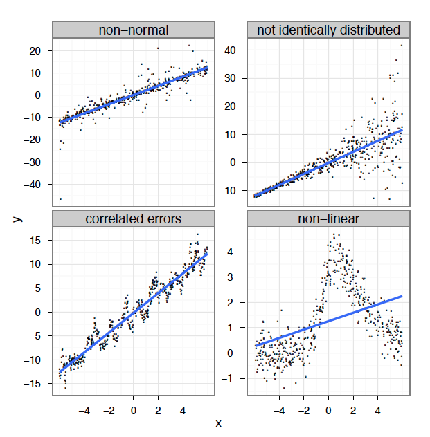
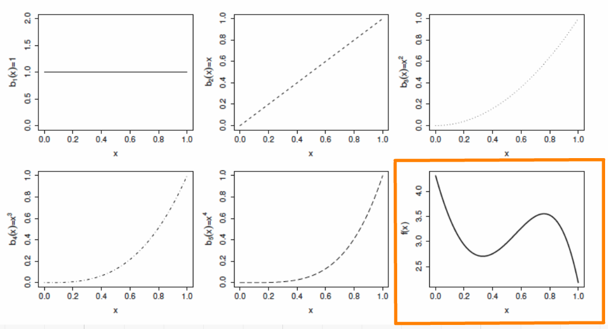
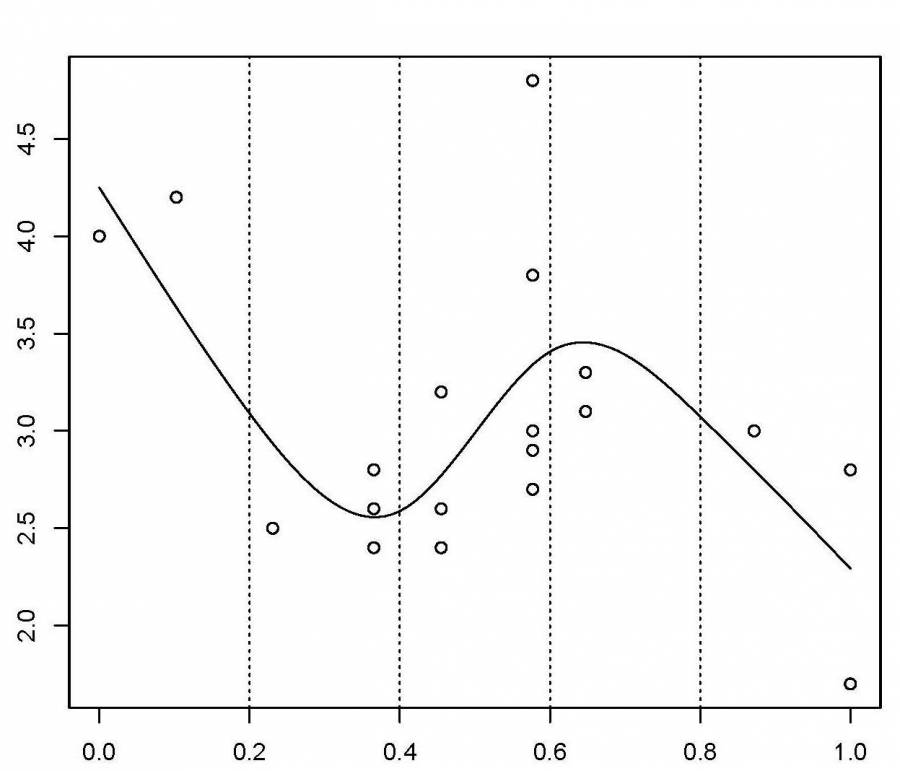
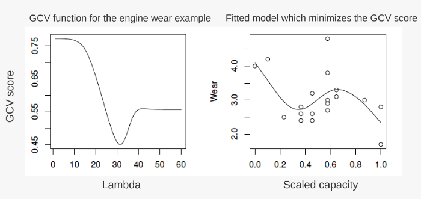

```{r setup, echo = F}
knitr::opts_chunk$set(
  comment = "#",
  collapse = TRUE,
  warning = FALSE,
  message = FALSE,
  cache = TRUE,
  fig.width=6, fig.height=6,
  fig.align = 'center'
)
```

```{r, include = FALSE}
if (!require(ggplot2)) install.packages("ggplot2")
library(ggplot2)
if (!require(mgcv)) install.packages("mgcv")
library(mgcv)
if (!require(itsadug)) install.packages("itsadug")
library(itsadug)
```

## Aperçu
1. Le modèle linéaire ... et où il échoue
2. Introduction aux GAMs
3. Plusieurs termes non linéaires
4. Interactions
5. Changer la fonction de base
6. Intro rapide aux GAMMs
7. Autres distributions
8. Les GAMs en coulisse

---
## Objectifs d'apprentissage

1. Utiliser la librairie `mgcv` pour modéliser les relations non linéaires,
2. Évaluer la sortie d'un Modèle Additif Généralisé (GAM) afin de mieux comprendre nos données,
3. Utiliser des tests pour déterminer si nos relations correspondent à des modèles non linéaires ou linéaires,
4. Ajouter des interactions non linéaires entre les variables explicatives,
5. Comprendre l'idée d'une fonction de base (basis function) et la raison pour laquelle ça rend les GAMs si puissants !,
6. Comment modéliser la dépendance dans les données (autocorrélation, structure hiérarchique) en utilisant les GAMMs.

---
## Prérequis

> Expérience du logiciel R (assez pour être en mesure d'exécuter un script et d'examiner les données et les objets dans R).

> Une connaissance de base de la régression simple (vous devez savoir ce qu'on entend par une régression linéaire et une ANOVA).

---
class: inverse, center, middle
# 1. Le modèle linéaire

## ...et où il échoue

---
## La régression linéaire

La régression linéaire est ce que la plupart des gens apprennent avant tout en statistiques et est parmi les méthodes les plus performantes. Elle nous permet de modéliser une variable réponse en fonction de facteurs prédictifs et d'une erreur résiduelle.

--
Tel que vu dans l'[atelier sur les modèles linéaires](http://qcbs.ca/wiki/r_workshop4), la régression fait cependant quatre suppositions importantes :

1. L'erreur est distribuée normalement
2. La variance des erreurs est constante
3. Chaque erreur est indépendante des autres (homoscédasticité)
4. La réponse est linéaire: $y = β_0 + β_1x$


---
## La régression linéaire

Il n'y a qu'une façon pour qu'un modèle linéaire soit correctement appliqué :

.center[

]


---
## La régression linéaire

Et pourtant tant de façons pour qu'il ne le soit pas :

.center[

]

---
## La régression linéaire

**Quel est le problème et comment le régler?**

Un **modèle linéaire** essaye d'ajuster la meilleure **droite** qui passe au milieu des données, cela ne fonctionne donc pas pour tous les jeux de données.

En revanche, les **GAM** font cela en ajustant une **fonction de lissage non-linéaire** à travers les données, mais tout en contrôlant le degré de courbure de la ligne (*plus d'information sur cela plus bas*).

---
class: inverse, center, middle

## 2. Introduction aux GAMs

---
## Modèles Additifs Généralisés (GAMs)

Examinons un exemple! Premièrement, nous allons générer des données et les représenter graphiquement.

```{r, eval = F, echo = T}
require(ggplot2)
set.seed(10)
n <- 250
x <- runif(n,0,5)
y_model <- 3*x/(1+2*x)
y_obs <- rnorm(n,y_model,0.1)
data_plot <- qplot(x, y_obs) +
  geom_line(aes(y=y_model)) +
  theme_bw()
data_plot
```

---
## GAM

```{r, eval = T, echo = F}
set.seed(10)
n <- 250
x <- runif(n,0,5)
y_model <- 3*x/(1+2*x)
y_obs <- rnorm(n,y_model,0.1)
data_plot <- qplot(x, y_obs) +
  geom_line(aes(y=y_model)) +
  theme_bw()
data_plot
```


---
## GAM

Si nous modélisions cette relation par une régression linéaire, les résultats ne respecteraient pas les suppositions énumérées ci-dessus.

```{r, echo = F}
linear_model <- gam(y_obs ~ x)
model_summary <- summary(linear_model)
data_plot <- data_plot +
             geom_line(colour = "red", size = 1.2, aes(y = fitted(linear_model)))
data_plot
```

---
## GAM

Dans un GAM, la relation entre la variable réponse et le prédicteur est :

$$y = \alpha + s(x_1) + s(x_2) + ... + \epsilon$$

Un des grands avantages d'utiliser un GAM est que la forme optimale de la non-linéarité, i.e le degré de lissage de `s(x)`, est contrôlée en utilisant une régression pénalisée qui est déterminée automatiquement à l'aide d'une méthode de validation croisée généralisée.

---
## GAM

Essayons de modéliser les données à l'aide d'une fonction de lissage avec la fonction `mgcv::gam()`

```{r, eval = F}
library(mgcv)
gam_model <- gam(y_obs ~ s(x))
summary(gam_model)

data_plot <- data_plot +
     geom_line(colour = "blue", size = 1.2, aes(y = fitted(gam_model)))
data_plot
```

---
## GAM

```{r, echo = F}
gam_model <- gam(y_obs ~ s(x))
summary(gam_model)
```

---
## GAM

```{r, echo = F}
data_plot <- data_plot +
     geom_line(colour = "blue", size = 1.2, aes(y = fitted(gam_model)))
data_plot
```

.comment[Note: contrairement à un coefficient fixe $β$, la fonction de lissage peut changer tout au long du gradient $x$]


---
## GAM

La librairie `mgcv` comprend également une fonction plot qui, par défaut, nous permet de visualiser la non-linéarité du modèle :

```{r, fig.width=5.5, fig.height=5.5}
plot(gam_model)
```


---
## Test de linéarité avec GAM

Nous pouvons utiliser les fonctions `gam()` et `anova()` pour tester formellement si une hypothèse de linéarité est justifiée. Nous devons simplement le configurer de sorte que notre modèle non-linéaire soit emboîté dans notre modèle linéaire.

```{r}
linear_model <- gam(y_obs ~ x) # ajuster un modèle linéaire régulier avec gam()
nested_gam_model <- gam(y_obs ~ s(x) + x)
anova(linear_model, nested_gam_model, test = "Chisq")
```

---
## Test de linéarité avec GAM

```{r}
linear_model <- gam(y_obs ~ x) # ajuster un modèle linéaire régulier avec gam()
nested_gam_model <- gam(y_obs ~ s(x) + x)
anova(linear_model, nested_gam_model, test = "Chisq")
```

.comment[Notez que le modèle `y_obs~s(x)` donne exactement les même résultats que `y_obs~s(x)+x`. Nous utilisons $s(x)+x$ pour illustrer l'imbrication du modèle, mais le $+x$ peut être omis.]

---
## Défi 1 

Nous allons maintenant essayer cela avec d'autres données générées aléatoirement.

```{r}
n <- 250
x_test <- runif(n, -5, 5)
y_test_fit <- 4 * dnorm(x_test)
y_test_obs <- rnorm(n, y_test_fit, 0.2)
```

1. Ajustez un modèle linéaire et un GAM à la relation entre `x_test` et `y_test_obs`.
2. Déterminez si l'hypothèse de linéarité est justifiée pour ces données.
3. Quels sont les degrés de libertés effectifs du terme non-linéaire ?


<!-- nous n'avons pas parlé de degrés de liberté avant... -->

---
## Défi 1 - Solution 

```{r}
linear_model_test <- gam(y_test_obs ~ x_test)
nested_gam_model_test <- gam(y_test_obs ~ s(x_test) + x_test)

anova(linear_model_test, nested_gam_model_test, test="Chisq")
```

---
## Défi 1 - Solution 

```{r}
qplot(x_test, y_test_obs) +
  geom_line(aes(y = y_test_fit)) +
  theme_bw()
```

---
## Défi 1 - Solution 

```{r}
nested_gam_model_test
```

**Réponse** Oui la non-linéarité est justifiée. Les degrés de libertés effectifs (edf) sont >> 1 (on reviendra la dessus bientôt).

---
class: inverse, center, middle

## 3. Plusieurs termes non linéaires

---
## GAM à plusieurs variables

Avec les GAMs, il est facile d'ajouter des termes non linéaires et linéaires dans un seul modèle, plusieurs termes non linéaires ou même des interactions non linéaires.

Dans cette section, nous allons utiliser un ensemble de données générées automatiquement par `mgcv::gamSim()`.

```{r}
# ?gamSim
gam_data <-  gamSim(eg = 5)
head(gam_data)
```

Nous allons essayer de modéliser la réponse `y` avec les prédicteurs `x0` à `x3`.

---
## GAM à plusieurs variables

Commençons par un modèle de base comprenant un terme non linéaire (`x1`) et un facteur qualitatif (`x0` avec 4 niveaux).

```{r}
basic_model <- gam(y ~ x0 + s(x1), data = gam_data)
basic_summary <- summary(basic_model)
basic_summary$p.table

basic_summary$s.table
```
.comment[La sortie de `p.table` fournit le tableau de résultats pour chaque terme paramétrique

Le tableau `s.table` nous donne les résultats du terme non linéaire.
]

---
## Note sur les degrés de liberté estimés

```{r}
basic_summary$s.table
```

Le paramètre `edf` indiqué dans le tableau `s.table` correspond au degrés de liberté estimés – essentiellement, plus la valeur de l'edf est élevée, plus la non-linéarité est forte.

- Une valeur proche de 1 se rapproche d'un terme linéaire.

- Une valeur elevée (8–10 ou plus) signifie que la courbe est fortement non-linéaire.

> Dans notre modèle de base, l'edf du terme non-linéaire `s(x1)` est ~2, ce qui suggère une courbe non-linéaire.

---
## Note sur les degrés de liberté estimés

Les edf dans un GAM sont différents des degrés de liberté dans une régression linéaire.

Dans la régression linéaire, les degrés de libertés du *modèle* sont équivalents au nombre de paramètres libres non redondants, p, dans le modèle (et les degrés de libertés *résiduels* sont égaux à $n-p$).

Nous reviendrons plus tard sur le concept d'edf.

---
## GAM à plusieurs variables

```{r}
plot(basic_model)
```

---
## GAM à plusieurs variables

Nous pouvons ajouter un second terme, `x2`, mais spécifier une relation linéaire avec `y`

```{r}
two_term_model <- gam(y ~ x0 + s(x1) + x2, data = gam_data)
two_term_summary <- summary(two_term_model)
two_term_summary$p.table

two_term_summary$s.table
```

---
## GAM à plusieurs variables

Nous pouvons ajouter un second terme, `x2`, mais spécifier une relation linéaire avec `y`

```{r, fig.width=5.5, fig.height=5.5}
plot(two_term_model)
```


---
## GAM à plusieurs variables

Nous pouvons aussi explorer si la relation entre `y` et `x2` est non-linéaire

```{r}
two_smooth_model <- gam(y ~ x0 + s(x1) + s(x2), data = gam_data)
two_smooth_summary <- summary(two_smooth_model)
two_smooth_summary$p.table

two_smooth_summary$s.table
```

---
## GAM à plusieurs variables

Nous pouvons aussi explorer si la relation entre `y` et `x2` est non-linéaire

```{r, fig.width=10}
plot(two_smooth_model, page = 1)
```

---
## GAM à plusieurs variables

Comme avant, nous pouvons faire une ANOVA pour tester si le terme non-linéaire est nécessaire

```{r}
anova(basic_model, two_term_model, two_smooth_model, test = "Chisq")
```

.alert[Le meilleur modèle est le modèle avec deux fonctions non linéaires pour `x1` et pour `x2`.]

---
## Défi 2 

<br>

1. Créez deux nouveaux modèles avec la variable `x3` comme paramètre linéaire et non linéaire.
2. Utilisez des graphiques, les tables des coefficients et la fonction `anova()` afin de déterminer s'il est nécessaire d'inclure `x3` dans le modèle.

---
## Défi 2 - Solution 

<br>
```{r}
three_term_model <- gam(y ~ x0 + s(x1) + s(x2) + x3, data = gam_data)
three_smooth_model <- gam(y~x0 + s(x1) + s(x2) + s(x3), data = gam_data)
three_smooth_summary <- summary(three_smooth_model)
```

---
## Défi 2 - Solution 

```{r, eval = F}
plot(three_smooth_model, page = 1)
```

```{r, fig.width=8, fig.height=7, echo = F}
par(mar=c(3.8,3.8,.2,.2))
plot(three_smooth_model, page = 1)
```

---
## Défi 2 - Solution 

```{r}
three_smooth_summary$s.table

# edf = 1 donc le terme est linéaire.

anova(two_smooth_model, three_term_model, test = "Chisq")

# terme x3 non significatif, il doit être enlevé!
```


---
class: inverse, center, middle

## 4. Intéractions

---
## GAM avec des termes d'intéraction

Il y a deux façons de modéliser une interaction entre deux variables :

- pour deux variables non-linéaire : `s(x1, x2)`
- pour une variable non-linéaire et une variable linéaire (quantitative ou qualitative) : utiliser l'argument `by`, `s(x1, by = x2)`
  - Quand `x2` est qualitative, vous avez un terme non linéaire qui varie entre les différents niveaux de `x2`
  - Quand `x2` est quantitative, l'effet linéaire de `x2` varie avec `x1`
  - Quand `x2` est qualitative, le facteur doit être ajouté comme effet principal dans le modèle

---
## GAM avec des termes d'intéraction

Nous allons examiner l'effet de l'interaction en utilisant notre variable qualitative `x0` et examiner si la non-linérité de `s(x2)` varie selon les différents niveaux de `x0`.

```{r}
factor_interact <- gam(y ~ x0 + s(x1) + s(x2, by = x0), data = gam_data)

summary(factor_interact)$s.table
```

---
## GAM avec des termes d'intéraction

```{r, fig.width=8}
plot(factor_interact, page = 1)
```

---
## GAM avec des termes d'intéraction

Nous pouvons aussi visualiser notre modèle en 3D avec `vis.gam`, où `theta` est le degré de rotation de notre plan x-y

```{r,fig.width=5.5, fig.height=5.5}
vis.gam(factor_interact, view = c("x2","x0"), theta = 40, n.grid = 500, border = NA)
```

---
## GAM avec des termes d'intéraction

Faisons une comparaison de modèle avec ANOVA pour déterminer si le terme d'intéraction est nécessaire

```{r}
anova(two_smooth_model, factor_interact, test = "Chisq")
```

À partir des graphiques, on voit que les formes des termes non-linéaires sont comparables parmi les 4 niveaux de `x0`. L'anova confirme cela aussi (p > 0.05).

---
## GAM avec des termes d'intéraction

Finalement, nous regardons les intéractions entre 2 termes non linéaires, `x1` et `x2`.

```{r}
smooth_interact <- gam(y~x0 + s(x1, x2), data = gam_data)
summary(smooth_interact)$s.table
```

---
## GAM avec des termes d'intéraction

```{r, fig.width=7, fig.height=7}
plot(smooth_interact, page = 1, scheme = 3)
```


---
## GAM avec des termes d'intéraction

```{r, fig.width=8, fig.height=8}
vis.gam(smooth_interact, view = c("x1", "x2"), theta=40, n.grid = 500, border = NA)
# similaire à plot(smooth_interact, page = 1, scheme = 1)
```

---
## GAM avec des termes d'intéraction

```{r}
anova(two_smooth_model, smooth_interact, test = "Chisq")
```

L'intéraction entre `s(x1)` et `s(x2)` est significative et le graphique en 2D illustre bien cette intéraction non-linéaire, où `y` est elevé pour de fortes valeurs de `x1` mais faible pour de petites à moyennes valeurs de `x2`.

---
class: inverse, center, middle

## 5. Changer la fonction de base

---
## Étendre le modèle de base de GAM

Il est possible de modifier le modèle de base de GAM que nous avons vu avec :

1. des fonctions plus complexes en modifiant la fonction de base (par exemple, cyclique),
2. d'autres distributions : tout ce que vous pouvez faire avec un GLM (tel que spécifier l'argument `family`) est possible avec les GAMs,
3. des modèles à effets mixtes en utilisant la fonction `gamm` ou le paquet `gamm4`.

Nous allons maintenant passer au travers de ces 3 extensions.

---
## Other smooth functions

Pour modéliser une surface lisse ou non-linéaire, nous pouvons utiliser trois fonctions lisses différentes :

`s()`  pour modéliser un terme lisse 1-dimensionnel, ou pour modéliser une intéraction entre des variables mesurées sur la *même échelle*

`te()`   pour modéliser une surface d'intéraction 2- ou n-dimensionnel entre des variables qui *ne sont pas sur la même échelle*. Comprend les effets principaux.

`ti()`  pour modéliser une surface d'intéraction 2- ou n-dimensionnel *qui ne comprend pas les effets principaux*.

---
## Paramètres des fonctions lisses

Les fonctions lisses ont beaucoup de paramètres qui pourraient changer leur comportement. Les paramètres les plus souvent utilisés sont les suivants :

`k`  nombre de ‘noeuds’
  - détermine la limite supérieure du nombre de fonctions de base utilisées pour construire la courbe.
  - contraint l'ondulation d'une fonction lisse.
  - le nombre de fonctions de base est représenté par l'edf.
  - par défaut, la limite supérieure de k pour `s()` est ~9, et de 5 pour chaque dimension de `te()` and `ti()`.
  - k devrait être < au nombre de données uniques.

---
## Paramètres des fonctions lisses

Les fonctions lisses ont beaucoup de paramètres qui pourraient changer leur comportement. Les paramètres les plus souvent utilisés sont les suivants :


`d`  spécifie quelles variables d'une intéraction se trouvent sur la même échelle lorsqu'on utilise `te()` and `ti()`.
  - Par exemple, `te(Temps, largeur, hauteur, d=c(1,2))`, indique que la `largeur` et la `hauteur` sont sur la même échelle, mais que `temps` ne l'est pas.

`bs`  spécifie la fonction de base sous-jacente.
  - pour `s()` on utilise `tp` (*thin plate regression spline*) et pour `te()` et `ti()` on utilise la base `cr` (*cubic regression spline*).

<!--last 2 slides were a copy-paste from this websites: http://www.sfs.uni-tuebingen.de/~jvanrij/Tutorial/GAMM.html. However, as I'm not a specialist of GAM, I let them asis, but we should modify them or at least site the website-->

---
## Exemple avec des données cycliques

Les données cycliques sont un bon exemple où changer la base est utile : vous voulez que le prédicteur corresponde à la fin.

Nous allons utiliser une série temporelle de données climatiques, divisées en mesures mensuelles, afin de déterminer s'il y a une tendance de température annuelle.

```{r, eval = F}
data(nottem) # Nottingham temperature time series
n_years <- length(nottem)/12
nottem_month <- rep(1:12, times = n_years)
nottem_year <- rep(1920:(1920 + n_years - 1), each = 12)
qplot(nottem_month, nottem, colour = factor(nottem_year), geom = "line") +
  theme_bw()
```

---
## Exemple avec des données cycliques

```{r, echo = F, fig.height=8, fig.width=12}
data(nottem)
n_years <- length(nottem)/12
nottem_month <- rep(1:12, times = n_years)
nottem_year <- rep(1920:(1920 + n_years - 1), each = 12)
qplot(nottem_month, nottem, colour = factor(nottem_year), geom = "line") +
  theme_bw()
```

---
## Exemple avec des données cycliques

Nous pouvons modéliser le changement cyclique de température à travers les mois et la tendance non-linéaire à travers les années, en utilisant une spline cubique, ou `cc` pour modéliser les effets de mois ainsi qu'un terme non-linéaire pour la variable année.

```{r, fig.height=4, fig.width=8}
year_gam <- gam(nottem ~ s(nottem_year) + s(nottem_month, bs = "cc"))
summary(year_gam)$s.table
```

---
## Exemple avec des données cycliques

```{r, fig.height=5, fig.width=8}
plot(year_gam, page = 1, scale = 0)
```
Il y a une hausse d'environ 1-1.5 degrés au cours de la série, mais au cours d'une année, il y a une variation d'environ 20 degrés. Les données réelles varient autour de ces valeurs prédites et ceci représente donc la variance inexpliquée.

---
class: inverse, center, middle

## 6. Autres distributions

---
## GAM avec d'autres distributions

Un bref aperçu de l'utilisation des GAMs lorsque la variable réponse ne suit pas une distribution normale ou que les données sont des abondances ou proportions (par exemple, distribution Gamma, binomiale, Poisson, binomiale négative).

Nous allons utiliser un exemple de données où une répartition binomiale sera nécessaire; la variable réponse représente le nombre de succès (l'événement a eu lieu) en fonction des défaillances au cours d'une expérience.

```{r}
gam_data3 <- read.csv("data/other_dist.csv")
str(gam_data3)
```

<!-- should change the name of the variables in the csv files, to make them meaningful-->

---
## GAM avec d'autres distributions

```{r, fig.height=4, fig.width=4}
plot(range(gam_data3$x1), c(0,1), type = "n",
     main = "Probabilités de succès dans le temps",
     ylab = "Probabilité", xlab = "x1 (temps)")
abline(h = 0.5)

avg <- aggregate(prop ~ x1, data=gam_data3, mean)
lines(avg$x1, avg$prop, col = "orange", lwd = 2)
```

---
## GAM avec d'autres distributions

Nous allons tester si cette tendance est linéaire ou non avec un GAM logistique (nous utilisons une famille de distributions binomiales parce que nous avons des données de proportion).

```{r, warning=F}
prop_model <- gam(prop ~ s(x1), data = gam_data3, weights = total, family = "binomial")
prop_summary <- summary(prop_model)
prop_summary$p.table
prop_summary$s.table
```

<!--Warning messages:
1: In eval(family$initialize) : non-integer #successes in a binomial glm!??-->
.comment[Que représente l'intercepte dans ce modèle?

Qu'est ce que le terme de lissage indique?]

---
## GAM avec d'autres distributions

```{r, echo = F}
prop_summary$p.table
```

.comment[Que représente l'intercepte dans ce modèle?]

**Rappel** le modèle utilise le nombre de succès vs échecs pour calculer le *logit*, qui est la logarithme du rapport entre les succès et échecs :

.small[
- Si succès = échecs, le rapport = 1 et le logit est de 0 (log(1) = 0).
- Si succès > échecs, le rapport > 1 et le logit a une valeur positive (log(2) = 0.69).
- Si succès < échecs, le rapport < 1 et le logit a une valeur négative (log(.5) = -0.69).
]

--

> Ici, l'estimé est positif ce qui signifie, qu'en moyenne, il y a plus de succès que d'échecs.

---
## GAM avec d'autres distributions

```{r, echo = F}
prop_summary$s.table
```

.comment[Qu'est ce que le terme de lissage indique?]

Cela représente comment le ratio de succès vs échecs change sur l'échelle de $x1$.

--

> Puisque l'edf > 1, la proportion des succès augmente plus rapidement avec $x1$

```{r, fig.height=3.5, fig.width=4, echo = F}
par(mar = c(4,4,0,0))
plot(prop_model)
```

---
## Visualiser la tendance au fil du temps

Il y a différente façon de représenter cette relation graphiquement :

- **Contribution/effet partiel** correspond aux effets isolés d'une interaction ou prédiction particulière. Si vous visualisez votre modèle GAM avec `plot()`, vous obtenez les effets partiels.
- **effets additionnés** correspond aux mesures réponse prédites pour une valeur ou niveau donné de prédicteurs. Si vous visualisez votre GAM avec `itsadug::plot_smooth()`, vous obtenez les effets additionnés.


---
## Visualiser la tendance au fil du temps

Que nous disent ces graphes sur les succès et échecs?

```{r, echo = F, fig.height=4.5, fig.width=9}
par(mfrow=c(1,2), mar = c(4,4,0,0))
plot(prop_model, select=1, scale=0, shade=TRUE)
abline(h=0)

out <- plot_smooth(prop_model, view="x1",main="", print.summary=F)
diff <- find_difference(out$fv$fit, out$fv$CI, xVals=out$fv$x1)
addInterval(0, lowVals = diff$start, highVals = diff$end, col='red', lwd=2)
abline(v=c(diff$start, diff$end), lty=3, col='red')
text(mean(c(diff$start, diff$end)), 2.1, "succès > échecs", col = 'red', font = 2)
```


.pull-left[
**Contribution / effets partiels**

La valeur logit augmente, donc les succès augmentent et les échecs diminuent.]

.pull-right[
**Valeurs ajustées, effets additionnés, intercepte inclu**

Quantités égales de succès et d'échecs jusqu'à $x1 = 400$.
]

<!-- this code should be shown but it is not well explained...-->
---
## Visualiser la tendance au fil du temps

Enfin, pour nous aider à interpréter les résultats, nous pouvons re-transformer l'effet sur une échelle de proportions avec la fonction `itsadug::plot_smooth()` :

```{r, echo = -1, fig.height=3.5, fig.width==4}
par(mar=c(3.8,4,0,0))
plot_smooth(prop_model, view = "x1", main = "",
            transform = plogis, ylim = c(0,1), print.summary = F)
abline(h = 0.5, v = diff$start, col = 'red', lty = 2)
```

Comme précédemment, la proportion de succès augmente au-dessus de 0.5 à $x1 = 400$.

<!-- again, lack of explanation here...-->


---
class: inverse, center, middle

# 7. Intro rapide aux GAMMs

---
## La non-indépendance des données

Lorsque les observations ne sont pas indépendantes, les GAMs peuvent être utilisés soit pour incorporer :

- une structure de corrélation pour modéliser les résidus autocorrélés (autorégressif (AR), moyenne mobile (MA), ou une combinaison des deux (ARMA)) ,
- des effets aléatoires qui modélisent l'indépendance entre les observations d'un même site.

---
## Modèle avec erreurs autocorrélées

Pour commencer, nous allons jeter un coup d’œil au premier cas; un modèle avec autocorrélation temporelle dans les résidus. Ré-examinons le modèle de la température de Nottingham et vérifions si les résidus sont corrélés en faisant appel à la fonction (partielle) d'autocorrélation.

```{r, eval = F, fig.width=9, fig.height=4.5}
par(mfrow = c(1,2))
acf(resid(year_gam), lag.max = 36, main = "ACF")
pacf(resid(year_gam), lag.max = 36, main = "pACF")
```

---
## Modèle avec erreurs autocorrélées

```{r, echo = F, fig.width=8.5, fig.height=4}
par(mfrow = c(1,2))
acf(resid(year_gam), lag.max = 36, main = "ACF")
pacf(resid(year_gam), lag.max = 36, main = "pACF")
```

.comment[ACF (et pACF) donne la corrélation croisée (et la corrélation partielle) d'une série temporelle avec elle-même à différent décalage de temps, et sont utilisés pour identifier combien d'intervalle de temps sont nécessaires pour que les observations commencent à être indépendantes.]

 Les graphiques des fonctions d'autocorrélation suggèrent qu'un modèle AR de faible ordre est nécessaire (avec un ou deux intervalles de temps décalés).

---
## Modèle avec erreurs autocorrélées

Nous pouvons tester l'autocorrélation en ajoutant des structures AR au modèle : AR(1) (corrélation avec un intervalle de temps décalé) ou un AR(2) (corrélation à 2 intervalles de temps décalés)

```{r}
year_gam <- gamm(nottem ~ s(nottem_year) + s(nottem_month, bs = "cc"))
year_gam_AR1 <- gamm(nottem ~ s(nottem_year) + s(nottem_month, bs = "cc"),
                     correlation = corARMA(form = ~ 1|nottem_year, p = 1))
year_gam_AR2 <- gamm(nottem ~ s(nottem_year) + s(nottem_month, bs = "cc"),
                     correlation = corARMA(form = ~ 1|nottem_year, p = 2))
anova(year_gam$lme, year_gam_AR1$lme, year_gam_AR2$lme)
```

.comment[Le modèle avec la structure AR(1) prévoit une augmentation significative comparativement au premier modèle (LRT = 10,69, p = 0,0011), mais il y a très peu d'intérêt à considérer le modèle AR(2) (LRT = 1,62, b = 0,203).]

---
## Modélisation avec effets mixtes

Comme nous l'avons vu dans la section précédente, `bs` spécifie la fonction de base sous-jacente. Pour les facteurs aléatoires (origine et pente linéaire), nous utilisons `bs = "re"` et pour les pentes aléatoires non linéaires, nous utilisons `bs = "fs"`.

---
## Modélisation avec effets mixtes

**3 types d'effets aléatoires différents** sont possibles lors de l'utilisation des GAMMs (où `fac`  variable qualitative utilisée pour l'effet aléatoire; `x0`  effet quantitatif fixe) :

- **interceptes aléatoires** ajustent la hauteur des termes du modèle avec une valeur constante de pente : `s(fac, bs="re")`
- **pentes aléatoires** ajustent la pente d'une variable explicative numérique : `s(fac, x0, bs="re")`
- **surfaces lisses aléatoires** ajustent la tendance d'une prédiction numérique de façon non linéaire: `s(x0, fac, bs="fs", m=1)`, où l'argument $m = 1$ met une plus grande pénalité au lissage qui s'éloigne de 0, ce qui entraîne un retrait vers la moyenne.

---
## GAMM avec un intercepte aléatoire

Tel que vu précédemment, nous allons utiliser `gamSim()` pour générer un ensemble de données, cette fois-ci avec une composante d'effet aléatoire. Ensuite, nous construirons un modèle avec un intercepte aléatoire en utilisant `fac` comme facteur aléatoire.

```{r}
gam_data2 <- gamSim(eg = 6)
str(gam_data2)
```


---
## GAMM avec un intercepte aléatoire

```{r, fig.height=4.5, fig.width=5.5, echo = -1}
par(mar=c(4,4,1,1))
gamm_intercept <- gam(y ~ s(x0) + s(fac, bs = "re"), data = gam_data2)
summary(gamm_intercept)$s.table
plot(gamm_intercept, select = 2)
```

---
## GAMM avec un intercepte aléatoire

Nous allons premièrement tracer l'effet combiné de `x0` (sans les niveaux de l'effet aléatoire) et ensuite une courbe pour les 4 niveaux de `fac` :

```{r, eval = F}
par(mfrow = c(1,2), cex = 1.1)

plot_smooth(gamm_intercept, view = "x0", rm.ranef = T,
            main = "intercept + s(x1)")

plot_smooth(gamm_intercept, view = "x0", cond = list(fac="1"),
            main = "... + s(fac)", col = 'orange', ylim = c(8,21))

plot_smooth(gamm_intercept, view = "x0", cond = list(fac = "2"), add = T, col = 'red')

plot_smooth(gamm_intercept, view="x0", cond = list(fac = "3"), add = T, col = 'purple')

plot_smooth(gamm_intercept, view="x0", cond = list(fac = "4"), add = T, col = 'turquoise')
```

---
## GAMM avec un intercepte aléatoire

<br>

```{r, echo = F, fig.width=12, fig.height=6}
par(mfrow = c(1,2), cex = 1.1, mar=c(4,4,1,1))
plot_smooth(gamm_intercept, view = "x0", rm.ranef = T,
            main = "intercept + s(x1)", print.summary=F)
plot_smooth(gamm_intercept, view = "x0", cond = list(fac="1"),
            main = "... + s(fac)", col = 'orange', ylim = c(8,21), print.summary=F)
plot_smooth(gamm_intercept, view = "x0", cond = list(fac = "2"), add = T, col = 'red', print.summary=F)
plot_smooth(gamm_intercept, view="x0", cond = list(fac = "3"), add = T, col = 'purple', print.summary=F)
plot_smooth(gamm_intercept, view="x0", cond = list(fac = "4"), add = T, col = 'turquoise', print.summary=F)
```

.pull-right[
&nbsp; <font color="orange">fac1</font> &nbsp; <font color="red">fac2</font> &nbsp; <font color="purple">fac3</font> &nbsp; <font color="turquoise">fac4</font>
]


---
## GAMM avec une pente aléatoire

```{r}
gamm_slope <- gam(y ~ s(x0) + s(x0, fac, bs = "re"), data = gam_data2)

summary(gamm_slope)$s.table
```


---
## GAMM avec une pente aléatoire

```{r, eval = F}
par(mfrow = c(1,2), cex = 1.1)

plot_smooth(gamm_slope, view = "x0", rm.ranef = T, main = "intercept + s(x0)")

plot_smooth(gamm_slope, view = "x0", cond = list(fac = "1"),
            main = "... + s(fac)", col = 'orange', ylim = c(7,22))

plot_smooth(gamm_slope, view = "x0", cond = list(fac = "2"), add = T, col = 'red')

plot_smooth(gamm_slope, view = "x0", cond = list(fac = "3"), add = T, col = 'purple')

plot_smooth(gamm_slope, view = "x0", cond = list(fac = "4"), add = T, col = 'turquoise')
```

---
## GAMM avec une pente aléatoire

<br>

```{r, echo = F, fig.width=12, fig.height=6}
par(mfrow = c(1,2), cex = 1.1, mar=c(4,4,1,1))
plot_smooth(gamm_slope, view = "x0", rm.ranef = T, main = "intercept + s(x0)",
            print.summary=F)
plot_smooth(gamm_slope, view = "x0", cond = list(fac = "1"),
            main = "... + s(fac)", col = 'orange', ylim = c(7,22), print.summary=F)
plot_smooth(gamm_slope, view = "x0", cond = list(fac = "2"), add = T, col = 'red',
            print.summary=F)
plot_smooth(gamm_slope, view = "x0", cond = list(fac = "3"), add = T, col = 'purple',
            print.summary=F)
plot_smooth(gamm_slope, view = "x0", cond = list(fac = "4"), add = T, col = 'turquoise',
            print.summary=F)
```

---
## GAMM avec un intercepte et une pente aléatoire

```{r}
gamm_int_slope <- gam(y ~ s(x0) + s(fac, bs = "re") + s(fac, x0, bs = "re"),
                      data = gam_data2)

summary(gamm_int_slope)$s.table
```

---
## GAMM avec un intercepte et une pente aléatoire

```{r, eval = F}
par(mfrow = c(1,2), cex = 1.1)

plot_smooth(gamm_int_slope, view = "x0", rm.ranef = T, main = "intercept + s(x0)")

plot_smooth(gamm_int_slope, view = "x0", cond = list(fac = "1"),
            main="... + s(fac) + s(fac, x0)", col = 'orange', ylim = c(7,22))

plot_smooth(gamm_int_slope, view = "x0", cond = list(fac = "2"), add = T, col='red')

plot_smooth(gamm_int_slope, view = "x0", cond = list(fac = "3"), add = T, col = 'purple')

plot_smooth(gamm_int_slope, view = "x0", cond = list(fac = "4"), add = T, col = 'turquoise')
```

---
## GAMM avec un intercepte et une pente aléatoire

<br>

```{r, echo = F, fig.width=12, fig.height=6}
par(mfrow = c(1,2), cex = 1.1, mar=c(4,4,1,1))
plot_smooth(gamm_int_slope, view = "x0", rm.ranef = T, main = "intercept + s(x0)", print.summary=F)
plot_smooth(gamm_int_slope, view = "x0", cond = list(fac = "1"), print.summary=F,
            main="... + s(fac) + s(fac, x0)", col = 'orange', ylim = c(7,22))
plot_smooth(gamm_int_slope, view = "x0", cond = list(fac = "2"), add = T,
            col='red',print.summary=F)
plot_smooth(gamm_int_slope, view = "x0", cond = list(fac = "3"), add = T,
            col = 'purple', print.summary=F)
plot_smooth(gamm_int_slope, view = "x0", cond = list(fac = "4"), add = T,
            col = 'turquoise', print.summary=F)
```

---
## GAMM avec un intercepte et une pente aléatoire

Notez que la pente aléatoire est statique dans ce cas :

```{r, fig.width=5, fig.height=5}
plot(gamm_int_slope, select = 3)
```

---
## GAMM avec une surface lisse aléatoire

```{r}
gamm_smooth <- gam(y ~ s(x0, fac, bs = "fs", m = 1), data = gam_data2)

summary(gamm_smooth)$s.table
```

---
## GAMM avec une surface lisse aléatoire

Ici, si les pentes aléatoires variaient selon `x0`, nous aurons des courbes variables pour chaque niveau :

```{r, echo = -1, fig.height=5, fig.width=5}
par(mar=c(4,4,.5,.5), lwd = 2)
plot(gamm_smooth, select = 1)
```

---
## GAMM avec une surface lisse aléatoire

```{r, eval = F}
par(mfrow = c(1,2), cex = 1.1)

plot_smooth(gamm_smooth, view = "x0", rm.ranef = T, main = "intercept + s(x0)")

plot_smooth(gamm_smooth, view = "x0", cond = list(fac = "1"),
            main="... + s(x0, fac)", col = 'orange', ylim = c(7,22))

plot_smooth(gamm_smooth, view = "x0", cond = list(fac = "2"), add = T, col='red')

plot_smooth(gamm_smooth, view = "x0", cond = list(fac = "3"), add = T, col = 'purple')

plot_smooth(gamm_smooth, view = "x0", cond = list(fac = "4"), add = T, col = 'turquoise')
```

---
## GAMM avec une surface lisse aléatoire

<br>

```{r, echo = F, fig.width=12, fig.height=6}
par(mfrow = c(1,2), cex = 1.1, mar=c(4,4,1,1))
plot_smooth(gamm_smooth, view = "x0", rm.ranef = T, main = "intercept + s(x0)", print.summary=F)
plot_smooth(gamm_smooth, view = "x0", cond = list(fac = "1"), print.summary=F,
            main="... + s(x0, fac)", col = 'orange', ylim = c(7,22))
plot_smooth(gamm_smooth, view = "x0", cond = list(fac = "2"), add = T,
            col='red',print.summary=F)
plot_smooth(gamm_smooth, view = "x0", cond = list(fac = "3"), add = T,
            col = 'purple', print.summary=F)
plot_smooth(gamm_smooth, view = "x0", cond = list(fac = "4"), add = T,
            col = 'turquoise', print.summary=F)
```

.comment[Ici, si la pente aléatoire varie selon `x0`, nous aurons des courbes variables pour chaque niveau.]

---
## GAMM

Tous ces modèles mixtes peuvent être comparés en utilisant la fonction `anova()` pour trouver le meilleur modèle.

```{r}
anova(gamm_intercept, gamm_slope, gamm_int_slope, gamm_smooth, test = "Chisq")
```

---
class: inverse, center, middle

# 8. Les GAMs en coulisse


---
## Un regard plus approfondi sur les GAMs

Nous allons maintenant prendre quelques minutes pour regarder comment fonctionnent les GAMs. Commençons en considérant d'abord un modèle qui contient une fonction lisse d'une covariable, $x_i$ :

$$y_i = f(x_i) + ε_i$$

Pour estimer la fonction $f$, nous avons besoin de représenter l'équation ci-dessus de manière à ce qu'elle devienne un modèle linéaire. Cela peut être fait en choisissant une base, $b_i(x)$, définissant l'espace des fonctions dont $f$ est un élément :

$$f(x) = \sum_{i=1}^q b_i(x) \times β_i$$

---
## Exemple : une base polynomiale

Supposons que $f$ est considérée comme un polynôme d'ordre 4, de sorte que l'espace des polynômes d'ordre 4 et moins contient $f$. Une base de cet espace serait alors :

$$b_1(x)=1,   b_2(x)=x,   b_3(x)=x^2,   b_4(x)=x^3,   b_5(x)=x^4$$

et $f(x)$ devient :

$$f(x) = β_1 + x_iβ_2 +  x^2_iβ_3 + x^3_iβ_4(x) + x^4_iβ_5$$

et le modèle complet devient :

$$y_i = β_1 + x_iβ_2 +  x^2_iβ_3 + x^3_iβ_4(x) + x^4_iβ_5 + ε_i$$

---
## Exemple : une base polynomiale

Chaque fonction de base est multipliée par un paramètre à valeur réelle, $β_i$, et est ensuite additionnée pour donner la <font color="orange">courbe finale $f(x)$</font>.

.center[

]

En faisant varier le coefficient $β_i$, on peut faire varier la forme de $f(x)$ pour produire une fonction polynomiale d'ordre 4 ou moins.

---
## Exemple : une base de spline cubique

Un spline cubique est une courbe construite à partir de sections d'un polynôme cubique reliées entre elles de sorte qu'elles sont continues en valeur. Chaque section du spline a des coefficients différents.

.center[

]

---
## Exemple : une base de spline cubique

Voici une représentation d'une fonction lisse utilisant une base de régression spline cubique de rang 5 avec des nœuds situés à incréments de 0.2:

.center[

]

Dans cet exemple, les nœuds sont espacés uniformément à travers la gamme des valeurs observées de x. Le choix du degré de finesse du modèle est pré-déterminé par le nombre de nœuds, qui était arbitraire.

.comment[Y a-t-il une meilleure façon de sélectionner les emplacements des nœuds?]

---
## Contrôler le degré de lissage avec des splines de régression pénalisés

Au lieu de contrôler le lissage (non linéarité) en modifiant le nombre de nœuds, nous gardons celui-ci fixé à une taille un peu plus grande que raisonnablement nécessaire et on contrôle le lissage du modèle en ajoutant une pénalité sur le niveau de courbure. Donc, plutôt que d'ajuster le modèle en minimisant (comme avec la méthode des moindres carrés) :

$$||y - XB||^{2}$$

Il peut être modélisé en minimisant :

$$||y - XB||^{2} + \lambda \int_0^1[f^{''}(x)]^2dx$$

Quand $\lambda$ tend vers $∞$, le modèle devient linéaire.

---
## Contrôler le degré de lissage avec des splines de régression pénalisés

Si $λ$ est trop élevé, les données seront trop lissées et si elle est trop faible, les données ne seront pas assez lissées. Idéalement, il serait bon de choisir une valeur $λ$ de sorte que le $\hat{f}$ prédit est aussi proche que possible du $f$ observé. Un critère approprié pourrait être de choisir $λ$ pour minimiser :

$$M = 1/n \times \sum_{i=1}^n (\hat{f_i} - f_i)^2$$

Étant donné que $f$ est inconnue, $M$ est estimé en utilisant une technique de validation croisée généralisée qui laisse de côté, à chaque tour, une donnée et estime la capacité moyenne des modèles, construits sur les données restantes, de prédire la donnée qui a été mise de côté.

---
## Principe de validation croisée

.center[

]

1. ajustement faible par rapport aux données et ne fait pas mieux avec le point manquant.

--

2. très bon ajustement de la courbe du signal sous-jacent, le lissage passe à travers le bruit et la donnée manquante est plutôt bien prédite.

--

3. la courbe ajuste le bruit aussi bien que le signal, la variabilité supplémentaire amène à prédire la donnée manquante plutôt mal.

---
## Principe de validation croisée

.center[

]


---
## Note supplémentaire sur les degrés de liberté effectifs (edf)

Combien de degrés de liberté a un GAM ?

Au lieu de fournir la sortie de la validation croisée en termes de $\lambda$ (complexité de l'ajustement), la fonction GAM du paquet `mgvc` utilise un terme appelé les degrés de liberté effectifs (edf).


---
## Note supplémentaire sur les degrés de liberté effectifs (edf)

Parce que le nombre de paramètres libres des splines de lissage (tel que les GAMs) est souvent difficile à définir, les edf sont liés à $\lambda$, où l'effet de la pénalité est de réduire les degrés de libertés.

Par exemple, si le nombre de noeuds est arbitrairement réglé à k = 10, k-1 définit la limite supérieure des degrés de libertés associés à un terme de lissage. Ce nombre diminue alors que la pénalité $\lambda$ augmente jusqu'à ce que le meilleur modèle soit trouvé par validation croisée.

---
## Ressources

Il existe beaucoup d'information sur les GAMs…

Simon Wood, l'auteur de la librairie `mgcv`, a un [site](http://people.bath.ac.uk/sw283/mgcv/) très utile avec des conférences et des notes introductives sur la façon d'utiliser les GAMs.

Il a aussi écrit un livre, *Generalized Additive Models: An Introduction with R*, que nous avons utilisé comme référence pour cet atelier.

Le matériel de cet atelier a également été obtenu à partir des blogs et des tutoriels suivants :

- [From the bottom of the heap](http://www.fromthebottomoftheheap.net/blog/)

- [Overview GAMM analysis of time series data](http://www.sfs.uni-tuebingen.de/~jvanrij/Tutorial/GAMM.html)

- [Advanced Analysis of Time series data](http://www.sfs.uni-tuebingen.de/~jvanrij/LSA2015/AnswersLab2.html)

Enfin, les pages d'aide, disponibles via `?gam` dans R sont une excellente ressource.

---
class: inverse, center, bottom

# Merci pour votre participation à cet atelier!


